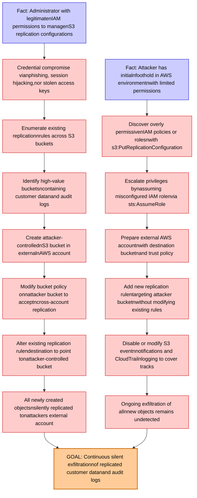

# Attack Tree: Data Exfiltration

**Threat ID**: T008
**Statement**: A compromised administrator or attacker with IAM permissions to modify replication configurations, can redirect cross-region or same-region replication to attacker-controlled buckets in external AWS accounts, which leads to continuous silent exfiltration of all newly created objects, resulting in reduced confidentiality of replicated customer data and audit logs.

## Attack Tree Diagram

## MITRE ATT&CK Mapping

This attack tree has been mapped to MITRE ATT&CK techniques:

### Identify high-value bucketsncontaining customer datanand audit logs

- **Technique**: [T1654](https://attack.mitre.org/techniques/T1654/) - Log Enumeration
- **Tactic**: Discovery
- **Similarity Score**: 68.47%
- **Mitigations (1):**
  - 🛡️ **User Account Management**
    User Account Management involves implementing and enforcing policies for the lifecycle of user accounts, including creat...

### Prepare external AWS accountnwith destination bucketnand trust policy

- **Technique**: [T1136.003](https://attack.mitre.org/techniques/T1136/003/) - Cloud Account
- **Tactic**: Persistence
- **Similarity Score**: 73.56%
- **Mitigations (3):**
  - 🛡️ **Network Segmentation**
    Network segmentation involves dividing a network into smaller, isolated segments to control and limit the flow of traffi...
  - 🛡️ **Multi-factor Authentication**
    Multi-Factor Authentication (MFA) enhances security by requiring users to provide at least two forms of verification to ...
  - 🛡️ **Privileged Account Management**
    Privileged Account Management focuses on implementing policies, controls, and tools to securely manage privileged accoun...

### Create attacker-controllednS3 bucket in externalnAWS account

- **Technique**: [T1537](https://attack.mitre.org/techniques/T1537/) - Transfer Data to Cloud Account
- **Tactic**: Exfiltration
- **Similarity Score**: 70.62%
- **Mitigations (4):**
  - 🛡️ **Data Loss Prevention**
    Data Loss Prevention (DLP) involves implementing strategies and technologies to identify, categorize, monitor, and contr...
  - 🛡️ **User Account Management**
    User Account Management involves implementing and enforcing policies for the lifecycle of user accounts, including creat...
  - 🛡️ **Software Configuration**
    Software configuration refers to making security-focused adjustments to the settings of applications, middleware, databa...
  - *1 more mitigation(s) available*

### Add new replication rulentargeting attacker bucketnwithout modifying existing rules

- **Technique**: [T1666](https://attack.mitre.org/techniques/T1666/) - Modify Cloud Resource Hierarchy
- **Tactic**: Defense Evasion
- **Similarity Score**: 43.50%
- **Mitigations (3):**
  - 🛡️ **Software Configuration**
    Software configuration refers to making security-focused adjustments to the settings of applications, middleware, databa...
  - 🛡️ **User Account Management**
    User Account Management involves implementing and enforcing policies for the lifecycle of user accounts, including creat...
  - 🛡️ **Audit**
    Auditing is the process of recording activity and systematically reviewing and analyzing the activity and system configu...

### All newly created objectsnsilently replicated tonattackers external account

- **Technique**: [T1136.001](https://attack.mitre.org/techniques/T1136/001/) - Local Account
- **Tactic**: Persistence
- **Similarity Score**: 61.06%
- **Mitigations (2):**
  - 🛡️ **Multi-factor Authentication**
    Multi-Factor Authentication (MFA) enhances security by requiring users to provide at least two forms of verification to ...
  - 🛡️ **Privileged Account Management**
    Privileged Account Management focuses on implementing policies, controls, and tools to securely manage privileged accoun...

### Ongoing exfiltration of allnnew objects remains undetected

- **Technique**: [T1074.001](https://attack.mitre.org/techniques/T1074/001/) - Local Data Staging
- **Tactic**: Collection
- **Similarity Score**: 71.11%

### Escalate privileges bynassuming misconfigured IAM rolenvia sts:AssumeRole

- **Technique**: [T1548](https://attack.mitre.org/techniques/T1548/) - Abuse Elevation Control Mechanism
- **Tactic**: Privilege Escalation, Defense Evasion
- **Similarity Score**: 78.83%
- **Mitigations (8):**
  - 🛡️ **Execution Prevention**
    Prevent the execution of unauthorized or malicious code on systems by implementing application control, script blocking,...
  - 🛡️ **Operating System Configuration**
    Operating System Configuration involves adjusting system settings and hardening the default configurations of an operati...
  - 🛡️ **Update Software**
    Software updates ensure systems are protected against known vulnerabilities by applying patches and upgrades provided by...
  - *5 more mitigation(s) available*

### Disable or modify S3 eventnnotifications and CloudTrailnlogging to cover tracks

- **Technique**: [T1562.008](https://attack.mitre.org/techniques/T1562/008/) - Disable or Modify Cloud Logs
- **Tactic**: Defense Evasion
- **Similarity Score**: 70.85%
- **Mitigations (1):**
  - 🛡️ **User Account Management**
    User Account Management involves implementing and enforcing policies for the lifecycle of user accounts, including creat...

### Enumerate existing replicationnrules across S3 buckets

- **Technique**: [T1119](https://attack.mitre.org/techniques/T1119/) - Automated Collection
- **Tactic**: Collection
- **Similarity Score**: 57.70%
- **Mitigations (2):**
  - 🛡️ **Remote Data Storage**
    Remote Data Storage focuses on moving critical data, such as security logs and sensitive files, to secure, off-host loca...
  - 🛡️ **Encrypt Sensitive Information**
    Protect sensitive information at rest, in transit, and during processing by using strong encryption algorithms. Encrypti...

### Fact: Administrator with legitimatenIAM permissions to managenS3 replication configurations

- **Technique**: [T1207](https://attack.mitre.org/techniques/T1207/) - Rogue Domain Controller
- **Tactic**: Defense Evasion
- **Similarity Score**: 45.08%

### Credential compromise vianphishing, session hijacking,nor stolen access keys

- **Technique**: [T1556](https://attack.mitre.org/techniques/T1556/) - Modify Authentication Process
- **Tactic**: Credential Access, Defense Evasion, Persistence
- **Similarity Score**: 75.80%
- **Mitigations (9):**
  - 🛡️ **Restrict Registry Permissions**
    Restricting registry permissions involves configuring access control settings for sensitive registry keys and hives to e...
  - 🛡️ **Multi-factor Authentication**
    Multi-Factor Authentication (MFA) enhances security by requiring users to provide at least two forms of verification to ...
  - 🛡️ **Password Policies**
    Set and enforce secure password policies for accounts to reduce the likelihood of unauthorized access. Strong password p...
  - *6 more mitigation(s) available*

### GOAL: Continuous silent exfiltrationnof replicated customer datanand audit logs

- **Technique**: [T1074](https://attack.mitre.org/techniques/T1074/) - Data Staged
- **Tactic**: Collection
- **Similarity Score**: 72.83%

### Discover overly permissivenIAM policies or rolesnwith s3:PutReplicationConfiguration

- **Technique**: [T1069.003](https://attack.mitre.org/techniques/T1069/003/) - Cloud Groups
- **Tactic**: Discovery
- **Similarity Score**: 61.36%

### Fact: Attacker has initialnfoothold in AWS environmentnwith limited permissions

- **Technique**: [T1546](https://attack.mitre.org/techniques/T1546/) - Event Triggered Execution
- **Tactic**: Privilege Escalation, Persistence
- **Similarity Score**: 55.61%
- **Mitigations (2):**
  - 🛡️ **Privileged Account Management**
    Privileged Account Management focuses on implementing policies, controls, and tools to securely manage privileged accoun...
  - 🛡️ **Update Software**
    Software updates ensure systems are protected against known vulnerabilities by applying patches and upgrades provided by...

### Alter existing replication rulendestination to point tonattacker-controlled bucket

- **Technique**: [T1074.002](https://attack.mitre.org/techniques/T1074/002/) - Remote Data Staging
- **Tactic**: Collection
- **Similarity Score**: 56.41%

### Modify bucket policy onnattacker bucket to acceptncross-account replication

- **Technique**: [T1537](https://attack.mitre.org/techniques/T1537/) - Transfer Data to Cloud Account
- **Tactic**: Exfiltration
- **Similarity Score**: 70.15%
- **Mitigations (4):**
  - 🛡️ **Data Loss Prevention**
    Data Loss Prevention (DLP) involves implementing strategies and technologies to identify, categorize, monitor, and contr...
  - 🛡️ **User Account Management**
    User Account Management involves implementing and enforcing policies for the lifecycle of user accounts, including creat...
  - 🛡️ **Software Configuration**
    Software configuration refers to making security-focused adjustments to the settings of applications, middleware, databa...
  - *1 more mitigation(s) available*

*Total technique mappings: 16 | Mitigations found: 39*

## Attack Path Analysis

Review this attack tree to:
1. Identify critical attack paths
2. Implement appropriate security controls
3. Monitor for indicators
4. Develop incident response procedures

---
*Generated by ThreatForest*
