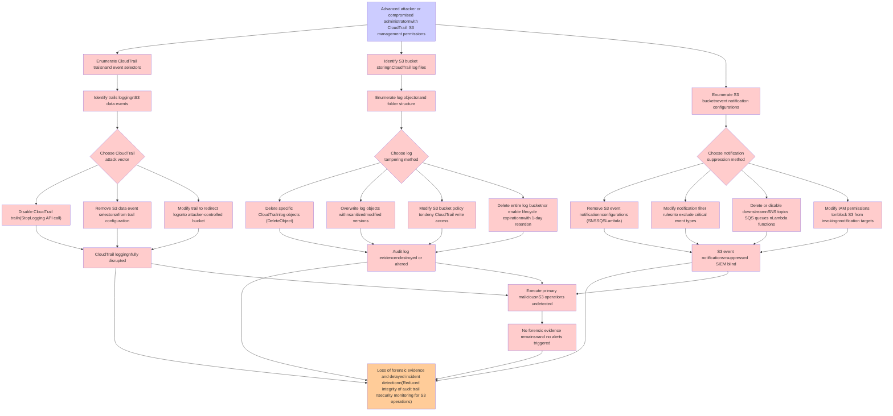

# Attack Tree: Logging Evasion

**Threat ID**: T009
**Statement**: An advanced attacker or compromised administrator with CloudTrail and S3 management permissions, can disable CloudTrail data event logging, delete or modify audit log objects, or suppress S3 event notifications, which leads to loss of forensic evidence and delayed incident detection, resulting in reduced integrity of the audit trail and security monitoring capabilities for all S3 operations.

## Attack Tree Diagram

## MITRE ATT&CK Mapping

This attack tree has been mapped to MITRE ATT&CK techniques:

### Disable CloudTrail trailn(StopLogging API call)

- **Technique**: [T1562.008](https://attack.mitre.org/techniques/T1562/008/) - Disable or Modify Cloud Logs
- **Tactic**: Defense Evasion
- **Similarity Score**: 75.51%
- **Mitigations (1):**
  - 🛡️ **User Account Management**
    User Account Management involves implementing and enforcing policies for the lifecycle of user accounts, including creat...

### No forensic evidence remainsnand no alerts triggered

- **Technique**: [T1562.012](https://attack.mitre.org/techniques/T1562/012/) - Disable or Modify Linux Audit System
- **Tactic**: Defense Evasion
- **Similarity Score**: 50.22%
- **Mitigations (2):**
  - 🛡️ **Audit**
    Auditing is the process of recording activity and systematically reviewing and analyzing the activity and system configu...
  - 🛡️ **User Account Management**
    User Account Management involves implementing and enforcing policies for the lifecycle of user accounts, including creat...

### Delete or disable downstreamnSNS topics  SQS queues nLambda functions

- **Technique**: [T1489](https://attack.mitre.org/techniques/T1489/) - Service Stop
- **Tactic**: Impact
- **Similarity Score**: 55.70%
- **Mitigations (5):**
  - 🛡️ **Network Segmentation**
    Network segmentation involves dividing a network into smaller, isolated segments to control and limit the flow of traffi...
  - 🛡️ **User Account Management**
    User Account Management involves implementing and enforcing policies for the lifecycle of user accounts, including creat...
  - 🛡️ **Out-of-Band Communications Channel**
    Establish secure out-of-band communication channels to ensure the continuity of critical communications during security ...
  - *2 more mitigation(s) available*

### Enumerate S3 bucketnevent notification configurations

- **Technique**: [T1619](https://attack.mitre.org/techniques/T1619/) - Cloud Storage Object Discovery
- **Tactic**: Discovery
- **Similarity Score**: 47.96%
- **Mitigations (1):**
  - 🛡️ **User Account Management**
    User Account Management involves implementing and enforcing policies for the lifecycle of user accounts, including creat...

### Delete specific CloudTrailnlog objects (DeleteObject)

- **Technique**: [T1485.001](https://attack.mitre.org/techniques/T1485/001/) - Lifecycle-Triggered Deletion
- **Tactic**: Impact
- **Similarity Score**: 85.31%
- **Mitigations (2):**
  - 🛡️ **User Account Management**
    User Account Management involves implementing and enforcing policies for the lifecycle of user accounts, including creat...
  - 🛡️ **Data Backup**
    Data Backup involves taking and securely storing backups of data from end-user systems and critical servers. It ensures ...

### Modify trail to redirect logsnto attacker-controlled bucket

- **Technique**: [T1562.008](https://attack.mitre.org/techniques/T1562/008/) - Disable or Modify Cloud Logs
- **Tactic**: Defense Evasion
- **Similarity Score**: 65.03%
- **Mitigations (1):**
  - 🛡️ **User Account Management**
    User Account Management involves implementing and enforcing policies for the lifecycle of user accounts, including creat...

### Delete entire log bucketnor enable lifecycle expirationnwith 1-day retention

- **Technique**: [T1485.001](https://attack.mitre.org/techniques/T1485/001/) - Lifecycle-Triggered Deletion
- **Tactic**: Impact
- **Similarity Score**: 90.53%
- **Mitigations (2):**
  - 🛡️ **User Account Management**
    User Account Management involves implementing and enforcing policies for the lifecycle of user accounts, including creat...
  - 🛡️ **Data Backup**
    Data Backup involves taking and securely storing backups of data from end-user systems and critical servers. It ensures ...

### Remove S3 data event selectorsnfrom trail configuration

- **Technique**: [T1070](https://attack.mitre.org/techniques/T1070/) - Indicator Removal
- **Tactic**: Defense Evasion
- **Similarity Score**: 58.81%
- **Mitigations (3):**
  - 🛡️ **Encrypt Sensitive Information**
    Protect sensitive information at rest, in transit, and during processing by using strong encryption algorithms. Encrypti...
  - 🛡️ **Remote Data Storage**
    Remote Data Storage focuses on moving critical data, such as security logs and sensitive files, to secure, off-host loca...
  - 🛡️ **Restrict File and Directory Permissions**
    Restricting file and directory permissions involves setting access controls at the file system level to limit which user...

### Identify S3 bucket storingnCloudTrail log files

- **Technique**: [T1119](https://attack.mitre.org/techniques/T1119/) - Automated Collection
- **Tactic**: Collection
- **Similarity Score**: 73.17%
- **Mitigations (2):**
  - 🛡️ **Remote Data Storage**
    Remote Data Storage focuses on moving critical data, such as security logs and sensitive files, to secure, off-host loca...
  - 🛡️ **Encrypt Sensitive Information**
    Protect sensitive information at rest, in transit, and during processing by using strong encryption algorithms. Encrypti...

### Remove S3 event notificationnconfigurations (SNSSQSLambda)

- **Technique**: [T1070](https://attack.mitre.org/techniques/T1070/) - Indicator Removal
- **Tactic**: Defense Evasion
- **Similarity Score**: 64.50%
- **Mitigations (3):**
  - 🛡️ **Encrypt Sensitive Information**
    Protect sensitive information at rest, in transit, and during processing by using strong encryption algorithms. Encrypti...
  - 🛡️ **Remote Data Storage**
    Remote Data Storage focuses on moving critical data, such as security logs and sensitive files, to secure, off-host loca...
  - 🛡️ **Restrict File and Directory Permissions**
    Restricting file and directory permissions involves setting access controls at the file system level to limit which user...

### CloudTrail loggingnfully disrupted

- **Technique**: [T1562.008](https://attack.mitre.org/techniques/T1562/008/) - Disable or Modify Cloud Logs
- **Tactic**: Defense Evasion
- **Similarity Score**: 74.25%
- **Mitigations (1):**
  - 🛡️ **User Account Management**
    User Account Management involves implementing and enforcing policies for the lifecycle of user accounts, including creat...

### Modify S3 bucket policy tondeny CloudTrail write access

- **Technique**: [T1485.001](https://attack.mitre.org/techniques/T1485/001/) - Lifecycle-Triggered Deletion
- **Tactic**: Impact
- **Similarity Score**: 83.24%
- **Mitigations (2):**
  - 🛡️ **User Account Management**
    User Account Management involves implementing and enforcing policies for the lifecycle of user accounts, including creat...
  - 🛡️ **Data Backup**
    Data Backup involves taking and securely storing backups of data from end-user systems and critical servers. It ensures ...

### Enumerate CloudTrail trailsnand event selectors

- **Technique**: [T1654](https://attack.mitre.org/techniques/T1654/) - Log Enumeration
- **Tactic**: Discovery
- **Similarity Score**: 42.10%
- **Mitigations (1):**
  - 🛡️ **User Account Management**
    User Account Management involves implementing and enforcing policies for the lifecycle of user accounts, including creat...

### Modify notification filter rulesnto exclude critical event types

- **Technique**: [T1562.011](https://attack.mitre.org/techniques/T1562/011/) - Spoof Security Alerting
- **Tactic**: Defense Evasion
- **Similarity Score**: 55.88%
- **Mitigations (1):**
  - 🛡️ **Execution Prevention**
    Prevent the execution of unauthorized or malicious code on systems by implementing application control, script blocking,...

### Enumerate log objectsnand folder structure

- **Technique**: [T1654](https://attack.mitre.org/techniques/T1654/) - Log Enumeration
- **Tactic**: Discovery
- **Similarity Score**: 66.27%
- **Mitigations (1):**
  - 🛡️ **User Account Management**
    User Account Management involves implementing and enforcing policies for the lifecycle of user accounts, including creat...

### Loss of forensic evidence and delayed incident detectionn(Reduced integrity of audit trail nsecurity monitoring for S3 operations)

- **Technique**: [T1485.001](https://attack.mitre.org/techniques/T1485/001/) - Lifecycle-Triggered Deletion
- **Tactic**: Impact
- **Similarity Score**: 71.01%
- **Mitigations (2):**
  - 🛡️ **User Account Management**
    User Account Management involves implementing and enforcing policies for the lifecycle of user accounts, including creat...
  - 🛡️ **Data Backup**
    Data Backup involves taking and securely storing backups of data from end-user systems and critical servers. It ensures ...

### Identify trails loggingnS3 data events

- **Technique**: [T1654](https://attack.mitre.org/techniques/T1654/) - Log Enumeration
- **Tactic**: Discovery
- **Similarity Score**: 61.55%
- **Mitigations (1):**
  - 🛡️ **User Account Management**
    User Account Management involves implementing and enforcing policies for the lifecycle of user accounts, including creat...

### Execute primary maliciousnS3 operations undetected

- **Technique**: [T1568.001](https://attack.mitre.org/techniques/T1568/001/) - Fast Flux DNS
- **Tactic**: Command And Control
- **Similarity Score**: 46.97%

### Modify IAM permissions tonblock S3 from invokingnnotification targets

- **Technique**: [T1548.006](https://attack.mitre.org/techniques/T1548/006/) - TCC Manipulation
- **Tactic**: Defense Evasion, Privilege Escalation
- **Similarity Score**: 71.83%
- **Mitigations (3):**
  - 🛡️ **Privileged Account Management**
    Privileged Account Management focuses on implementing policies, controls, and tools to securely manage privileged accoun...
  - 🛡️ **Audit**
    Auditing is the process of recording activity and systematically reviewing and analyzing the activity and system configu...
  - 🛡️ **Restrict File and Directory Permissions**
    Restricting file and directory permissions involves setting access controls at the file system level to limit which user...

### Audit log evidencendestroyed or altered

- **Technique**: [T1562.012](https://attack.mitre.org/techniques/T1562/012/) - Disable or Modify Linux Audit System
- **Tactic**: Defense Evasion
- **Similarity Score**: 73.78%
- **Mitigations (2):**
  - 🛡️ **Audit**
    Auditing is the process of recording activity and systematically reviewing and analyzing the activity and system configu...
  - 🛡️ **User Account Management**
    User Account Management involves implementing and enforcing policies for the lifecycle of user accounts, including creat...

### Overwrite log objects withnsanitizedmodified versions

- **Technique**: [T1070.002](https://attack.mitre.org/techniques/T1070/002/) - Clear Linux or Mac System Logs
- **Tactic**: Defense Evasion
- **Similarity Score**: 83.26%
- **Mitigations (3):**
  - 🛡️ **Remote Data Storage**
    Remote Data Storage focuses on moving critical data, such as security logs and sensitive files, to secure, off-host loca...
  - 🛡️ **Restrict File and Directory Permissions**
    Restricting file and directory permissions involves setting access controls at the file system level to limit which user...
  - 🛡️ **Encrypt Sensitive Information**
    Protect sensitive information at rest, in transit, and during processing by using strong encryption algorithms. Encrypti...

### Advanced attacker or compromised administratornwith CloudTrail  S3 management permissions

- **Technique**: [T1537](https://attack.mitre.org/techniques/T1537/) - Transfer Data to Cloud Account
- **Tactic**: Exfiltration
- **Similarity Score**: 61.61%
- **Mitigations (4):**
  - 🛡️ **Data Loss Prevention**
    Data Loss Prevention (DLP) involves implementing strategies and technologies to identify, categorize, monitor, and contr...
  - 🛡️ **User Account Management**
    User Account Management involves implementing and enforcing policies for the lifecycle of user accounts, including creat...
  - 🛡️ **Software Configuration**
    Software configuration refers to making security-focused adjustments to the settings of applications, middleware, databa...
  - *1 more mitigation(s) available*

### S3 event notificationsnsuppressed  SIEM blind

- **Technique**: [T1562.006](https://attack.mitre.org/techniques/T1562/006/) - Indicator Blocking
- **Tactic**: Defense Evasion
- **Similarity Score**: 40.04%
- **Mitigations (3):**
  - 🛡️ **Restrict File and Directory Permissions**
    Restricting file and directory permissions involves setting access controls at the file system level to limit which user...
  - 🛡️ **Software Configuration**
    Software configuration refers to making security-focused adjustments to the settings of applications, middleware, databa...
  - 🛡️ **User Account Management**
    User Account Management involves implementing and enforcing policies for the lifecycle of user accounts, including creat...

*Total technique mappings: 23 | Mitigations found: 46*

## Attack Path Analysis

Review this attack tree to:
1. Identify critical attack paths
2. Implement appropriate security controls
3. Monitor for indicators
4. Develop incident response procedures

---
*Generated by ThreatForest*
