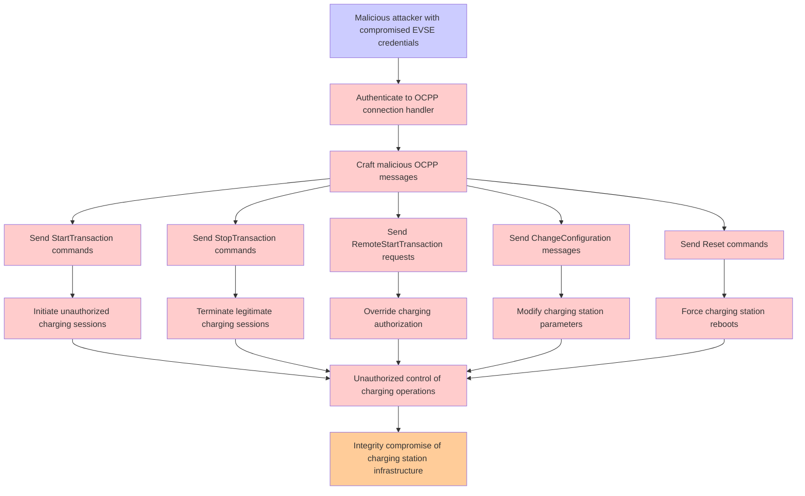

# Attack Tree: Authentication

**Threat ID**: T001
**Statement**: A malicious attacker with compromised EVSE credentials, can send malicious OCPP messages to the connection handler, which leads to unauthorized control of charging operations, resulting in reduced integrity of charging station infrastructure.

## Attack Tree Diagram

## MITRE ATT&CK Mapping

This attack tree has been mapped to MITRE ATT&CK techniques:

### Malicious attacker with compromised EVSE credentials

- **Technique**: [T1190](https://attack.mitre.org/techniques/T1190/) - Exploit Public-Facing Application
- **Tactic**: Initial Access
- **Similarity Score**: 42.88%
- **Mitigations (8):**
  - 🛡️ **Application Isolation and Sandboxing**
    Application Isolation and Sandboxing refers to the technique of restricting the execution of code to a controlled and is...
  - 🛡️ **Filter Network Traffic**
    Employ network appliances and endpoint software to filter ingress, egress, and lateral network traffic. This includes pr...
  - 🛡️ **Network Segmentation**
    Network segmentation involves dividing a network into smaller, isolated segments to control and limit the flow of traffi...
  - *5 more mitigation(s) available*

### Modify charging station parameters

- **Technique**: [T1098.005](https://attack.mitre.org/techniques/T1098/005/) - Device Registration
- **Tactic**: Persistence, Privilege Escalation
- **Similarity Score**: 32.44%
- **Mitigations (1):**
  - 🛡️ **Multi-factor Authentication**
    Multi-Factor Authentication (MFA) enhances security by requiring users to provide at least two forms of verification to ...

### Authenticate to OCPP connection handler

- **Technique**: [T1208](https://attack.mitre.org/techniques/T1208/) - Kerberoasting
- **Tactic**: Credential Access
- **Similarity Score**: 37.67%

### Send Reset commands

- **Technique**: [T1154](https://attack.mitre.org/techniques/T1154/) - Trap
- **Tactic**: Execution, Persistence
- **Similarity Score**: 39.59%

### Send RemoteStartTransaction requests

- **Technique**: [T1028](https://attack.mitre.org/techniques/T1028/) - Windows Remote Management
- **Tactic**: Execution, Lateral Movement
- **Similarity Score**: 34.46%

### Send StopTransaction commands

- **Technique**: [T1489](https://attack.mitre.org/techniques/T1489/) - Service Stop
- **Tactic**: Impact
- **Similarity Score**: 31.70%
- **Mitigations (5):**
  - 🛡️ **Network Segmentation**
    Network segmentation involves dividing a network into smaller, isolated segments to control and limit the flow of traffi...
  - 🛡️ **User Account Management**
    User Account Management involves implementing and enforcing policies for the lifecycle of user accounts, including creat...
  - 🛡️ **Out-of-Band Communications Channel**
    Establish secure out-of-band communication channels to ensure the continuity of critical communications during security ...
  - *2 more mitigation(s) available*

### Craft malicious OCPP messages

- **Technique**: [T1065](https://attack.mitre.org/techniques/T1065/) - Uncommonly Used Port
- **Tactic**: Command And Control
- **Similarity Score**: 38.89%

### Force charging station reboots

- **Technique**: [T1653](https://attack.mitre.org/techniques/T1653/) - Power Settings
- **Tactic**: Persistence
- **Similarity Score**: 41.15%
- **Mitigations (1):**
  - 🛡️ **Audit**
    Auditing is the process of recording activity and systematically reviewing and analyzing the activity and system configu...

### Send ChangeConfiguration messages

- **Technique**: [T1013](https://attack.mitre.org/techniques/T1013/) - Port Monitors
- **Tactic**: Persistence, Privilege Escalation
- **Similarity Score**: 34.72%

*Total technique mappings: 9 | Mitigations found: 15*

## Attack Path Analysis

Review this attack tree to:
1. Identify critical attack paths
2. Implement appropriate security controls
3. Monitor for indicators
4. Develop incident response procedures

---
*Generated by ThreatForest*
