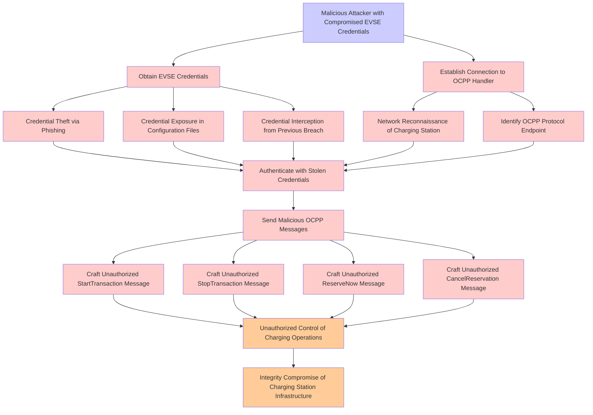

# Attack Tree: Authentication

**Threat ID**: T001
**Statement**: T001 - Authentication

## Attack Tree Diagram

## MITRE ATT&CK Mapping

This attack tree has been mapped to MITRE ATT&CK techniques:

### Establish Connection to OCPP Handler

- **Technique**: [T1028](https://attack.mitre.org/techniques/T1028/) - Windows Remote Management
- **Tactic**: Execution, Lateral Movement
- **Similarity Score**: 38.18%

### Identify OCPP Protocol Endpoint

- **Technique**: [T1065](https://attack.mitre.org/techniques/T1065/) - Uncommonly Used Port
- **Tactic**: Command And Control
- **Similarity Score**: 41.20%

### Credential Exposure in Configuration Files

- **Technique**: [T1552.001](https://attack.mitre.org/techniques/T1552/001/) - Credentials In Files
- **Tactic**: Credential Access
- **Similarity Score**: 41.42%
- **Mitigations (4):**
  - 🛡️ **User Training**
    User Training involves educating employees and contractors on recognizing, reporting, and preventing cyber threats that ...
  - 🛡️ **Audit**
    Auditing is the process of recording activity and systematically reviewing and analyzing the activity and system configu...
  - 🛡️ **Restrict File and Directory Permissions**
    Restricting file and directory permissions involves setting access controls at the file system level to limit which user...
  - *1 more mitigation(s) available*

### Integrity Compromise of Charging Station Infrastructure

- **Technique**: [T1669](https://attack.mitre.org/techniques/T1669/) - Wi-Fi Networks
- **Tactic**: Initial Access
- **Similarity Score**: 34.23%
- **Mitigations (3):**
  - 🛡️ **Multi-factor Authentication**
    Multi-Factor Authentication (MFA) enhances security by requiring users to provide at least two forms of verification to ...
  - 🛡️ **Network Segmentation**
    Network segmentation involves dividing a network into smaller, isolated segments to control and limit the flow of traffi...
  - 🛡️ **Encrypt Sensitive Information**
    Protect sensitive information at rest, in transit, and during processing by using strong encryption algorithms. Encrypti...

### Authenticate with Stolen Credentials

- **Technique**: [T1556](https://attack.mitre.org/techniques/T1556/) - Modify Authentication Process
- **Tactic**: Credential Access, Defense Evasion, Persistence
- **Similarity Score**: 50.17%
- **Mitigations (9):**
  - 🛡️ **Restrict Registry Permissions**
    Restricting registry permissions involves configuring access control settings for sensitive registry keys and hives to e...
  - 🛡️ **Multi-factor Authentication**
    Multi-Factor Authentication (MFA) enhances security by requiring users to provide at least two forms of verification to ...
  - 🛡️ **Password Policies**
    Set and enforce secure password policies for accounts to reduce the likelihood of unauthorized access. Strong password p...
  - *6 more mitigation(s) available*

### Credential Theft via Phishing

- **Technique**: [T1078](https://attack.mitre.org/techniques/T1078/) - Valid Accounts
- **Tactic**: Defense Evasion, Persistence, Privilege Escalation, Initial Access
- **Similarity Score**: 49.81%
- **Mitigations (8):**
  - 🛡️ **Password Policies**
    Set and enforce secure password policies for accounts to reduce the likelihood of unauthorized access. Strong password p...
  - 🛡️ **User Account Management**
    User Account Management involves implementing and enforcing policies for the lifecycle of user accounts, including creat...
  - 🛡️ **Privileged Account Management**
    Privileged Account Management focuses on implementing policies, controls, and tools to securely manage privileged accoun...
  - *5 more mitigation(s) available*

### Obtain EVSE Credentials

- **Technique**: [T1212](https://attack.mitre.org/techniques/T1212/) - Exploitation for Credential Access
- **Tactic**: Credential Access
- **Similarity Score**: 41.91%
- **Mitigations (5):**
  - 🛡️ **Exploit Protection**
    Deploy capabilities that detect, block, and mitigate conditions indicative of software exploits. These capabilities aim ...
  - 🛡️ **Update Software**
    Software updates ensure systems are protected against known vulnerabilities by applying patches and upgrades provided by...
  - 🛡️ **Application Developer Guidance**
    Application Developer Guidance focuses on providing developers with the knowledge, tools, and best practices needed to w...
  - *2 more mitigation(s) available*

### Craft Unauthorized StopTransaction Message

- **Technique**: [T1154](https://attack.mitre.org/techniques/T1154/) - Trap
- **Tactic**: Execution, Persistence
- **Similarity Score**: 31.21%

### Craft Unauthorized ReserveNow Message

- **Technique**: [T1672](https://attack.mitre.org/techniques/T1672/) - Email Spoofing
- **Tactic**: Defense Evasion
- **Similarity Score**: 32.68%
- **Mitigations (1):**
  - 🛡️ **Software Configuration**
    Software configuration refers to making security-focused adjustments to the settings of applications, middleware, databa...

### Malicious Attacker with Compromised EVSE Credentials

- **Technique**: [T1190](https://attack.mitre.org/techniques/T1190/) - Exploit Public-Facing Application
- **Tactic**: Initial Access
- **Similarity Score**: 43.95%
- **Mitigations (8):**
  - 🛡️ **Application Isolation and Sandboxing**
    Application Isolation and Sandboxing refers to the technique of restricting the execution of code to a controlled and is...
  - 🛡️ **Filter Network Traffic**
    Employ network appliances and endpoint software to filter ingress, egress, and lateral network traffic. This includes pr...
  - 🛡️ **Network Segmentation**
    Network segmentation involves dividing a network into smaller, isolated segments to control and limit the flow of traffi...
  - *5 more mitigation(s) available*

### Send Malicious OCPP Messages

- **Technique**: [T1065](https://attack.mitre.org/techniques/T1065/) - Uncommonly Used Port
- **Tactic**: Command And Control
- **Similarity Score**: 43.44%

### Credential Interception from Previous Breach

- **Technique**: [T1555](https://attack.mitre.org/techniques/T1555/) - Credentials from Password Stores
- **Tactic**: Credential Access
- **Similarity Score**: 44.03%
- **Mitigations (3):**
  - 🛡️ **Privileged Account Management**
    Privileged Account Management focuses on implementing policies, controls, and tools to securely manage privileged accoun...
  - 🛡️ **Update Software**
    Software updates ensure systems are protected against known vulnerabilities by applying patches and upgrades provided by...
  - 🛡️ **Password Policies**
    Set and enforce secure password policies for accounts to reduce the likelihood of unauthorized access. Strong password p...

### Network Reconnaissance of Charging Station

- **Technique**: [T1669](https://attack.mitre.org/techniques/T1669/) - Wi-Fi Networks
- **Tactic**: Initial Access
- **Similarity Score**: 42.54%
- **Mitigations (3):**
  - 🛡️ **Multi-factor Authentication**
    Multi-Factor Authentication (MFA) enhances security by requiring users to provide at least two forms of verification to ...
  - 🛡️ **Network Segmentation**
    Network segmentation involves dividing a network into smaller, isolated segments to control and limit the flow of traffi...
  - 🛡️ **Encrypt Sensitive Information**
    Protect sensitive information at rest, in transit, and during processing by using strong encryption algorithms. Encrypti...

*Total technique mappings: 13 | Mitigations found: 44*

## Attack Path Analysis

Review this attack tree to:
1. Identify critical attack paths
2. Implement appropriate security controls
3. Monitor for indicators
4. Develop incident response procedures

---
*Generated by ThreatForest*
