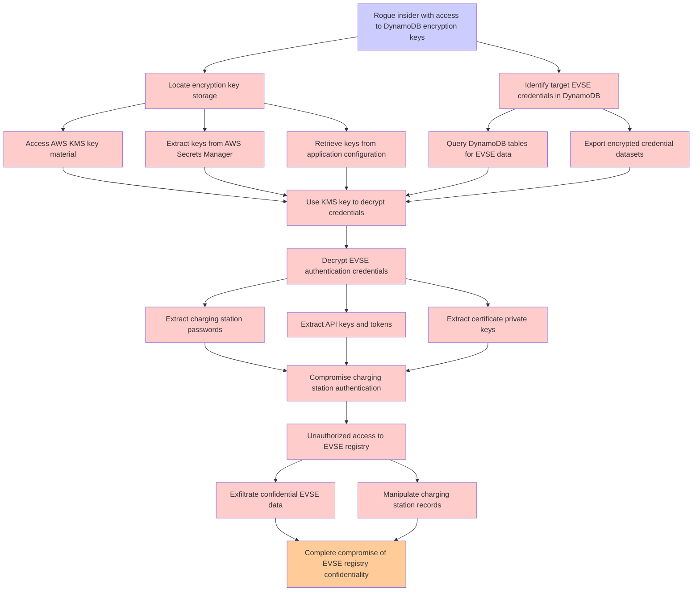

# Attack Tree: Data Exposure

**Threat ID**: T002
**Statement**: A rogue insider with access to DynamoDB encryption keys, can decrypt stored EVSE credentials, which leads to compromise of charging station authentication, resulting in reduced confidentiality of EVSE registry.

## Attack Tree Diagram

## MITRE ATT&CK Mapping

This attack tree has been mapped to MITRE ATT&CK techniques:

### Extract keys from AWS Secrets Manager

- **Technique**: [T1555.006](https://attack.mitre.org/techniques/T1555/006/) - Cloud Secrets Management Stores
- **Tactic**: Credential Access
- **Similarity Score**: 71.25%
- **Mitigations (1):**
  - 🛡️ **Privileged Account Management**
    Privileged Account Management focuses on implementing policies, controls, and tools to securely manage privileged accoun...

### Rogue insider with access to DynamoDB encryption keys

- **Technique**: [T1213.006](https://attack.mitre.org/techniques/T1213/006/) - Databases
- **Tactic**: Collection
- **Similarity Score**: 37.51%
- **Mitigations (5):**
  - 🛡️ **User Training**
    User Training involves educating employees and contractors on recognizing, reporting, and preventing cyber threats that ...
  - 🛡️ **Encrypt Sensitive Information**
    Protect sensitive information at rest, in transit, and during processing by using strong encryption algorithms. Encrypti...
  - 🛡️ **Software Configuration**
    Software configuration refers to making security-focused adjustments to the settings of applications, middleware, databa...
  - *2 more mitigation(s) available*

### Identify target EVSE credentials in DynamoDB

- **Technique**: [T1213.006](https://attack.mitre.org/techniques/T1213/006/) - Databases
- **Tactic**: Collection
- **Similarity Score**: 34.97%
- **Mitigations (5):**
  - 🛡️ **User Training**
    User Training involves educating employees and contractors on recognizing, reporting, and preventing cyber threats that ...
  - 🛡️ **Encrypt Sensitive Information**
    Protect sensitive information at rest, in transit, and during processing by using strong encryption algorithms. Encrypti...
  - 🛡️ **Software Configuration**
    Software configuration refers to making security-focused adjustments to the settings of applications, middleware, databa...
  - *2 more mitigation(s) available*

### Query DynamoDB tables for EVSE data

- **Technique**: [T1213.006](https://attack.mitre.org/techniques/T1213/006/) - Databases
- **Tactic**: Collection
- **Similarity Score**: 42.68%
- **Mitigations (5):**
  - 🛡️ **User Training**
    User Training involves educating employees and contractors on recognizing, reporting, and preventing cyber threats that ...
  - 🛡️ **Encrypt Sensitive Information**
    Protect sensitive information at rest, in transit, and during processing by using strong encryption algorithms. Encrypti...
  - 🛡️ **Software Configuration**
    Software configuration refers to making security-focused adjustments to the settings of applications, middleware, databa...
  - *2 more mitigation(s) available*

### Retrieve keys from application configuration

- **Technique**: [T1098.001](https://attack.mitre.org/techniques/T1098/001/) - Additional Cloud Credentials
- **Tactic**: Persistence, Privilege Escalation
- **Similarity Score**: 37.08%
- **Mitigations (5):**
  - 🛡️ **Multi-factor Authentication**
    Multi-Factor Authentication (MFA) enhances security by requiring users to provide at least two forms of verification to ...
  - 🛡️ **User Account Management**
    User Account Management involves implementing and enforcing policies for the lifecycle of user accounts, including creat...
  - 🛡️ **Network Segmentation**
    Network segmentation involves dividing a network into smaller, isolated segments to control and limit the flow of traffi...
  - *2 more mitigation(s) available*

### Export encrypted credential datasets

- **Technique**: [T1555.006](https://attack.mitre.org/techniques/T1555/006/) - Cloud Secrets Management Stores
- **Tactic**: Credential Access
- **Similarity Score**: 43.36%
- **Mitigations (1):**
  - 🛡️ **Privileged Account Management**
    Privileged Account Management focuses on implementing policies, controls, and tools to securely manage privileged accoun...

### Compromise charging station authentication

- **Technique**: [T1111](https://attack.mitre.org/techniques/T1111/) - Multi-Factor Authentication Interception
- **Tactic**: Credential Access
- **Similarity Score**: 38.26%
- **Mitigations (1):**
  - 🛡️ **User Training**
    User Training involves educating employees and contractors on recognizing, reporting, and preventing cyber threats that ...

### Manipulate charging station records

- **Technique**: [T1111](https://attack.mitre.org/techniques/T1111/) - Multi-Factor Authentication Interception
- **Tactic**: Credential Access
- **Similarity Score**: 39.40%
- **Mitigations (1):**
  - 🛡️ **User Training**
    User Training involves educating employees and contractors on recognizing, reporting, and preventing cyber threats that ...

### Unauthorized access to EVSE registry

- **Technique**: [T1058](https://attack.mitre.org/techniques/T1058/) - Service Registry Permissions Weakness
- **Tactic**: Persistence, Privilege Escalation
- **Similarity Score**: 40.31%

### Access AWS KMS key material

- **Technique**: [T1021.004](https://attack.mitre.org/techniques/T1021/004/) - SSH
- **Tactic**: Lateral Movement
- **Similarity Score**: 51.21%
- **Mitigations (3):**
  - 🛡️ **Disable or Remove Feature or Program**
    Disable or remove unnecessary and potentially vulnerable software, features, or services to reduce the attack surface an...
  - 🛡️ **Multi-factor Authentication**
    Multi-Factor Authentication (MFA) enhances security by requiring users to provide at least two forms of verification to ...
  - 🛡️ **User Account Management**
    User Account Management involves implementing and enforcing policies for the lifecycle of user accounts, including creat...

### Extract certificate private keys

- **Technique**: [T1587.003](https://attack.mitre.org/techniques/T1587/003/) - Digital Certificates
- **Tactic**: Resource Development
- **Similarity Score**: 63.20%
- **Mitigations (1):**
  - 🛡️ **Pre-compromise**
    Pre-compromise mitigations involve proactive measures and defenses implemented to prevent adversaries from successfully ...

### Locate encryption key storage

- **Technique**: [T1552.004](https://attack.mitre.org/techniques/T1552/004/) - Private Keys
- **Tactic**: Credential Access
- **Similarity Score**: 38.25%
- **Mitigations (4):**
  - 🛡️ **Password Policies**
    Set and enforce secure password policies for accounts to reduce the likelihood of unauthorized access. Strong password p...
  - 🛡️ **Restrict File and Directory Permissions**
    Restricting file and directory permissions involves setting access controls at the file system level to limit which user...
  - 🛡️ **Audit**
    Auditing is the process of recording activity and systematically reviewing and analyzing the activity and system configu...
  - *1 more mitigation(s) available*

### Decrypt EVSE authentication credentials

- **Technique**: [T1556](https://attack.mitre.org/techniques/T1556/) - Modify Authentication Process
- **Tactic**: Credential Access, Defense Evasion, Persistence
- **Similarity Score**: 39.15%
- **Mitigations (9):**
  - 🛡️ **Restrict Registry Permissions**
    Restricting registry permissions involves configuring access control settings for sensitive registry keys and hives to e...
  - 🛡️ **Multi-factor Authentication**
    Multi-Factor Authentication (MFA) enhances security by requiring users to provide at least two forms of verification to ...
  - 🛡️ **Password Policies**
    Set and enforce secure password policies for accounts to reduce the likelihood of unauthorized access. Strong password p...
  - *6 more mitigation(s) available*

### Extract charging station passwords

- **Technique**: [T1016.002](https://attack.mitre.org/techniques/T1016/002/) - Wi-Fi Discovery
- **Tactic**: Discovery
- **Similarity Score**: 46.61%

### Complete compromise of EVSE registry confidentiality

- **Technique**: [T1495](https://attack.mitre.org/techniques/T1495/) - Firmware Corruption
- **Tactic**: Impact
- **Similarity Score**: 36.27%
- **Mitigations (3):**
  - 🛡️ **Update Software**
    Software updates ensure systems are protected against known vulnerabilities by applying patches and upgrades provided by...
  - 🛡️ **Privileged Account Management**
    Privileged Account Management focuses on implementing policies, controls, and tools to securely manage privileged accoun...
  - 🛡️ **Boot Integrity**
    Boot Integrity ensures that a system starts securely by verifying the integrity of its boot process, operating system, a...

### Extract API keys and tokens

- **Technique**: [T1550.001](https://attack.mitre.org/techniques/T1550/001/) - Application Access Token
- **Tactic**: Defense Evasion, Lateral Movement
- **Similarity Score**: 52.06%
- **Mitigations (5):**
  - 🛡️ **Account Use Policies**
    Account Use Policies help mitigate unauthorized access by configuring and enforcing rules that govern how and when accou...
  - 🛡️ **Audit**
    Auditing is the process of recording activity and systematically reviewing and analyzing the activity and system configu...
  - 🛡️ **Restrict Web-Based Content**
    Restricting web-based content involves enforcing policies and technologies that limit access to potentially malicious we...
  - *2 more mitigation(s) available*

### Exfiltrate confidential EVSE data

- **Technique**: [T1022](https://attack.mitre.org/techniques/T1022/) - Data Encrypted
- **Tactic**: Exfiltration
- **Similarity Score**: 42.88%

### Use KMS key to decrypt credentials

- **Technique**: [T1573.002](https://attack.mitre.org/techniques/T1573/002/) - Asymmetric Cryptography
- **Tactic**: Command And Control
- **Similarity Score**: 51.58%
- **Mitigations (2):**
  - 🛡️ **Network Intrusion Prevention**
    Use intrusion detection signatures to block traffic at network boundaries.
  - 🛡️ **SSL/TLS Inspection**
    SSL/TLS inspection involves decrypting encrypted network traffic to examine its content for signs of malicious activity....

*Total technique mappings: 18 | Mitigations found: 51*

## Attack Path Analysis

Review this attack tree to:
1. Identify critical attack paths
2. Implement appropriate security controls
3. Monitor for indicators
4. Develop incident response procedures

---
*Generated by ThreatForest*
