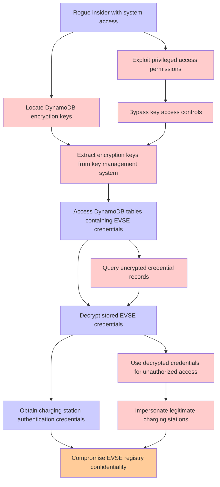

# Attack Tree: Data Exposure

**Threat ID**: T002
**Statement**: T002 - Data Exposure

## Attack Tree Diagram

## MITRE ATT&CK Mapping

This attack tree has been mapped to MITRE ATT&CK techniques:

### Bypass key access controls

- **Technique**: [T1556](https://attack.mitre.org/techniques/T1556/) - Modify Authentication Process
- **Tactic**: Credential Access, Defense Evasion, Persistence
- **Similarity Score**: 40.13%
- **Mitigations (9):**
  - 🛡️ **Restrict Registry Permissions**
    Restricting registry permissions involves configuring access control settings for sensitive registry keys and hives to e...
  - 🛡️ **Multi-factor Authentication**
    Multi-Factor Authentication (MFA) enhances security by requiring users to provide at least two forms of verification to ...
  - 🛡️ **Password Policies**
    Set and enforce secure password policies for accounts to reduce the likelihood of unauthorized access. Strong password p...
  - *6 more mitigation(s) available*

### Impersonate legitimate charging stations

- **Technique**: [T1496.003](https://attack.mitre.org/techniques/T1496/003/) - SMS Pumping
- **Tactic**: Impact
- **Similarity Score**: 37.05%
- **Mitigations (1):**
  - 🛡️ **Application Developer Guidance**
    Application Developer Guidance focuses on providing developers with the knowledge, tools, and best practices needed to w...

### Query encrypted credential records

- **Technique**: [T1555.006](https://attack.mitre.org/techniques/T1555/006/) - Cloud Secrets Management Stores
- **Tactic**: Credential Access
- **Similarity Score**: 38.75%
- **Mitigations (1):**
  - 🛡️ **Privileged Account Management**
    Privileged Account Management focuses on implementing policies, controls, and tools to securely manage privileged accoun...

### Access DynamoDB tables containing EVSE credentials

- **Technique**: [T1213.006](https://attack.mitre.org/techniques/T1213/006/) - Databases
- **Tactic**: Collection
- **Similarity Score**: 40.38%
- **Mitigations (5):**
  - 🛡️ **User Training**
    User Training involves educating employees and contractors on recognizing, reporting, and preventing cyber threats that ...
  - 🛡️ **Encrypt Sensitive Information**
    Protect sensitive information at rest, in transit, and during processing by using strong encryption algorithms. Encrypti...
  - 🛡️ **Software Configuration**
    Software configuration refers to making security-focused adjustments to the settings of applications, middleware, databa...
  - *2 more mitigation(s) available*

### Exploit privileged access permissions

- **Technique**: [T1556](https://attack.mitre.org/techniques/T1556/) - Modify Authentication Process
- **Tactic**: Credential Access, Defense Evasion, Persistence
- **Similarity Score**: 40.69%
- **Mitigations (9):**
  - 🛡️ **Restrict Registry Permissions**
    Restricting registry permissions involves configuring access control settings for sensitive registry keys and hives to e...
  - 🛡️ **Multi-factor Authentication**
    Multi-Factor Authentication (MFA) enhances security by requiring users to provide at least two forms of verification to ...
  - 🛡️ **Password Policies**
    Set and enforce secure password policies for accounts to reduce the likelihood of unauthorized access. Strong password p...
  - *6 more mitigation(s) available*

### Use decrypted credentials for unauthorized access

- **Technique**: [T1552](https://attack.mitre.org/techniques/T1552/) - Unsecured Credentials
- **Tactic**: Credential Access
- **Similarity Score**: 50.90%
- **Mitigations (11):**
  - 🛡️ **Encrypt Sensitive Information**
    Protect sensitive information at rest, in transit, and during processing by using strong encryption algorithms. Encrypti...
  - 🛡️ **Update Software**
    Software updates ensure systems are protected against known vulnerabilities by applying patches and upgrades provided by...
  - 🛡️ **User Training**
    User Training involves educating employees and contractors on recognizing, reporting, and preventing cyber threats that ...
  - *8 more mitigation(s) available*

### Locate DynamoDB encryption keys

- **Technique**: [T1213.006](https://attack.mitre.org/techniques/T1213/006/) - Databases
- **Tactic**: Collection
- **Similarity Score**: 39.62%
- **Mitigations (5):**
  - 🛡️ **User Training**
    User Training involves educating employees and contractors on recognizing, reporting, and preventing cyber threats that ...
  - 🛡️ **Encrypt Sensitive Information**
    Protect sensitive information at rest, in transit, and during processing by using strong encryption algorithms. Encrypti...
  - 🛡️ **Software Configuration**
    Software configuration refers to making security-focused adjustments to the settings of applications, middleware, databa...
  - *2 more mitigation(s) available*

### Compromise EVSE registry confidentiality

- **Technique**: [T1495](https://attack.mitre.org/techniques/T1495/) - Firmware Corruption
- **Tactic**: Impact
- **Similarity Score**: 37.66%
- **Mitigations (3):**
  - 🛡️ **Update Software**
    Software updates ensure systems are protected against known vulnerabilities by applying patches and upgrades provided by...
  - 🛡️ **Privileged Account Management**
    Privileged Account Management focuses on implementing policies, controls, and tools to securely manage privileged accoun...
  - 🛡️ **Boot Integrity**
    Boot Integrity ensures that a system starts securely by verifying the integrity of its boot process, operating system, a...

### Obtain charging station authentication credentials

- **Technique**: [T1098.005](https://attack.mitre.org/techniques/T1098/005/) - Device Registration
- **Tactic**: Persistence, Privilege Escalation
- **Similarity Score**: 45.42%
- **Mitigations (1):**
  - 🛡️ **Multi-factor Authentication**
    Multi-Factor Authentication (MFA) enhances security by requiring users to provide at least two forms of verification to ...

### Extract encryption keys from key management system

- **Technique**: [T1145](https://attack.mitre.org/techniques/T1145/) - Private Keys
- **Tactic**: Credential Access
- **Similarity Score**: 46.84%

### Rogue insider with system access

- **Technique**: [T1078.003](https://attack.mitre.org/techniques/T1078/003/) - Local Accounts
- **Tactic**: Defense Evasion, Persistence, Privilege Escalation, Initial Access
- **Similarity Score**: 35.97%
- **Mitigations (4):**
  - 🛡️ **Privileged Account Management**
    Privileged Account Management focuses on implementing policies, controls, and tools to securely manage privileged accoun...
  - 🛡️ **Multi-factor Authentication**
    Multi-Factor Authentication (MFA) enhances security by requiring users to provide at least two forms of verification to ...
  - 🛡️ **Password Policies**
    Set and enforce secure password policies for accounts to reduce the likelihood of unauthorized access. Strong password p...
  - *1 more mitigation(s) available*

### Decrypt stored EVSE credentials

- **Technique**: [T1556.005](https://attack.mitre.org/techniques/T1556/005/) - Reversible Encryption
- **Tactic**: Credential Access, Defense Evasion, Persistence
- **Similarity Score**: 39.09%
- **Mitigations (2):**
  - 🛡️ **Privileged Account Management**
    Privileged Account Management focuses on implementing policies, controls, and tools to securely manage privileged accoun...
  - 🛡️ **Password Policies**
    Set and enforce secure password policies for accounts to reduce the likelihood of unauthorized access. Strong password p...

*Total technique mappings: 12 | Mitigations found: 51*

## Attack Path Analysis

Review this attack tree to:
1. Identify critical attack paths
2. Implement appropriate security controls
3. Monitor for indicators
4. Develop incident response procedures

---
*Generated by ThreatForest*
