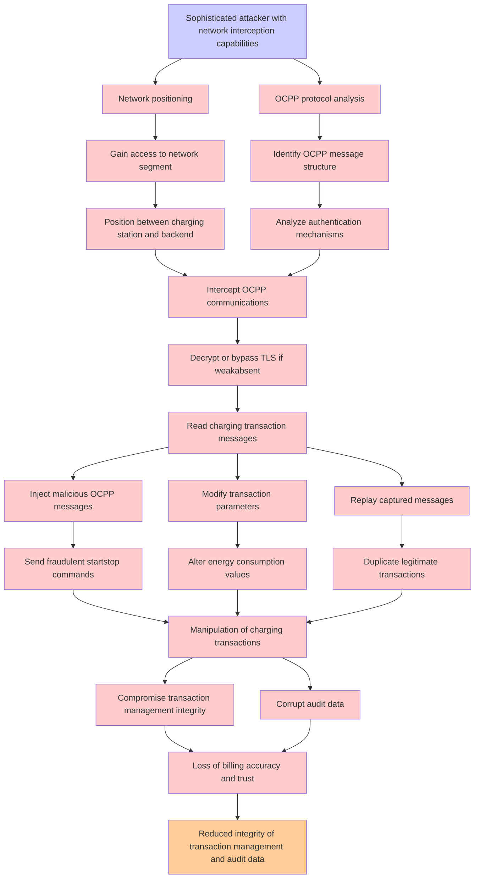

# Attack Tree: Communication Security

**Threat ID**: T003
**Statement**: A sophisticated attacker with network interception capabilities, can perform man-in-the-middle attacks on OCPP communications, which leads to manipulation of charging transactions, resulting in reduced integrity of transaction management and audit data.

## Attack Tree Diagram

## MITRE ATT&CK Mapping

This attack tree has been mapped to MITRE ATT&CK techniques:

### Position between charging station and backend

- **Technique**: [T1098.005](https://attack.mitre.org/techniques/T1098/005/) - Device Registration
- **Tactic**: Persistence, Privilege Escalation
- **Similarity Score**: 33.75%
- **Mitigations (1):**
  - 🛡️ **Multi-factor Authentication**
    Multi-Factor Authentication (MFA) enhances security by requiring users to provide at least two forms of verification to ...

### Intercept OCPP communications

- **Technique**: [T1040](https://attack.mitre.org/techniques/T1040/) - Network Sniffing
- **Tactic**: Credential Access, Discovery
- **Similarity Score**: 47.10%
- **Mitigations (4):**
  - 🛡️ **User Account Management**
    User Account Management involves implementing and enforcing policies for the lifecycle of user accounts, including creat...
  - 🛡️ **Multi-factor Authentication**
    Multi-Factor Authentication (MFA) enhances security by requiring users to provide at least two forms of verification to ...
  - 🛡️ **Encrypt Sensitive Information**
    Protect sensitive information at rest, in transit, and during processing by using strong encryption algorithms. Encrypti...
  - *1 more mitigation(s) available*

### Read charging transaction messages

- **Technique**: [T1098.005](https://attack.mitre.org/techniques/T1098/005/) - Device Registration
- **Tactic**: Persistence, Privilege Escalation
- **Similarity Score**: 30.51%
- **Mitigations (1):**
  - 🛡️ **Multi-factor Authentication**
    Multi-Factor Authentication (MFA) enhances security by requiring users to provide at least two forms of verification to ...

### Manipulation of charging transactions

- **Technique**: [T1078](https://attack.mitre.org/techniques/T1078/) - Valid Accounts
- **Tactic**: Defense Evasion, Persistence, Privilege Escalation, Initial Access
- **Similarity Score**: 36.43%
- **Mitigations (8):**
  - 🛡️ **Password Policies**
    Set and enforce secure password policies for accounts to reduce the likelihood of unauthorized access. Strong password p...
  - 🛡️ **User Account Management**
    User Account Management involves implementing and enforcing policies for the lifecycle of user accounts, including creat...
  - 🛡️ **Privileged Account Management**
    Privileged Account Management focuses on implementing policies, controls, and tools to securely manage privileged accoun...
  - *5 more mitigation(s) available*

### Network positioning

- **Technique**: [T1614](https://attack.mitre.org/techniques/T1614/) - System Location Discovery
- **Tactic**: Discovery
- **Similarity Score**: 38.47%

### Gain access to network segment

- **Technique**: [T1077](https://attack.mitre.org/techniques/T1077/) - Windows Admin Shares
- **Tactic**: Lateral Movement
- **Similarity Score**: 38.89%

### Send fraudulent startstop commands

- **Technique**: [T1013](https://attack.mitre.org/techniques/T1013/) - Port Monitors
- **Tactic**: Persistence, Privilege Escalation
- **Similarity Score**: 42.97%

### Decrypt or bypass TLS if weakabsent

- **Technique**: [T1587.003](https://attack.mitre.org/techniques/T1587/003/) - Digital Certificates
- **Tactic**: Resource Development
- **Similarity Score**: 42.43%
- **Mitigations (1):**
  - 🛡️ **Pre-compromise**
    Pre-compromise mitigations involve proactive measures and defenses implemented to prevent adversaries from successfully ...

### Inject malicious OCPP messages

- **Technique**: [T1557.002](https://attack.mitre.org/techniques/T1557/002/) - ARP Cache Poisoning
- **Tactic**: Credential Access, Collection
- **Similarity Score**: 45.25%
- **Mitigations (6):**
  - 🛡️ **Encrypt Sensitive Information**
    Protect sensitive information at rest, in transit, and during processing by using strong encryption algorithms. Encrypti...
  - 🛡️ **Network Intrusion Prevention**
    Use intrusion detection signatures to block traffic at network boundaries.
  - 🛡️ **User Training**
    User Training involves educating employees and contractors on recognizing, reporting, and preventing cyber threats that ...
  - *3 more mitigation(s) available*

### Alter energy consumption values

- **Technique**: [T1499.001](https://attack.mitre.org/techniques/T1499/001/) - OS Exhaustion Flood
- **Tactic**: Impact
- **Similarity Score**: 30.66%
- **Mitigations (1):**
  - 🛡️ **Filter Network Traffic**
    Employ network appliances and endpoint software to filter ingress, egress, and lateral network traffic. This includes pr...

### Sophisticated attacker with network interception capabilities

- **Technique**: [T1040](https://attack.mitre.org/techniques/T1040/) - Network Sniffing
- **Tactic**: Credential Access, Discovery
- **Similarity Score**: 39.48%
- **Mitigations (4):**
  - 🛡️ **User Account Management**
    User Account Management involves implementing and enforcing policies for the lifecycle of user accounts, including creat...
  - 🛡️ **Multi-factor Authentication**
    Multi-Factor Authentication (MFA) enhances security by requiring users to provide at least two forms of verification to ...
  - 🛡️ **Encrypt Sensitive Information**
    Protect sensitive information at rest, in transit, and during processing by using strong encryption algorithms. Encrypti...
  - *1 more mitigation(s) available*

### OCPP protocol analysis

- **Technique**: [T1040](https://attack.mitre.org/techniques/T1040/) - Network Sniffing
- **Tactic**: Credential Access, Discovery
- **Similarity Score**: 30.62%
- **Mitigations (4):**
  - 🛡️ **User Account Management**
    User Account Management involves implementing and enforcing policies for the lifecycle of user accounts, including creat...
  - 🛡️ **Multi-factor Authentication**
    Multi-Factor Authentication (MFA) enhances security by requiring users to provide at least two forms of verification to ...
  - 🛡️ **Encrypt Sensitive Information**
    Protect sensitive information at rest, in transit, and during processing by using strong encryption algorithms. Encrypti...
  - *1 more mitigation(s) available*

*Total technique mappings: 12 | Mitigations found: 30*

## Attack Path Analysis

Review this attack tree to:
1. Identify critical attack paths
2. Implement appropriate security controls
3. Monitor for indicators
4. Develop incident response procedures

---
*Generated by ThreatForest*
