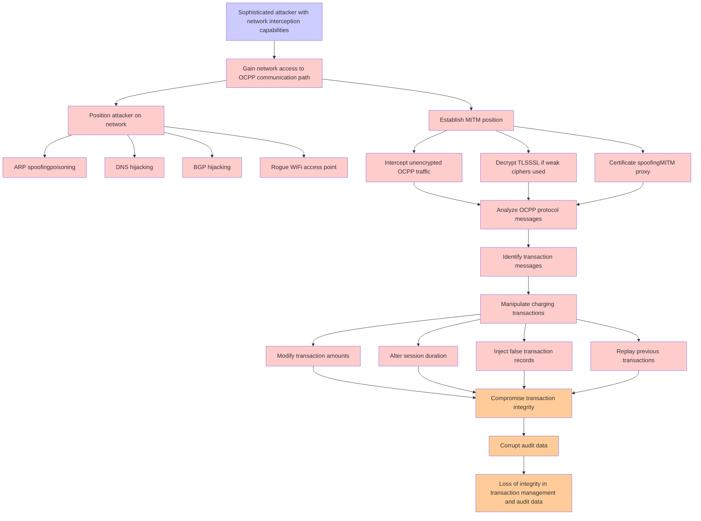

# Attack Tree: Communication Security

**Threat ID**: T003
**Statement**: T003 - Communication Security

## Attack Tree Diagram

## MITRE ATT&CK Mapping

This attack tree has been mapped to MITRE ATT&CK techniques:

### Sophisticated attacker with network interception capabilities

- **Technique**: [T1040](https://attack.mitre.org/techniques/T1040/) - Network Sniffing
- **Tactic**: Credential Access, Discovery
- **Similarity Score**: 39.48%
- **Mitigations (4):**
  - 🛡️ **User Account Management**
    User Account Management involves implementing and enforcing policies for the lifecycle of user accounts, including creat...
  - 🛡️ **Multi-factor Authentication**
    Multi-Factor Authentication (MFA) enhances security by requiring users to provide at least two forms of verification to ...
  - 🛡️ **Encrypt Sensitive Information**
    Protect sensitive information at rest, in transit, and during processing by using strong encryption algorithms. Encrypti...
  - *1 more mitigation(s) available*

### Gain network access to OCPP communication path

- **Technique**: [T1040](https://attack.mitre.org/techniques/T1040/) - Network Sniffing
- **Tactic**: Credential Access, Discovery
- **Similarity Score**: 48.62%
- **Mitigations (4):**
  - 🛡️ **User Account Management**
    User Account Management involves implementing and enforcing policies for the lifecycle of user accounts, including creat...
  - 🛡️ **Multi-factor Authentication**
    Multi-Factor Authentication (MFA) enhances security by requiring users to provide at least two forms of verification to ...
  - 🛡️ **Encrypt Sensitive Information**
    Protect sensitive information at rest, in transit, and during processing by using strong encryption algorithms. Encrypti...
  - *1 more mitigation(s) available*

### Intercept unencrypted OCPP traffic

- **Technique**: [T1040](https://attack.mitre.org/techniques/T1040/) - Network Sniffing
- **Tactic**: Credential Access, Discovery
- **Similarity Score**: 41.90%
- **Mitigations (4):**
  - 🛡️ **User Account Management**
    User Account Management involves implementing and enforcing policies for the lifecycle of user accounts, including creat...
  - 🛡️ **Multi-factor Authentication**
    Multi-Factor Authentication (MFA) enhances security by requiring users to provide at least two forms of verification to ...
  - 🛡️ **Encrypt Sensitive Information**
    Protect sensitive information at rest, in transit, and during processing by using strong encryption algorithms. Encrypti...
  - *1 more mitigation(s) available*

### Certificate spoofingMITM proxy

- **Technique**: [T1608.003](https://attack.mitre.org/techniques/T1608/003/) - Install Digital Certificate
- **Tactic**: Resource Development
- **Similarity Score**: 41.88%
- **Mitigations (1):**
  - 🛡️ **Pre-compromise**
    Pre-compromise mitigations involve proactive measures and defenses implemented to prevent adversaries from successfully ...

### DNS hijacking

- **Technique**: [T1071.004](https://attack.mitre.org/techniques/T1071/004/) - DNS
- **Tactic**: Command And Control
- **Similarity Score**: 49.62%
- **Mitigations (2):**
  - 🛡️ **Filter Network Traffic**
    Employ network appliances and endpoint software to filter ingress, egress, and lateral network traffic. This includes pr...
  - 🛡️ **Network Intrusion Prevention**
    Use intrusion detection signatures to block traffic at network boundaries.

### Analyze OCPP protocol messages

- **Technique**: [T1188](https://attack.mitre.org/techniques/T1188/) - Multi-hop Proxy
- **Tactic**: Command And Control
- **Similarity Score**: 31.00%

### Loss of integrity in transaction management and audit data

- **Technique**: [T1495](https://attack.mitre.org/techniques/T1495/) - Firmware Corruption
- **Tactic**: Impact
- **Similarity Score**: 35.77%
- **Mitigations (3):**
  - 🛡️ **Update Software**
    Software updates ensure systems are protected against known vulnerabilities by applying patches and upgrades provided by...
  - 🛡️ **Privileged Account Management**
    Privileged Account Management focuses on implementing policies, controls, and tools to securely manage privileged accoun...
  - 🛡️ **Boot Integrity**
    Boot Integrity ensures that a system starts securely by verifying the integrity of its boot process, operating system, a...

### Manipulate charging transactions

- **Technique**: [T1078](https://attack.mitre.org/techniques/T1078/) - Valid Accounts
- **Tactic**: Defense Evasion, Persistence, Privilege Escalation, Initial Access
- **Similarity Score**: 34.82%
- **Mitigations (8):**
  - 🛡️ **Password Policies**
    Set and enforce secure password policies for accounts to reduce the likelihood of unauthorized access. Strong password p...
  - 🛡️ **User Account Management**
    User Account Management involves implementing and enforcing policies for the lifecycle of user accounts, including creat...
  - 🛡️ **Privileged Account Management**
    Privileged Account Management focuses on implementing policies, controls, and tools to securely manage privileged accoun...
  - *5 more mitigation(s) available*

### BGP hijacking

- **Technique**: [T1557.002](https://attack.mitre.org/techniques/T1557/002/) - ARP Cache Poisoning
- **Tactic**: Credential Access, Collection
- **Similarity Score**: 44.21%
- **Mitigations (6):**
  - 🛡️ **Encrypt Sensitive Information**
    Protect sensitive information at rest, in transit, and during processing by using strong encryption algorithms. Encrypti...
  - 🛡️ **Network Intrusion Prevention**
    Use intrusion detection signatures to block traffic at network boundaries.
  - 🛡️ **User Training**
    User Training involves educating employees and contractors on recognizing, reporting, and preventing cyber threats that ...
  - *3 more mitigation(s) available*

### Position attacker on network

- **Technique**: [T1005](https://attack.mitre.org/techniques/T1005/) - Data from Local System
- **Tactic**: Collection
- **Similarity Score**: 31.33%
- **Mitigations (1):**
  - 🛡️ **Data Loss Prevention**
    Data Loss Prevention (DLP) involves implementing strategies and technologies to identify, categorize, monitor, and contr...

### Rogue WiFi access point

- **Technique**: [T1584.008](https://attack.mitre.org/techniques/T1584/008/) - Network Devices
- **Tactic**: Resource Development
- **Similarity Score**: 45.34%
- **Mitigations (1):**
  - 🛡️ **Pre-compromise**
    Pre-compromise mitigations involve proactive measures and defenses implemented to prevent adversaries from successfully ...

### ARP spoofingpoisoning

- **Technique**: [T1557.002](https://attack.mitre.org/techniques/T1557/002/) - ARP Cache Poisoning
- **Tactic**: Credential Access, Collection
- **Similarity Score**: 54.28%
- **Mitigations (6):**
  - 🛡️ **Encrypt Sensitive Information**
    Protect sensitive information at rest, in transit, and during processing by using strong encryption algorithms. Encrypti...
  - 🛡️ **Network Intrusion Prevention**
    Use intrusion detection signatures to block traffic at network boundaries.
  - 🛡️ **User Training**
    User Training involves educating employees and contractors on recognizing, reporting, and preventing cyber threats that ...
  - *3 more mitigation(s) available*

### Decrypt TLSSSL if weak ciphers used

- **Technique**: [T1600.002](https://attack.mitre.org/techniques/T1600/002/) - Disable Crypto Hardware
- **Tactic**: Defense Evasion
- **Similarity Score**: 31.35%

### Alter session duration

- **Technique**: [T1499.001](https://attack.mitre.org/techniques/T1499/001/) - OS Exhaustion Flood
- **Tactic**: Impact
- **Similarity Score**: 41.25%
- **Mitigations (1):**
  - 🛡️ **Filter Network Traffic**
    Employ network appliances and endpoint software to filter ingress, egress, and lateral network traffic. This includes pr...

*Total technique mappings: 14 | Mitigations found: 41*

## Attack Path Analysis

Review this attack tree to:
1. Identify critical attack paths
2. Implement appropriate security controls
3. Monitor for indicators
4. Develop incident response procedures

---
*Generated by ThreatForest*
