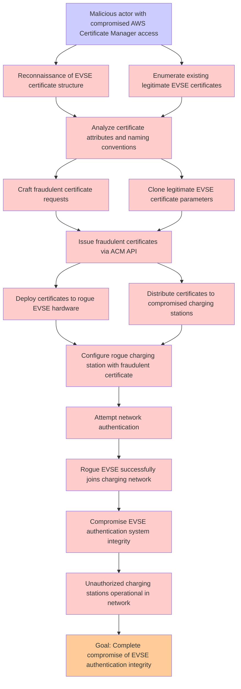

# Attack Tree: Certificate Management

**Threat ID**: T004
**Statement**: A malicious actor with compromised AWS Certificate Manager access, can issue fraudulent certificates for unauthorized EVSEs, which leads to rogue charging stations joining the network, resulting in reduced integrity of EVSE authentication system.

## Attack Tree Diagram

## MITRE ATT&CK Mapping

This attack tree has been mapped to MITRE ATT&CK techniques:

### Enumerate existing legitimate EVSE certificates

- **Technique**: [T1596.003](https://attack.mitre.org/techniques/T1596/003/) - Digital Certificates
- **Tactic**: Reconnaissance
- **Similarity Score**: 44.92%
- **Mitigations (1):**
  - 🛡️ **Pre-compromise**
    Pre-compromise mitigations involve proactive measures and defenses implemented to prevent adversaries from successfully ...

### Reconnaissance of EVSE certificate structure

- **Technique**: [T1596.003](https://attack.mitre.org/techniques/T1596/003/) - Digital Certificates
- **Tactic**: Reconnaissance
- **Similarity Score**: 46.19%
- **Mitigations (1):**
  - 🛡️ **Pre-compromise**
    Pre-compromise mitigations involve proactive measures and defenses implemented to prevent adversaries from successfully ...

### Craft fraudulent certificate requests

- **Technique**: [T1587.003](https://attack.mitre.org/techniques/T1587/003/) - Digital Certificates
- **Tactic**: Resource Development
- **Similarity Score**: 46.70%
- **Mitigations (1):**
  - 🛡️ **Pre-compromise**
    Pre-compromise mitigations involve proactive measures and defenses implemented to prevent adversaries from successfully ...

### Compromise EVSE authentication system integrity

- **Technique**: [T1649](https://attack.mitre.org/techniques/T1649/) - Steal or Forge Authentication Certificates
- **Tactic**: Credential Access
- **Similarity Score**: 38.68%
- **Mitigations (4):**
  - 🛡️ **Active Directory Configuration**
    Implement robust Active Directory (AD) configurations using group policies to secure user accounts, control access, and ...
  - 🛡️ **Disable or Remove Feature or Program**
    Disable or remove unnecessary and potentially vulnerable software, features, or services to reduce the attack surface an...
  - 🛡️ **Encrypt Sensitive Information**
    Protect sensitive information at rest, in transit, and during processing by using strong encryption algorithms. Encrypti...
  - *1 more mitigation(s) available*

### Rogue EVSE successfully joins charging network

- **Technique**: [T1584.008](https://attack.mitre.org/techniques/T1584/008/) - Network Devices
- **Tactic**: Resource Development
- **Similarity Score**: 39.21%
- **Mitigations (1):**
  - 🛡️ **Pre-compromise**
    Pre-compromise mitigations involve proactive measures and defenses implemented to prevent adversaries from successfully ...

### Analyze certificate attributes and naming conventions

- **Technique**: [T1587.003](https://attack.mitre.org/techniques/T1587/003/) - Digital Certificates
- **Tactic**: Resource Development
- **Similarity Score**: 52.28%
- **Mitigations (1):**
  - 🛡️ **Pre-compromise**
    Pre-compromise mitigations involve proactive measures and defenses implemented to prevent adversaries from successfully ...

### Attempt network authentication

- **Technique**: [T1021.004](https://attack.mitre.org/techniques/T1021/004/) - SSH
- **Tactic**: Lateral Movement
- **Similarity Score**: 36.53%
- **Mitigations (3):**
  - 🛡️ **Disable or Remove Feature or Program**
    Disable or remove unnecessary and potentially vulnerable software, features, or services to reduce the attack surface an...
  - 🛡️ **Multi-factor Authentication**
    Multi-Factor Authentication (MFA) enhances security by requiring users to provide at least two forms of verification to ...
  - 🛡️ **User Account Management**
    User Account Management involves implementing and enforcing policies for the lifecycle of user accounts, including creat...

### Configure rogue charging station with fraudulent certificate

- **Technique**: [T1098.005](https://attack.mitre.org/techniques/T1098/005/) - Device Registration
- **Tactic**: Persistence, Privilege Escalation
- **Similarity Score**: 42.24%
- **Mitigations (1):**
  - 🛡️ **Multi-factor Authentication**
    Multi-Factor Authentication (MFA) enhances security by requiring users to provide at least two forms of verification to ...

### Goal: Complete compromise of EVSE authentication integrity

- **Technique**: [T1068](https://attack.mitre.org/techniques/T1068/) - Exploitation for Privilege Escalation
- **Tactic**: Privilege Escalation
- **Similarity Score**: 38.15%
- **Mitigations (5):**
  - 🛡️ **Update Software**
    Software updates ensure systems are protected against known vulnerabilities by applying patches and upgrades provided by...
  - 🛡️ **Exploit Protection**
    Deploy capabilities that detect, block, and mitigate conditions indicative of software exploits. These capabilities aim ...
  - 🛡️ **Application Isolation and Sandboxing**
    Application Isolation and Sandboxing refers to the technique of restricting the execution of code to a controlled and is...
  - *2 more mitigation(s) available*

### Clone legitimate EVSE certificate parameters

- **Technique**: [T1130](https://attack.mitre.org/techniques/T1130/) - Install Root Certificate
- **Tactic**: Defense Evasion
- **Similarity Score**: 42.44%

### Distribute certificates to compromised charging stations

- **Technique**: [T1098.005](https://attack.mitre.org/techniques/T1098/005/) - Device Registration
- **Tactic**: Persistence, Privilege Escalation
- **Similarity Score**: 42.80%
- **Mitigations (1):**
  - 🛡️ **Multi-factor Authentication**
    Multi-Factor Authentication (MFA) enhances security by requiring users to provide at least two forms of verification to ...

### Unauthorized charging stations operational in network

- **Technique**: [T1557.004](https://attack.mitre.org/techniques/T1557/004/) - Evil Twin
- **Tactic**: Credential Access, Collection
- **Similarity Score**: 33.99%
- **Mitigations (2):**
  - 🛡️ **Network Intrusion Prevention**
    Use intrusion detection signatures to block traffic at network boundaries.
  - 🛡️ **User Training**
    User Training involves educating employees and contractors on recognizing, reporting, and preventing cyber threats that ...

### Deploy certificates to rogue EVSE hardware

- **Technique**: [T1130](https://attack.mitre.org/techniques/T1130/) - Install Root Certificate
- **Tactic**: Defense Evasion
- **Similarity Score**: 43.09%

### Malicious actor with compromised AWS Certificate Manager access

- **Technique**: [T1587.003](https://attack.mitre.org/techniques/T1587/003/) - Digital Certificates
- **Tactic**: Resource Development
- **Similarity Score**: 38.66%
- **Mitigations (1):**
  - 🛡️ **Pre-compromise**
    Pre-compromise mitigations involve proactive measures and defenses implemented to prevent adversaries from successfully ...

### Issue fraudulent certificates via ACM API

- **Technique**: [T1649](https://attack.mitre.org/techniques/T1649/) - Steal or Forge Authentication Certificates
- **Tactic**: Credential Access
- **Similarity Score**: 49.63%
- **Mitigations (4):**
  - 🛡️ **Active Directory Configuration**
    Implement robust Active Directory (AD) configurations using group policies to secure user accounts, control access, and ...
  - 🛡️ **Disable or Remove Feature or Program**
    Disable or remove unnecessary and potentially vulnerable software, features, or services to reduce the attack surface an...
  - 🛡️ **Encrypt Sensitive Information**
    Protect sensitive information at rest, in transit, and during processing by using strong encryption algorithms. Encrypti...
  - *1 more mitigation(s) available*

*Total technique mappings: 15 | Mitigations found: 26*

## Attack Path Analysis

Review this attack tree to:
1. Identify critical attack paths
2. Implement appropriate security controls
3. Monitor for indicators
4. Develop incident response procedures

---
*Generated by ThreatForest*
