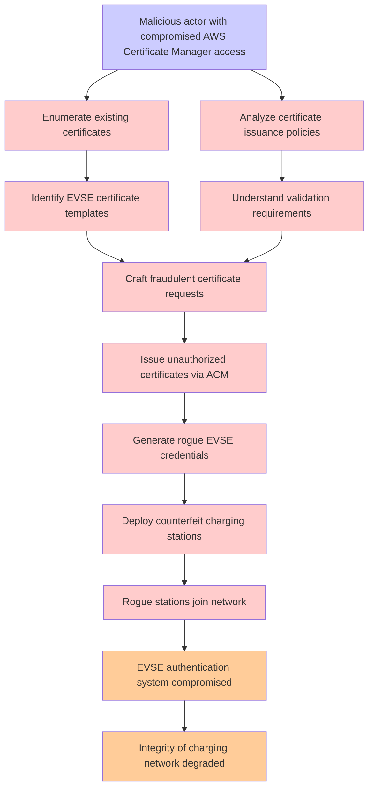

# Attack Tree: Certificate Management

**Threat ID**: T004
**Statement**: T004 - Certificate Management

## Attack Tree Diagram

## MITRE ATT&CK Mapping

This attack tree has been mapped to MITRE ATT&CK techniques:

### Analyze certificate issuance policies

- **Technique**: [T1587.003](https://attack.mitre.org/techniques/T1587/003/) - Digital Certificates
- **Tactic**: Resource Development
- **Similarity Score**: 46.84%
- **Mitigations (1):**
  - 🛡️ **Pre-compromise**
    Pre-compromise mitigations involve proactive measures and defenses implemented to prevent adversaries from successfully ...

### Rogue stations join network

- **Technique**: [T1557.002](https://attack.mitre.org/techniques/T1557/002/) - ARP Cache Poisoning
- **Tactic**: Credential Access, Collection
- **Similarity Score**: 42.47%
- **Mitigations (6):**
  - 🛡️ **Encrypt Sensitive Information**
    Protect sensitive information at rest, in transit, and during processing by using strong encryption algorithms. Encrypti...
  - 🛡️ **Network Intrusion Prevention**
    Use intrusion detection signatures to block traffic at network boundaries.
  - 🛡️ **User Training**
    User Training involves educating employees and contractors on recognizing, reporting, and preventing cyber threats that ...
  - *3 more mitigation(s) available*

### Enumerate existing certificates

- **Technique**: [T1553.004](https://attack.mitre.org/techniques/T1553/004/) - Install Root Certificate
- **Tactic**: Defense Evasion
- **Similarity Score**: 40.78%
- **Mitigations (2):**
  - 🛡️ **Software Configuration**
    Software configuration refers to making security-focused adjustments to the settings of applications, middleware, databa...
  - 🛡️ **Operating System Configuration**
    Operating System Configuration involves adjusting system settings and hardening the default configurations of an operati...

### Malicious actor with compromised AWS Certificate Manager access

- **Technique**: [T1587.003](https://attack.mitre.org/techniques/T1587/003/) - Digital Certificates
- **Tactic**: Resource Development
- **Similarity Score**: 38.66%
- **Mitigations (1):**
  - 🛡️ **Pre-compromise**
    Pre-compromise mitigations involve proactive measures and defenses implemented to prevent adversaries from successfully ...

### Identify EVSE certificate templates

- **Technique**: [T1587.003](https://attack.mitre.org/techniques/T1587/003/) - Digital Certificates
- **Tactic**: Resource Development
- **Similarity Score**: 40.51%
- **Mitigations (1):**
  - 🛡️ **Pre-compromise**
    Pre-compromise mitigations involve proactive measures and defenses implemented to prevent adversaries from successfully ...

### Craft fraudulent certificate requests

- **Technique**: [T1587.003](https://attack.mitre.org/techniques/T1587/003/) - Digital Certificates
- **Tactic**: Resource Development
- **Similarity Score**: 46.70%
- **Mitigations (1):**
  - 🛡️ **Pre-compromise**
    Pre-compromise mitigations involve proactive measures and defenses implemented to prevent adversaries from successfully ...

### Generate rogue EVSE credentials

- **Technique**: [T1212](https://attack.mitre.org/techniques/T1212/) - Exploitation for Credential Access
- **Tactic**: Credential Access
- **Similarity Score**: 35.62%
- **Mitigations (5):**
  - 🛡️ **Exploit Protection**
    Deploy capabilities that detect, block, and mitigate conditions indicative of software exploits. These capabilities aim ...
  - 🛡️ **Update Software**
    Software updates ensure systems are protected against known vulnerabilities by applying patches and upgrades provided by...
  - 🛡️ **Application Developer Guidance**
    Application Developer Guidance focuses on providing developers with the knowledge, tools, and best practices needed to w...
  - *2 more mitigation(s) available*

### Issue unauthorized certificates via ACM

- **Technique**: [T1553.004](https://attack.mitre.org/techniques/T1553/004/) - Install Root Certificate
- **Tactic**: Defense Evasion
- **Similarity Score**: 50.34%
- **Mitigations (2):**
  - 🛡️ **Software Configuration**
    Software configuration refers to making security-focused adjustments to the settings of applications, middleware, databa...
  - 🛡️ **Operating System Configuration**
    Operating System Configuration involves adjusting system settings and hardening the default configurations of an operati...

### Deploy counterfeit charging stations

- **Technique**: [T1098.005](https://attack.mitre.org/techniques/T1098/005/) - Device Registration
- **Tactic**: Persistence, Privilege Escalation
- **Similarity Score**: 33.68%
- **Mitigations (1):**
  - 🛡️ **Multi-factor Authentication**
    Multi-Factor Authentication (MFA) enhances security by requiring users to provide at least two forms of verification to ...

*Total technique mappings: 9 | Mitigations found: 20*

## Attack Path Analysis

Review this attack tree to:
1. Identify critical attack paths
2. Implement appropriate security controls
3. Monitor for indicators
4. Develop incident response procedures

---
*Generated by ThreatForest*
