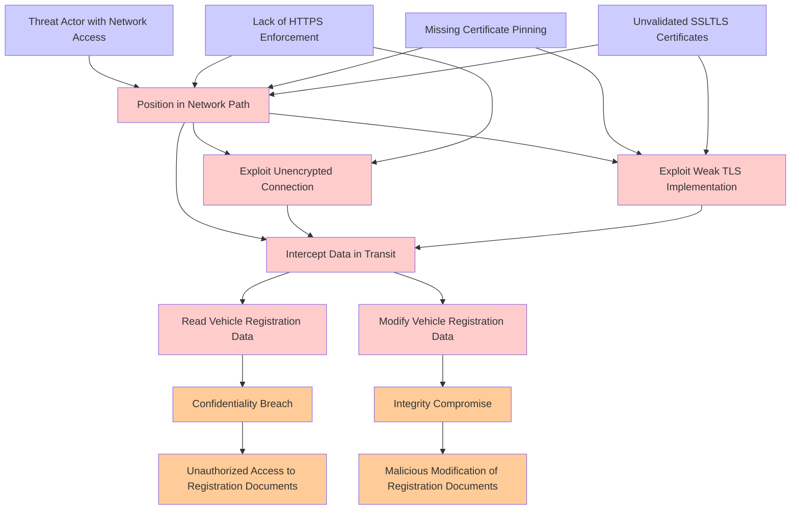

# Attack Tree: Man-in-the-Middle

**Threat ID**: 0d244afc-8cbf-42c6-ac44-6408d41d290c
**Statement**: A threat actor with access to data in transit between the user and the Amazon S3 bucket can read or modify that data, resulting in reduced confidentiality and/or integrity of vehicle registration documents.

## Attack Tree Diagram

## MITRE ATT&CK Mapping

This attack tree has been mapped to MITRE ATT&CK techniques:

### Malicious Modification of Registration Documents

- **Technique**: [T1098.005](https://attack.mitre.org/techniques/T1098/005/) - Device Registration
- **Tactic**: Persistence, Privilege Escalation
- **Similarity Score**: 53.95%
- **Mitigations (1):**
  - 🛡️ **Multi-factor Authentication**
    Multi-Factor Authentication (MFA) enhances security by requiring users to provide at least two forms of verification to ...

### Missing Certificate Pinning

- **Technique**: [T1130](https://attack.mitre.org/techniques/T1130/) - Install Root Certificate
- **Tactic**: Defense Evasion
- **Similarity Score**: 66.32%

### Unauthorized Access to Registration Documents

- **Technique**: [T1098.005](https://attack.mitre.org/techniques/T1098/005/) - Device Registration
- **Tactic**: Persistence, Privilege Escalation
- **Similarity Score**: 52.72%
- **Mitigations (1):**
  - 🛡️ **Multi-factor Authentication**
    Multi-Factor Authentication (MFA) enhances security by requiring users to provide at least two forms of verification to ...

### Threat Actor with Network Access

- **Technique**: [T1108](https://attack.mitre.org/techniques/T1108/) - Redundant Access
- **Tactic**: Defense Evasion, Persistence
- **Similarity Score**: 65.28%

### Read Vehicle Registration Data

- **Technique**: [T1096](https://attack.mitre.org/techniques/T1096/) - NTFS File Attributes
- **Tactic**: Defense Evasion
- **Similarity Score**: 43.02%

### Exploit Weak TLS Implementation

- **Technique**: [T1001.003](https://attack.mitre.org/techniques/T1001/003/) - Protocol or Service Impersonation
- **Tactic**: Command And Control
- **Similarity Score**: 63.58%
- **Mitigations (1):**
  - 🛡️ **Network Intrusion Prevention**
    Use intrusion detection signatures to block traffic at network boundaries.

### Unvalidated SSLTLS Certificates

- **Technique**: [T1553.004](https://attack.mitre.org/techniques/T1553/004/) - Install Root Certificate
- **Tactic**: Defense Evasion
- **Similarity Score**: 67.42%
- **Mitigations (2):**
  - 🛡️ **Software Configuration**
    Software configuration refers to making security-focused adjustments to the settings of applications, middleware, databa...
  - 🛡️ **Operating System Configuration**
    Operating System Configuration involves adjusting system settings and hardening the default configurations of an operati...

### Intercept Data in Transit

- **Technique**: [T1001.003](https://attack.mitre.org/techniques/T1001/003/) - Protocol or Service Impersonation
- **Tactic**: Command And Control
- **Similarity Score**: 64.08%
- **Mitigations (1):**
  - 🛡️ **Network Intrusion Prevention**
    Use intrusion detection signatures to block traffic at network boundaries.

### Lack of HTTPS Enforcement

- **Technique**: [T1608.003](https://attack.mitre.org/techniques/T1608/003/) - Install Digital Certificate
- **Tactic**: Resource Development
- **Similarity Score**: 62.30%
- **Mitigations (1):**
  - 🛡️ **Pre-compromise**
    Pre-compromise mitigations involve proactive measures and defenses implemented to prevent adversaries from successfully ...

### Position in Network Path

- **Technique**: [T1018](https://attack.mitre.org/techniques/T1018/) - Remote System Discovery
- **Tactic**: Discovery
- **Similarity Score**: 67.71%

### Integrity Compromise

- **Technique**: [T1565.003](https://attack.mitre.org/techniques/T1565/003/) - Runtime Data Manipulation
- **Tactic**: Impact
- **Similarity Score**: 59.74%
- **Mitigations (2):**
  - 🛡️ **Network Segmentation**
    Network segmentation involves dividing a network into smaller, isolated segments to control and limit the flow of traffi...
  - 🛡️ **Restrict File and Directory Permissions**
    Restricting file and directory permissions involves setting access controls at the file system level to limit which user...

### Modify Vehicle Registration Data

- **Technique**: [T1565.003](https://attack.mitre.org/techniques/T1565/003/) - Runtime Data Manipulation
- **Tactic**: Impact
- **Similarity Score**: 45.00%
- **Mitigations (2):**
  - 🛡️ **Network Segmentation**
    Network segmentation involves dividing a network into smaller, isolated segments to control and limit the flow of traffi...
  - 🛡️ **Restrict File and Directory Permissions**
    Restricting file and directory permissions involves setting access controls at the file system level to limit which user...

### Exploit Unencrypted Connection

- **Technique**: [T1572](https://attack.mitre.org/techniques/T1572/) - Protocol Tunneling
- **Tactic**: Command And Control
- **Similarity Score**: 74.97%
- **Mitigations (2):**
  - 🛡️ **Filter Network Traffic**
    Employ network appliances and endpoint software to filter ingress, egress, and lateral network traffic. This includes pr...
  - 🛡️ **Network Intrusion Prevention**
    Use intrusion detection signatures to block traffic at network boundaries.

### Confidentiality Breach

- **Technique**: [T1565](https://attack.mitre.org/techniques/T1565/) - Data Manipulation
- **Tactic**: Impact
- **Similarity Score**: 49.82%
- **Mitigations (4):**
  - 🛡️ **Encrypt Sensitive Information**
    Protect sensitive information at rest, in transit, and during processing by using strong encryption algorithms. Encrypti...
  - 🛡️ **Remote Data Storage**
    Remote Data Storage focuses on moving critical data, such as security logs and sensitive files, to secure, off-host loca...
  - 🛡️ **Network Segmentation**
    Network segmentation involves dividing a network into smaller, isolated segments to control and limit the flow of traffi...
  - *1 more mitigation(s) available*

*Total technique mappings: 14 | Mitigations found: 17*

## Attack Path Analysis

Review this attack tree to:
1. Identify critical attack paths
2. Implement appropriate security controls
3. Monitor for indicators
4. Develop incident response procedures

---
*Generated by ThreatForest*
