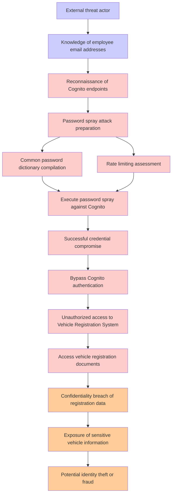

# Attack Tree: Authentication

**Threat ID**: 2df06a4e-b1eb-4303-bb48-46cf05182f58
**Statement**: An external threat actor with knowledge of employee email addresses can password spray Cognito, which leads to unauthorized access to Vehicle Registration System, resulting in reduced confidentiality of vehicle registration documents

## Attack Tree Diagram

## MITRE ATT&CK Mapping

This attack tree has been mapped to MITRE ATT&CK techniques:

### External threat actor

- **Technique**: [T1588.001](https://attack.mitre.org/techniques/T1588/001/) - Malware
- **Tactic**: Resource Development
- **Similarity Score**: 41.53%
- **Mitigations (1):**
  - 🛡️ **Pre-compromise**
    Pre-compromise mitigations involve proactive measures and defenses implemented to prevent adversaries from successfully ...

### Execute password spray against Cognito

- **Technique**: [T1110.003](https://attack.mitre.org/techniques/T1110/003/) - Password Spraying
- **Tactic**: Credential Access
- **Similarity Score**: 83.24%
- **Mitigations (3):**
  - 🛡️ **Multi-factor Authentication**
    Multi-Factor Authentication (MFA) enhances security by requiring users to provide at least two forms of verification to ...
  - 🛡️ **Password Policies**
    Set and enforce secure password policies for accounts to reduce the likelihood of unauthorized access. Strong password p...
  - 🛡️ **Account Use Policies**
    Account Use Policies help mitigate unauthorized access by configuring and enforcing rules that govern how and when accou...

### Password spray attack preparation

- **Technique**: [T1110.003](https://attack.mitre.org/techniques/T1110/003/) - Password Spraying
- **Tactic**: Credential Access
- **Similarity Score**: 81.69%
- **Mitigations (3):**
  - 🛡️ **Multi-factor Authentication**
    Multi-Factor Authentication (MFA) enhances security by requiring users to provide at least two forms of verification to ...
  - 🛡️ **Password Policies**
    Set and enforce secure password policies for accounts to reduce the likelihood of unauthorized access. Strong password p...
  - 🛡️ **Account Use Policies**
    Account Use Policies help mitigate unauthorized access by configuring and enforcing rules that govern how and when accou...

### Reconnaissance of Cognito endpoints

- **Technique**: [T1595](https://attack.mitre.org/techniques/T1595/) - Active Scanning
- **Tactic**: Reconnaissance
- **Similarity Score**: 55.73%
- **Mitigations (1):**
  - 🛡️ **Pre-compromise**
    Pre-compromise mitigations involve proactive measures and defenses implemented to prevent adversaries from successfully ...

### Bypass Cognito authentication

- **Technique**: [T1550](https://attack.mitre.org/techniques/T1550/) - Use Alternate Authentication Material
- **Tactic**: Defense Evasion, Lateral Movement
- **Similarity Score**: 79.89%
- **Mitigations (7):**
  - 🛡️ **Audit**
    Auditing is the process of recording activity and systematically reviewing and analyzing the activity and system configu...
  - 🛡️ **Password Policies**
    Set and enforce secure password policies for accounts to reduce the likelihood of unauthorized access. Strong password p...
  - 🛡️ **Account Use Policies**
    Account Use Policies help mitigate unauthorized access by configuring and enforcing rules that govern how and when accou...
  - *4 more mitigation(s) available*

### Unauthorized access to Vehicle Registration System

- **Technique**: [T1098.005](https://attack.mitre.org/techniques/T1098/005/) - Device Registration
- **Tactic**: Persistence, Privilege Escalation
- **Similarity Score**: 47.17%
- **Mitigations (1):**
  - 🛡️ **Multi-factor Authentication**
    Multi-Factor Authentication (MFA) enhances security by requiring users to provide at least two forms of verification to ...

### Knowledge of employee email addresses

- **Technique**: [T1589.002](https://attack.mitre.org/techniques/T1589/002/) - Email Addresses
- **Tactic**: Reconnaissance
- **Similarity Score**: 83.04%
- **Mitigations (1):**
  - 🛡️ **Pre-compromise**
    Pre-compromise mitigations involve proactive measures and defenses implemented to prevent adversaries from successfully ...

### Potential identity theft or fraud

- **Technique**: [T1657](https://attack.mitre.org/techniques/T1657/) - Financial Theft
- **Tactic**: Impact
- **Similarity Score**: 55.54%
- **Mitigations (2):**
  - 🛡️ **User Training**
    User Training involves educating employees and contractors on recognizing, reporting, and preventing cyber threats that ...
  - 🛡️ **User Account Management**
    User Account Management involves implementing and enforcing policies for the lifecycle of user accounts, including creat...

### Common password dictionary compilation

- **Technique**: [T1556.002](https://attack.mitre.org/techniques/T1556/002/) - Password Filter DLL
- **Tactic**: Credential Access, Defense Evasion, Persistence
- **Similarity Score**: 79.70%
- **Mitigations (1):**
  - 🛡️ **Operating System Configuration**
    Operating System Configuration involves adjusting system settings and hardening the default configurations of an operati...

### Successful credential compromise

- **Technique**: [T1556](https://attack.mitre.org/techniques/T1556/) - Modify Authentication Process
- **Tactic**: Credential Access, Defense Evasion, Persistence
- **Similarity Score**: 77.92%
- **Mitigations (9):**
  - 🛡️ **Restrict Registry Permissions**
    Restricting registry permissions involves configuring access control settings for sensitive registry keys and hives to e...
  - 🛡️ **Multi-factor Authentication**
    Multi-Factor Authentication (MFA) enhances security by requiring users to provide at least two forms of verification to ...
  - 🛡️ **Password Policies**
    Set and enforce secure password policies for accounts to reduce the likelihood of unauthorized access. Strong password p...
  - *6 more mitigation(s) available*

### Confidentiality breach of registration data

- **Technique**: [T1589](https://attack.mitre.org/techniques/T1589/) - Gather Victim Identity Information
- **Tactic**: Reconnaissance
- **Similarity Score**: 52.26%
- **Mitigations (1):**
  - 🛡️ **Pre-compromise**
    Pre-compromise mitigations involve proactive measures and defenses implemented to prevent adversaries from successfully ...

### Exposure of sensitive vehicle information

- **Technique**: [T1597.002](https://attack.mitre.org/techniques/T1597/002/) - Purchase Technical Data
- **Tactic**: Reconnaissance
- **Similarity Score**: 49.80%
- **Mitigations (1):**
  - 🛡️ **Pre-compromise**
    Pre-compromise mitigations involve proactive measures and defenses implemented to prevent adversaries from successfully ...

### Rate limiting assessment

- **Technique**: [T1499.001](https://attack.mitre.org/techniques/T1499/001/) - OS Exhaustion Flood
- **Tactic**: Impact
- **Similarity Score**: 48.77%
- **Mitigations (1):**
  - 🛡️ **Filter Network Traffic**
    Employ network appliances and endpoint software to filter ingress, egress, and lateral network traffic. This includes pr...

### Access vehicle registration documents

- **Technique**: [T1602](https://attack.mitre.org/techniques/T1602/) - Data from Configuration Repository
- **Tactic**: Collection
- **Similarity Score**: 40.48%
- **Mitigations (6):**
  - 🛡️ **Update Software**
    Software updates ensure systems are protected against known vulnerabilities by applying patches and upgrades provided by...
  - 🛡️ **Software Configuration**
    Software configuration refers to making security-focused adjustments to the settings of applications, middleware, databa...
  - 🛡️ **Network Segmentation**
    Network segmentation involves dividing a network into smaller, isolated segments to control and limit the flow of traffi...
  - *3 more mitigation(s) available*

*Total technique mappings: 14 | Mitigations found: 38*

## Attack Path Analysis

Review this attack tree to:
1. Identify critical attack paths
2. Implement appropriate security controls
3. Monitor for indicators
4. Develop incident response procedures

---
*Generated by ThreatForest*
