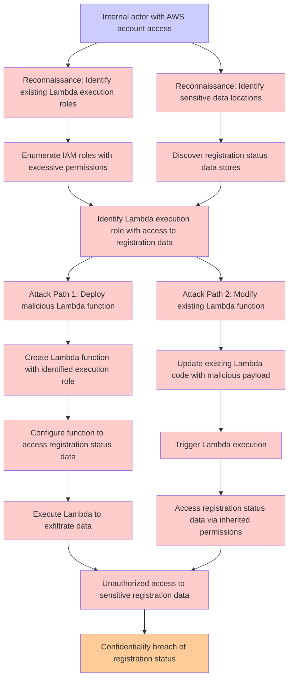

# Attack Tree: Authorization

**Threat ID**: 9b4dbea5-ccaa-41ea-a057-c6dd47f99523
**Statement**: An internal actor with access to the AWS account can deploy a lambda function that will use existing execution role, which leads to unauthorised access to sensitive data, resulting in reduced confidentiality of registration status

## Attack Tree Diagram

## MITRE ATT&CK Mapping

This attack tree has been mapped to MITRE ATT&CK techniques:

### Enumerate IAM roles with excessive permissions

- **Technique**: [T1069.002](https://attack.mitre.org/techniques/T1069/002/) - Domain Groups
- **Tactic**: Discovery
- **Similarity Score**: 75.73%

### Update existing Lambda code with malicious payload

- **Technique**: [T1648](https://attack.mitre.org/techniques/T1648/) - Serverless Execution
- **Tactic**: Execution
- **Similarity Score**: 40.79%
- **Mitigations (2):**
  - 🛡️ **Account Use Policies**
    Account Use Policies help mitigate unauthorized access by configuring and enforcing rules that govern how and when accou...
  - 🛡️ **User Account Management**
    User Account Management involves implementing and enforcing policies for the lifecycle of user accounts, including creat...

### Reconnaissance: Identify sensitive data locations

- **Technique**: [T1005](https://attack.mitre.org/techniques/T1005/) - Data from Local System
- **Tactic**: Collection
- **Similarity Score**: 75.73%
- **Mitigations (1):**
  - 🛡️ **Data Loss Prevention**
    Data Loss Prevention (DLP) involves implementing strategies and technologies to identify, categorize, monitor, and contr...

### Trigger Lambda execution

- **Technique**: [T1055.004](https://attack.mitre.org/techniques/T1055/004/) - Asynchronous Procedure Call
- **Tactic**: Defense Evasion, Privilege Escalation
- **Similarity Score**: 32.78%
- **Mitigations (1):**
  - 🛡️ **Behavior Prevention on Endpoint**
    Behavior Prevention on Endpoint refers to the use of technologies and strategies to detect and block potentially malicio...

### Identify Lambda execution role with access to registration data

- **Technique**: [T1069.003](https://attack.mitre.org/techniques/T1069/003/) - Cloud Groups
- **Tactic**: Discovery
- **Similarity Score**: 62.10%

### Discover registration status data stores

- **Technique**: [T1087](https://attack.mitre.org/techniques/T1087/) - Account Discovery
- **Tactic**: Discovery
- **Similarity Score**: 53.83%
- **Mitigations (2):**
  - 🛡️ **Operating System Configuration**
    Operating System Configuration involves adjusting system settings and hardening the default configurations of an operati...
  - 🛡️ **User Account Management**
    User Account Management involves implementing and enforcing policies for the lifecycle of user accounts, including creat...

### Attack Path 1: Deploy malicious Lambda function

- **Technique**: [T1608](https://attack.mitre.org/techniques/T1608/) - Stage Capabilities
- **Tactic**: Resource Development
- **Similarity Score**: 41.74%
- **Mitigations (1):**
  - 🛡️ **Pre-compromise**
    Pre-compromise mitigations involve proactive measures and defenses implemented to prevent adversaries from successfully ...

### Unauthorized access to sensitive registration data

- **Technique**: [T1586](https://attack.mitre.org/techniques/T1586/) - Compromise Accounts
- **Tactic**: Resource Development
- **Similarity Score**: 53.69%
- **Mitigations (1):**
  - 🛡️ **Pre-compromise**
    Pre-compromise mitigations involve proactive measures and defenses implemented to prevent adversaries from successfully ...

### Configure function to access registration status data

- **Technique**: [T1087](https://attack.mitre.org/techniques/T1087/) - Account Discovery
- **Tactic**: Discovery
- **Similarity Score**: 45.37%
- **Mitigations (2):**
  - 🛡️ **Operating System Configuration**
    Operating System Configuration involves adjusting system settings and hardening the default configurations of an operati...
  - 🛡️ **User Account Management**
    User Account Management involves implementing and enforcing policies for the lifecycle of user accounts, including creat...

### Access registration status data via inherited permissions

- **Technique**: [T1178](https://attack.mitre.org/techniques/T1178/) - SID-History Injection
- **Tactic**: Privilege Escalation
- **Similarity Score**: 63.25%

### Confidentiality breach of registration status

- **Technique**: [T1098.005](https://attack.mitre.org/techniques/T1098/005/) - Device Registration
- **Tactic**: Persistence, Privilege Escalation
- **Similarity Score**: 51.10%
- **Mitigations (1):**
  - 🛡️ **Multi-factor Authentication**
    Multi-Factor Authentication (MFA) enhances security by requiring users to provide at least two forms of verification to ...

### Internal actor with AWS account access

- **Technique**: [T1136.003](https://attack.mitre.org/techniques/T1136/003/) - Cloud Account
- **Tactic**: Persistence
- **Similarity Score**: 86.87%
- **Mitigations (3):**
  - 🛡️ **Network Segmentation**
    Network segmentation involves dividing a network into smaller, isolated segments to control and limit the flow of traffi...
  - 🛡️ **Multi-factor Authentication**
    Multi-Factor Authentication (MFA) enhances security by requiring users to provide at least two forms of verification to ...
  - 🛡️ **Privileged Account Management**
    Privileged Account Management focuses on implementing policies, controls, and tools to securely manage privileged accoun...

### Attack Path 2: Modify existing Lambda function

- **Technique**: [T1562](https://attack.mitre.org/techniques/T1562/) - Impair Defenses
- **Tactic**: Defense Evasion
- **Similarity Score**: 36.29%
- **Mitigations (7):**
  - 🛡️ **Software Configuration**
    Software configuration refers to making security-focused adjustments to the settings of applications, middleware, databa...
  - 🛡️ **User Account Management**
    User Account Management involves implementing and enforcing policies for the lifecycle of user accounts, including creat...
  - 🛡️ **Execution Prevention**
    Prevent the execution of unauthorized or malicious code on systems by implementing application control, script blocking,...
  - *4 more mitigation(s) available*

### Create Lambda function with identified execution role

- **Technique**: [T1648](https://attack.mitre.org/techniques/T1648/) - Serverless Execution
- **Tactic**: Execution
- **Similarity Score**: 54.49%
- **Mitigations (2):**
  - 🛡️ **Account Use Policies**
    Account Use Policies help mitigate unauthorized access by configuring and enforcing rules that govern how and when accou...
  - 🛡️ **User Account Management**
    User Account Management involves implementing and enforcing policies for the lifecycle of user accounts, including creat...

### Execute Lambda to exfiltrate data

- **Technique**: [T1567.002](https://attack.mitre.org/techniques/T1567/002/) - Exfiltration to Cloud Storage
- **Tactic**: Exfiltration
- **Similarity Score**: 71.46%
- **Mitigations (1):**
  - 🛡️ **Restrict Web-Based Content**
    Restricting web-based content involves enforcing policies and technologies that limit access to potentially malicious we...

### Reconnaissance: Identify existing Lambda execution roles

- **Technique**: [T1069.003](https://attack.mitre.org/techniques/T1069/003/) - Cloud Groups
- **Tactic**: Discovery
- **Similarity Score**: 60.57%

*Total technique mappings: 16 | Mitigations found: 24*

## Attack Path Analysis

Review this attack tree to:
1. Identify critical attack paths
2. Implement appropriate security controls
3. Monitor for indicators
4. Develop incident response procedures

---
*Generated by ThreatForest*
