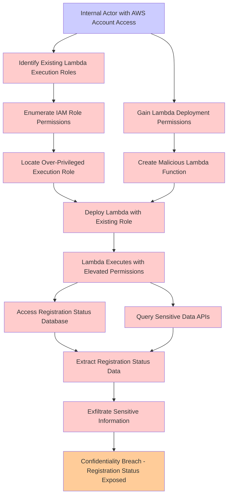

# Attack Tree: Privilege Escalation

**Threat ID**: 9b4dbea5-ccaa-41ea-a057-c6dd47f99523
**Statement**: An internal actor with access to the AWS account can deploy a lambda function that will use existing execution role, which leads to unauthorised access to sensitive data, resulting in reduced confidentiality of registration status

## Attack Tree Diagram

## MITRE ATT&CK Mapping

This attack tree has been mapped to MITRE ATT&CK techniques:

### Locate Over-Privileged Execution Role

- **Technique**: [T1069.001](https://attack.mitre.org/techniques/T1069/001/) - Local Groups
- **Tactic**: Discovery
- **Similarity Score**: 70.03%

### Deploy Lambda with Existing Role

- **Technique**: [T1548.005](https://attack.mitre.org/techniques/T1548/005/) - Temporary Elevated Cloud Access
- **Tactic**: Privilege Escalation, Defense Evasion
- **Similarity Score**: 63.17%
- **Mitigations (1):**
  - 🛡️ **User Account Management**
    User Account Management involves implementing and enforcing policies for the lifecycle of user accounts, including creat...

### Exfiltrate Sensitive Information

- **Technique**: [T1020](https://attack.mitre.org/techniques/T1020/) - Automated Exfiltration
- **Tactic**: Exfiltration
- **Similarity Score**: 80.79%

### Identify Existing Lambda Execution Roles

- **Technique**: [T1069.003](https://attack.mitre.org/techniques/T1069/003/) - Cloud Groups
- **Tactic**: Discovery
- **Similarity Score**: 59.07%

### Access Registration Status Database

- **Technique**: [T1087](https://attack.mitre.org/techniques/T1087/) - Account Discovery
- **Tactic**: Discovery
- **Similarity Score**: 56.87%
- **Mitigations (2):**
  - 🛡️ **Operating System Configuration**
    Operating System Configuration involves adjusting system settings and hardening the default configurations of an operati...
  - 🛡️ **User Account Management**
    User Account Management involves implementing and enforcing policies for the lifecycle of user accounts, including creat...

### Query Sensitive Data APIs

- **Technique**: [T1213](https://attack.mitre.org/techniques/T1213/) - Data from Information Repositories
- **Tactic**: Collection
- **Similarity Score**: 59.35%
- **Mitigations (7):**
  - 🛡️ **Multi-factor Authentication**
    Multi-Factor Authentication (MFA) enhances security by requiring users to provide at least two forms of verification to ...
  - 🛡️ **Out-of-Band Communications Channel**
    Establish secure out-of-band communication channels to ensure the continuity of critical communications during security ...
  - 🛡️ **User Training**
    User Training involves educating employees and contractors on recognizing, reporting, and preventing cyber threats that ...
  - *4 more mitigation(s) available*

### Create Malicious Lambda Function

- **Technique**: [T1059.011](https://attack.mitre.org/techniques/T1059/011/) - Lua
- **Tactic**: Execution
- **Similarity Score**: 33.15%
- **Mitigations (3):**
  - 🛡️ **Limit Software Installation**
    Prevent users or groups from installing unauthorized or unapproved software to reduce the risk of introducing malicious ...
  - 🛡️ **Audit**
    Auditing is the process of recording activity and systematically reviewing and analyzing the activity and system configu...
  - 🛡️ **Execution Prevention**
    Prevent the execution of unauthorized or malicious code on systems by implementing application control, script blocking,...

### Confidentiality Breach - Registration Status Exposed

- **Technique**: [T1589](https://attack.mitre.org/techniques/T1589/) - Gather Victim Identity Information
- **Tactic**: Reconnaissance
- **Similarity Score**: 50.83%
- **Mitigations (1):**
  - 🛡️ **Pre-compromise**
    Pre-compromise mitigations involve proactive measures and defenses implemented to prevent adversaries from successfully ...

### Extract Registration Status Data

- **Technique**: [T1003.002](https://attack.mitre.org/techniques/T1003/002/) - Security Account Manager
- **Tactic**: Credential Access
- **Similarity Score**: 50.98%
- **Mitigations (4):**
  - 🛡️ **Password Policies**
    Set and enforce secure password policies for accounts to reduce the likelihood of unauthorized access. Strong password p...
  - 🛡️ **Privileged Account Management**
    Privileged Account Management focuses on implementing policies, controls, and tools to securely manage privileged accoun...
  - 🛡️ **Operating System Configuration**
    Operating System Configuration involves adjusting system settings and hardening the default configurations of an operati...
  - *1 more mitigation(s) available*

### Gain Lambda Deployment Permissions

- **Technique**: [T1648](https://attack.mitre.org/techniques/T1648/) - Serverless Execution
- **Tactic**: Execution
- **Similarity Score**: 62.13%
- **Mitigations (2):**
  - 🛡️ **Account Use Policies**
    Account Use Policies help mitigate unauthorized access by configuring and enforcing rules that govern how and when accou...
  - 🛡️ **User Account Management**
    User Account Management involves implementing and enforcing policies for the lifecycle of user accounts, including creat...

### Lambda Executes with Elevated Permissions

- **Technique**: [T1548.002](https://attack.mitre.org/techniques/T1548/002/) - Bypass User Account Control
- **Tactic**: Privilege Escalation, Defense Evasion
- **Similarity Score**: 62.55%
- **Mitigations (4):**
  - 🛡️ **Update Software**
    Software updates ensure systems are protected against known vulnerabilities by applying patches and upgrades provided by...
  - 🛡️ **Audit**
    Auditing is the process of recording activity and systematically reviewing and analyzing the activity and system configu...
  - 🛡️ **User Account Control**
    User Account Control (UAC) is a security feature in Microsoft Windows that prevents unauthorized changes to the operatin...
  - *1 more mitigation(s) available*

### Enumerate IAM Role Permissions

- **Technique**: [T1069.001](https://attack.mitre.org/techniques/T1069/001/) - Local Groups
- **Tactic**: Discovery
- **Similarity Score**: 79.56%

### Internal Actor with AWS Account Access

- **Technique**: [T1136.003](https://attack.mitre.org/techniques/T1136/003/) - Cloud Account
- **Tactic**: Persistence
- **Similarity Score**: 86.87%
- **Mitigations (3):**
  - 🛡️ **Network Segmentation**
    Network segmentation involves dividing a network into smaller, isolated segments to control and limit the flow of traffi...
  - 🛡️ **Multi-factor Authentication**
    Multi-Factor Authentication (MFA) enhances security by requiring users to provide at least two forms of verification to ...
  - 🛡️ **Privileged Account Management**
    Privileged Account Management focuses on implementing policies, controls, and tools to securely manage privileged accoun...

*Total technique mappings: 13 | Mitigations found: 27*

## Attack Path Analysis

Review this attack tree to:
1. Identify critical attack paths
2. Implement appropriate security controls
3. Monitor for indicators
4. Develop incident response procedures

---
*Generated by ThreatForest*
