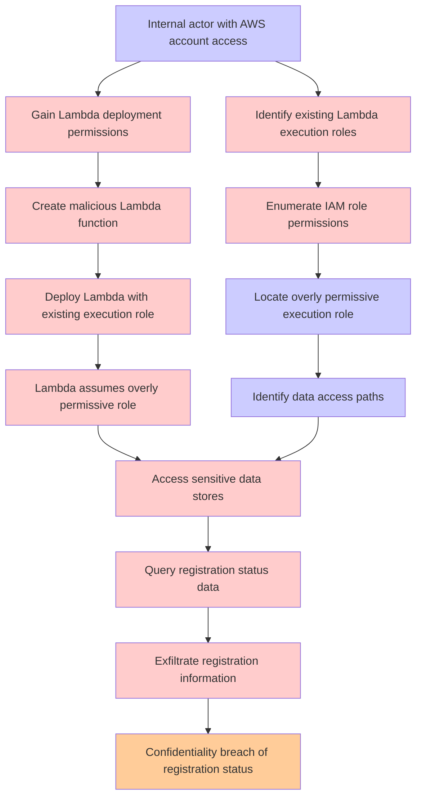

# Attack Tree: Privilege Escalation

**Threat ID**: 9b4dbea5-ccaa-41ea-a057-c6dd47f99523
**Statement**: An internal actor with access to the AWS account can deploy a lambda function that will use existing execution role, which leads to unauthorised access to sensitive data, resulting in reduced confidentiality of registration status

## Attack Tree Diagram

## MITRE ATT&CK Mapping

This attack tree has been mapped to MITRE ATT&CK techniques:

### Create malicious Lambda function

- **Technique**: [T1059.011](https://attack.mitre.org/techniques/T1059/011/) - Lua
- **Tactic**: Execution
- **Similarity Score**: 33.15%
- **Mitigations (3):**
  - 🛡️ **Limit Software Installation**
    Prevent users or groups from installing unauthorized or unapproved software to reduce the risk of introducing malicious ...
  - 🛡️ **Audit**
    Auditing is the process of recording activity and systematically reviewing and analyzing the activity and system configu...
  - 🛡️ **Execution Prevention**
    Prevent the execution of unauthorized or malicious code on systems by implementing application control, script blocking,...

### Exfiltrate registration information

- **Technique**: [T1074.001](https://attack.mitre.org/techniques/T1074/001/) - Local Data Staging
- **Tactic**: Collection
- **Similarity Score**: 58.44%

### Enumerate IAM role permissions

- **Technique**: [T1069.001](https://attack.mitre.org/techniques/T1069/001/) - Local Groups
- **Tactic**: Discovery
- **Similarity Score**: 79.56%

### Internal actor with AWS account access

- **Technique**: [T1136.003](https://attack.mitre.org/techniques/T1136/003/) - Cloud Account
- **Tactic**: Persistence
- **Similarity Score**: 86.87%
- **Mitigations (3):**
  - 🛡️ **Network Segmentation**
    Network segmentation involves dividing a network into smaller, isolated segments to control and limit the flow of traffi...
  - 🛡️ **Multi-factor Authentication**
    Multi-Factor Authentication (MFA) enhances security by requiring users to provide at least two forms of verification to ...
  - 🛡️ **Privileged Account Management**
    Privileged Account Management focuses on implementing policies, controls, and tools to securely manage privileged accoun...

### Deploy Lambda with existing execution role

- **Technique**: [T1648](https://attack.mitre.org/techniques/T1648/) - Serverless Execution
- **Tactic**: Execution
- **Similarity Score**: 68.89%
- **Mitigations (2):**
  - 🛡️ **Account Use Policies**
    Account Use Policies help mitigate unauthorized access by configuring and enforcing rules that govern how and when accou...
  - 🛡️ **User Account Management**
    User Account Management involves implementing and enforcing policies for the lifecycle of user accounts, including creat...

### Query registration status data

- **Technique**: [T1087](https://attack.mitre.org/techniques/T1087/) - Account Discovery
- **Tactic**: Discovery
- **Similarity Score**: 53.48%
- **Mitigations (2):**
  - 🛡️ **Operating System Configuration**
    Operating System Configuration involves adjusting system settings and hardening the default configurations of an operati...
  - 🛡️ **User Account Management**
    User Account Management involves implementing and enforcing policies for the lifecycle of user accounts, including creat...

### Locate overly permissive execution role

- **Technique**: [T1548.002](https://attack.mitre.org/techniques/T1548/002/) - Bypass User Account Control
- **Tactic**: Privilege Escalation, Defense Evasion
- **Similarity Score**: 62.19%
- **Mitigations (4):**
  - 🛡️ **Update Software**
    Software updates ensure systems are protected against known vulnerabilities by applying patches and upgrades provided by...
  - 🛡️ **Audit**
    Auditing is the process of recording activity and systematically reviewing and analyzing the activity and system configu...
  - 🛡️ **User Account Control**
    User Account Control (UAC) is a security feature in Microsoft Windows that prevents unauthorized changes to the operatin...
  - *1 more mitigation(s) available*

### Lambda assumes overly permissive role

- **Technique**: [T1218.009](https://attack.mitre.org/techniques/T1218/009/) - Regsvcs/Regasm
- **Tactic**: Defense Evasion
- **Similarity Score**: 40.93%
- **Mitigations (2):**
  - 🛡️ **Execution Prevention**
    Prevent the execution of unauthorized or malicious code on systems by implementing application control, script blocking,...
  - 🛡️ **Disable or Remove Feature or Program**
    Disable or remove unnecessary and potentially vulnerable software, features, or services to reduce the attack surface an...

### Access sensitive data stores

- **Technique**: [T1530](https://attack.mitre.org/techniques/T1530/) - Data from Cloud Storage
- **Tactic**: Collection
- **Similarity Score**: 79.66%
- **Mitigations (6):**
  - 🛡️ **User Account Management**
    User Account Management involves implementing and enforcing policies for the lifecycle of user accounts, including creat...
  - 🛡️ **Encrypt Sensitive Information**
    Protect sensitive information at rest, in transit, and during processing by using strong encryption algorithms. Encrypti...
  - 🛡️ **Restrict File and Directory Permissions**
    Restricting file and directory permissions involves setting access controls at the file system level to limit which user...
  - *3 more mitigation(s) available*

### Identify existing Lambda execution roles

- **Technique**: [T1069.003](https://attack.mitre.org/techniques/T1069/003/) - Cloud Groups
- **Tactic**: Discovery
- **Similarity Score**: 59.07%

### Confidentiality breach of registration status

- **Technique**: [T1098.005](https://attack.mitre.org/techniques/T1098/005/) - Device Registration
- **Tactic**: Persistence, Privilege Escalation
- **Similarity Score**: 51.10%
- **Mitigations (1):**
  - 🛡️ **Multi-factor Authentication**
    Multi-Factor Authentication (MFA) enhances security by requiring users to provide at least two forms of verification to ...

### Gain Lambda deployment permissions

- **Technique**: [T1648](https://attack.mitre.org/techniques/T1648/) - Serverless Execution
- **Tactic**: Execution
- **Similarity Score**: 62.13%
- **Mitigations (2):**
  - 🛡️ **Account Use Policies**
    Account Use Policies help mitigate unauthorized access by configuring and enforcing rules that govern how and when accou...
  - 🛡️ **User Account Management**
    User Account Management involves implementing and enforcing policies for the lifecycle of user accounts, including creat...

### Identify data access paths

- **Technique**: [T1083](https://attack.mitre.org/techniques/T1083/) - File and Directory Discovery
- **Tactic**: Discovery
- **Similarity Score**: 74.35%

*Total technique mappings: 13 | Mitigations found: 25*

## Attack Path Analysis

Review this attack tree to:
1. Identify critical attack paths
2. Implement appropriate security controls
3. Monitor for indicators
4. Develop incident response procedures

---
*Generated by ThreatForest*
