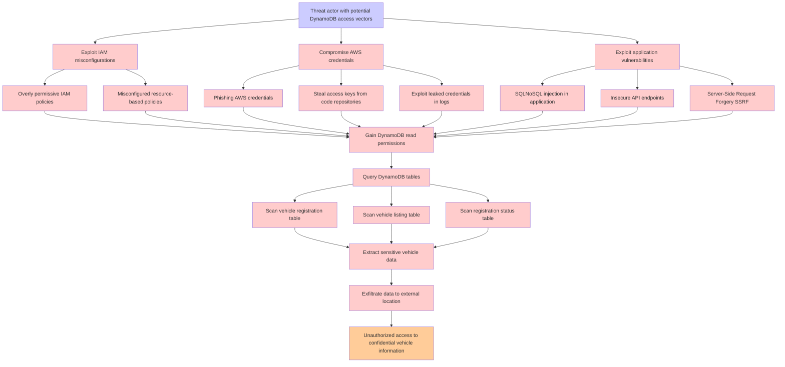

# Attack Tree: Data Breach

**Threat ID**: 9c19d403-f595-45f8-ba66-df2e60744f67
**Statement**: A threat actor who is able to access the DynamoDB tables can access sensitive data, which leads to unauthorized access, resulting in reduced confidentiality of vehicle registration, vehicle listing and registration status

## Attack Tree Diagram

## MITRE ATT&CK Mapping

This attack tree has been mapped to MITRE ATT&CK techniques:

### Insecure API endpoints

- **Technique**: [T1001.003](https://attack.mitre.org/techniques/T1001/003/) - Protocol or Service Impersonation
- **Tactic**: Command And Control
- **Similarity Score**: 52.18%
- **Mitigations (1):**
  - 🛡️ **Network Intrusion Prevention**
    Use intrusion detection signatures to block traffic at network boundaries.

### Exfiltrate data to external location

- **Technique**: [T1052](https://attack.mitre.org/techniques/T1052/) - Exfiltration Over Physical Medium
- **Tactic**: Exfiltration
- **Similarity Score**: 76.26%
- **Mitigations (3):**
  - 🛡️ **Data Loss Prevention**
    Data Loss Prevention (DLP) involves implementing strategies and technologies to identify, categorize, monitor, and contr...
  - 🛡️ **Limit Hardware Installation**
    Prevent unauthorized users or groups from installing or using hardware, such as external drives, peripheral devices, or ...
  - 🛡️ **Disable or Remove Feature or Program**
    Disable or remove unnecessary and potentially vulnerable software, features, or services to reduce the attack surface an...

### Threat actor with potential DynamoDB access vectors

- **Technique**: [T1530](https://attack.mitre.org/techniques/T1530/) - Data from Cloud Storage
- **Tactic**: Collection
- **Similarity Score**: 52.68%
- **Mitigations (6):**
  - 🛡️ **User Account Management**
    User Account Management involves implementing and enforcing policies for the lifecycle of user accounts, including creat...
  - 🛡️ **Encrypt Sensitive Information**
    Protect sensitive information at rest, in transit, and during processing by using strong encryption algorithms. Encrypti...
  - 🛡️ **Restrict File and Directory Permissions**
    Restricting file and directory permissions involves setting access controls at the file system level to limit which user...
  - *3 more mitigation(s) available*

### Exploit leaked credentials in logs

- **Technique**: [T1552.008](https://attack.mitre.org/techniques/T1552/008/) - Chat Messages
- **Tactic**: Credential Access
- **Similarity Score**: 77.45%
- **Mitigations (2):**
  - 🛡️ **Audit**
    Auditing is the process of recording activity and systematically reviewing and analyzing the activity and system configu...
  - 🛡️ **User Training**
    User Training involves educating employees and contractors on recognizing, reporting, and preventing cyber threats that ...

### Server-Side Request Forgery SSRF

- **Technique**: [T1672](https://attack.mitre.org/techniques/T1672/) - Email Spoofing
- **Tactic**: Defense Evasion
- **Similarity Score**: 49.63%
- **Mitigations (1):**
  - 🛡️ **Software Configuration**
    Software configuration refers to making security-focused adjustments to the settings of applications, middleware, databa...

### Steal access keys from code repositories

- **Technique**: [T1213.003](https://attack.mitre.org/techniques/T1213/003/) - Code Repositories
- **Tactic**: Collection
- **Similarity Score**: 51.53%
- **Mitigations (4):**
  - 🛡️ **User Training**
    User Training involves educating employees and contractors on recognizing, reporting, and preventing cyber threats that ...
  - 🛡️ **Audit**
    Auditing is the process of recording activity and systematically reviewing and analyzing the activity and system configu...
  - 🛡️ **User Account Management**
    User Account Management involves implementing and enforcing policies for the lifecycle of user accounts, including creat...
  - *1 more mitigation(s) available*

### Exploit application vulnerabilities

- **Technique**: [T1211](https://attack.mitre.org/techniques/T1211/) - Exploitation for Defense Evasion
- **Tactic**: Defense Evasion
- **Similarity Score**: 68.09%
- **Mitigations (4):**
  - 🛡️ **Exploit Protection**
    Deploy capabilities that detect, block, and mitigate conditions indicative of software exploits. These capabilities aim ...
  - 🛡️ **Update Software**
    Software updates ensure systems are protected against known vulnerabilities by applying patches and upgrades provided by...
  - 🛡️ **Threat Intelligence Program**
    A Threat Intelligence Program enables organizations to proactively identify, analyze, and act on cyber threats by levera...
  - *1 more mitigation(s) available*

### Exploit IAM misconfigurations

- **Technique**: [T1059.008](https://attack.mitre.org/techniques/T1059/008/) - Network Device CLI
- **Tactic**: Execution
- **Similarity Score**: 43.63%
- **Mitigations (3):**
  - 🛡️ **Execution Prevention**
    Prevent the execution of unauthorized or malicious code on systems by implementing application control, script blocking,...
  - 🛡️ **Privileged Account Management**
    Privileged Account Management focuses on implementing policies, controls, and tools to securely manage privileged accoun...
  - 🛡️ **User Account Management**
    User Account Management involves implementing and enforcing policies for the lifecycle of user accounts, including creat...

### Gain DynamoDB read permissions

- **Technique**: [T1530](https://attack.mitre.org/techniques/T1530/) - Data from Cloud Storage
- **Tactic**: Collection
- **Similarity Score**: 51.41%
- **Mitigations (6):**
  - 🛡️ **User Account Management**
    User Account Management involves implementing and enforcing policies for the lifecycle of user accounts, including creat...
  - 🛡️ **Encrypt Sensitive Information**
    Protect sensitive information at rest, in transit, and during processing by using strong encryption algorithms. Encrypti...
  - 🛡️ **Restrict File and Directory Permissions**
    Restricting file and directory permissions involves setting access controls at the file system level to limit which user...
  - *3 more mitigation(s) available*

### Scan vehicle registration table

- **Technique**: [T1590.001](https://attack.mitre.org/techniques/T1590/001/) - Domain Properties
- **Tactic**: Reconnaissance
- **Similarity Score**: 45.90%
- **Mitigations (1):**
  - 🛡️ **Pre-compromise**
    Pre-compromise mitigations involve proactive measures and defenses implemented to prevent adversaries from successfully ...

### Query DynamoDB tables

- **Technique**: [T1119](https://attack.mitre.org/techniques/T1119/) - Automated Collection
- **Tactic**: Collection
- **Similarity Score**: 53.32%
- **Mitigations (2):**
  - 🛡️ **Remote Data Storage**
    Remote Data Storage focuses on moving critical data, such as security logs and sensitive files, to secure, off-host loca...
  - 🛡️ **Encrypt Sensitive Information**
    Protect sensitive information at rest, in transit, and during processing by using strong encryption algorithms. Encrypti...

### Overly permissive IAM policies

- **Technique**: [T1556.009](https://attack.mitre.org/techniques/T1556/009/) - Conditional Access Policies
- **Tactic**: Credential Access, Defense Evasion, Persistence
- **Similarity Score**: 74.28%
- **Mitigations (1):**
  - 🛡️ **User Account Management**
    User Account Management involves implementing and enforcing policies for the lifecycle of user accounts, including creat...

### Scan vehicle listing table

- **Technique**: [T1083](https://attack.mitre.org/techniques/T1083/) - File and Directory Discovery
- **Tactic**: Discovery
- **Similarity Score**: 47.98%

### Unauthorized access to confidential vehicle information

- **Technique**: [T1213](https://attack.mitre.org/techniques/T1213/) - Data from Information Repositories
- **Tactic**: Collection
- **Similarity Score**: 47.23%
- **Mitigations (7):**
  - 🛡️ **Multi-factor Authentication**
    Multi-Factor Authentication (MFA) enhances security by requiring users to provide at least two forms of verification to ...
  - 🛡️ **Out-of-Band Communications Channel**
    Establish secure out-of-band communication channels to ensure the continuity of critical communications during security ...
  - 🛡️ **User Training**
    User Training involves educating employees and contractors on recognizing, reporting, and preventing cyber threats that ...
  - *4 more mitigation(s) available*

### Extract sensitive vehicle data

- **Technique**: [T1025](https://attack.mitre.org/techniques/T1025/) - Data from Removable Media
- **Tactic**: Collection
- **Similarity Score**: 63.45%
- **Mitigations (1):**
  - 🛡️ **Data Loss Prevention**
    Data Loss Prevention (DLP) involves implementing strategies and technologies to identify, categorize, monitor, and contr...

### Misconfigured resource-based policies

- **Technique**: [T1484.001](https://attack.mitre.org/techniques/T1484/001/) - Group Policy Modification
- **Tactic**: Defense Evasion, Privilege Escalation
- **Similarity Score**: 57.97%
- **Mitigations (2):**
  - 🛡️ **Audit**
    Auditing is the process of recording activity and systematically reviewing and analyzing the activity and system configu...
  - 🛡️ **User Account Management**
    User Account Management involves implementing and enforcing policies for the lifecycle of user accounts, including creat...

### Phishing AWS credentials

- **Technique**: [T1589.001](https://attack.mitre.org/techniques/T1589/001/) - Credentials
- **Tactic**: Reconnaissance
- **Similarity Score**: 74.42%
- **Mitigations (1):**
  - 🛡️ **Pre-compromise**
    Pre-compromise mitigations involve proactive measures and defenses implemented to prevent adversaries from successfully ...

### Compromise AWS credentials

- **Technique**: [T1021.007](https://attack.mitre.org/techniques/T1021/007/) - Cloud Services
- **Tactic**: Lateral Movement
- **Similarity Score**: 74.40%
- **Mitigations (2):**
  - 🛡️ **Multi-factor Authentication**
    Multi-Factor Authentication (MFA) enhances security by requiring users to provide at least two forms of verification to ...
  - 🛡️ **Privileged Account Management**
    Privileged Account Management focuses on implementing policies, controls, and tools to securely manage privileged accoun...

### Scan registration status table

- **Technique**: [T1087](https://attack.mitre.org/techniques/T1087/) - Account Discovery
- **Tactic**: Discovery
- **Similarity Score**: 57.06%
- **Mitigations (2):**
  - 🛡️ **Operating System Configuration**
    Operating System Configuration involves adjusting system settings and hardening the default configurations of an operati...
  - 🛡️ **User Account Management**
    User Account Management involves implementing and enforcing policies for the lifecycle of user accounts, including creat...

### SQLNoSQL injection in application

- **Technique**: [T1505.001](https://attack.mitre.org/techniques/T1505/001/) - SQL Stored Procedures
- **Tactic**: Persistence
- **Similarity Score**: 41.26%
- **Mitigations (3):**
  - 🛡️ **Audit**
    Auditing is the process of recording activity and systematically reviewing and analyzing the activity and system configu...
  - 🛡️ **Code Signing**
    Code Signing is a security process that ensures the authenticity and integrity of software by digitally signing executab...
  - 🛡️ **Privileged Account Management**
    Privileged Account Management focuses on implementing policies, controls, and tools to securely manage privileged accoun...

*Total technique mappings: 20 | Mitigations found: 52*

## Attack Path Analysis

Review this attack tree to:
1. Identify critical attack paths
2. Implement appropriate security controls
3. Monitor for indicators
4. Develop incident response procedures

---
*Generated by ThreatForest*
