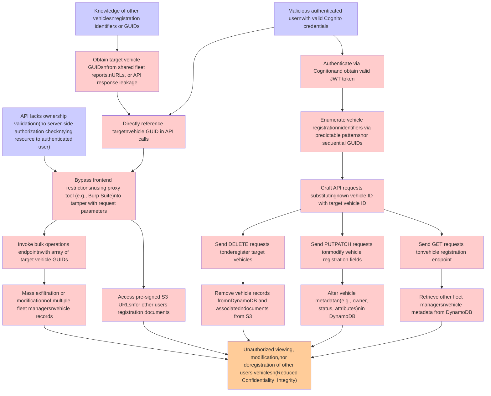

# Attack Tree: Broken Access Control (IDOR)

**Threat ID**: T001
**Statement**: A malicious authenticated user with valid Cognito credentials and knowledge of other vehicles' registration identifiers, can manipulate API request parameters (e.g., vehicle registration number or GUID) to access or modify other users' vehicle records via IDOR, which leads to unauthorized viewing, modification, or deregistration of vehicles belonging to other fleet managers, resulting in reduced confidentiality and integrity of vehicle registration metadata in DynamoDB and vehicle registration documents in S3.

## Attack Tree Diagram

## MITRE ATT&CK Mapping

This attack tree has been mapped to MITRE ATT&CK techniques:

### Mass exfiltration or modificationnof multiple fleet managersnvehicle records

- **Technique**: [T1485.001](https://attack.mitre.org/techniques/T1485/001/) - Lifecycle-Triggered Deletion
- **Tactic**: Impact
- **Similarity Score**: 57.64%
- **Mitigations (2):**
  - 🛡️ **User Account Management**
    User Account Management involves implementing and enforcing policies for the lifecycle of user accounts, including creat...
  - 🛡️ **Data Backup**
    Data Backup involves taking and securely storing backups of data from end-user systems and critical servers. It ensures ...

### Remove vehicle records fromnDynamoDB and associatedndocuments from S3

- **Technique**: [T1485.001](https://attack.mitre.org/techniques/T1485/001/) - Lifecycle-Triggered Deletion
- **Tactic**: Impact
- **Similarity Score**: 83.22%
- **Mitigations (2):**
  - 🛡️ **User Account Management**
    User Account Management involves implementing and enforcing policies for the lifecycle of user accounts, including creat...
  - 🛡️ **Data Backup**
    Data Backup involves taking and securely storing backups of data from end-user systems and critical servers. It ensures ...

### Send GET requests tonvehicle registration endpoint

- **Technique**: [T1522](https://attack.mitre.org/techniques/T1522/) - Cloud Instance Metadata API
- **Tactic**: Credential Access
- **Similarity Score**: 40.92%

### Retrieve other fleet managersnvehicle metadata from DynamoDB

- **Technique**: [T1602](https://attack.mitre.org/techniques/T1602/) - Data from Configuration Repository
- **Tactic**: Collection
- **Similarity Score**: 52.30%
- **Mitigations (6):**
  - 🛡️ **Update Software**
    Software updates ensure systems are protected against known vulnerabilities by applying patches and upgrades provided by...
  - 🛡️ **Software Configuration**
    Software configuration refers to making security-focused adjustments to the settings of applications, middleware, databa...
  - 🛡️ **Network Segmentation**
    Network segmentation involves dividing a network into smaller, isolated segments to control and limit the flow of traffi...
  - *3 more mitigation(s) available*

### Alter vehicle metadatan(e.g., owner, status, attributes)nin DynamoDB

- **Technique**: [T1565.003](https://attack.mitre.org/techniques/T1565/003/) - Runtime Data Manipulation
- **Tactic**: Impact
- **Similarity Score**: 48.40%
- **Mitigations (2):**
  - 🛡️ **Network Segmentation**
    Network segmentation involves dividing a network into smaller, isolated segments to control and limit the flow of traffi...
  - 🛡️ **Restrict File and Directory Permissions**
    Restricting file and directory permissions involves setting access controls at the file system level to limit which user...

### API lacks ownership validationn(no server-side authorization checkntying resource to authenticated user)

- **Technique**: [T1548.005](https://attack.mitre.org/techniques/T1548/005/) - Temporary Elevated Cloud Access
- **Tactic**: Privilege Escalation, Defense Evasion
- **Similarity Score**: 52.14%
- **Mitigations (1):**
  - 🛡️ **User Account Management**
    User Account Management involves implementing and enforcing policies for the lifecycle of user accounts, including creat...

### Malicious authenticated usernwith valid Cognito credentials

- **Technique**: [T1556](https://attack.mitre.org/techniques/T1556/) - Modify Authentication Process
- **Tactic**: Credential Access, Defense Evasion, Persistence
- **Similarity Score**: 79.64%
- **Mitigations (9):**
  - 🛡️ **Restrict Registry Permissions**
    Restricting registry permissions involves configuring access control settings for sensitive registry keys and hives to e...
  - 🛡️ **Multi-factor Authentication**
    Multi-Factor Authentication (MFA) enhances security by requiring users to provide at least two forms of verification to ...
  - 🛡️ **Password Policies**
    Set and enforce secure password policies for accounts to reduce the likelihood of unauthorized access. Strong password p...
  - *6 more mitigation(s) available*

### Directly reference targetnvehicle GUID in API calls

- **Technique**: [T1036.005](https://attack.mitre.org/techniques/T1036/005/) - Match Legitimate Resource Name or Location
- **Tactic**: Defense Evasion
- **Similarity Score**: 41.44%
- **Mitigations (3):**
  - 🛡️ **Restrict File and Directory Permissions**
    Restricting file and directory permissions involves setting access controls at the file system level to limit which user...
  - 🛡️ **Execution Prevention**
    Prevent the execution of unauthorized or malicious code on systems by implementing application control, script blocking,...
  - 🛡️ **Code Signing**
    Code Signing is a security process that ensures the authenticity and integrity of software by digitally signing executab...

### Invoke bulk operations endpointnwith array of target vehicle GUIDs

- **Technique**: [T1018](https://attack.mitre.org/techniques/T1018/) - Remote System Discovery
- **Tactic**: Discovery
- **Similarity Score**: 34.29%

### Obtain target vehicle GUIDsnfrom shared fleet reports,nURLs, or API response leakage

- **Technique**: [T1590.001](https://attack.mitre.org/techniques/T1590/001/) - Domain Properties
- **Tactic**: Reconnaissance
- **Similarity Score**: 52.07%
- **Mitigations (1):**
  - 🛡️ **Pre-compromise**
    Pre-compromise mitigations involve proactive measures and defenses implemented to prevent adversaries from successfully ...

### Send DELETE requests tonderegister target vehicles

- **Technique**: [T1107](https://attack.mitre.org/techniques/T1107/) - File Deletion
- **Tactic**: Defense Evasion
- **Similarity Score**: 74.91%

### Enumerate vehicle registrationnidentifiers via predictable patternsnor sequential GUIDs

- **Technique**: [T1003.003](https://attack.mitre.org/techniques/T1003/003/) - NTDS
- **Tactic**: Credential Access
- **Similarity Score**: 42.88%
- **Mitigations (4):**
  - 🛡️ **Password Policies**
    Set and enforce secure password policies for accounts to reduce the likelihood of unauthorized access. Strong password p...
  - 🛡️ **Privileged Account Management**
    Privileged Account Management focuses on implementing policies, controls, and tools to securely manage privileged accoun...
  - 🛡️ **User Training**
    User Training involves educating employees and contractors on recognizing, reporting, and preventing cyber threats that ...
  - *1 more mitigation(s) available*

### Access pre-signed S3 URLsnfor other users registration documents

- **Technique**: [T1530](https://attack.mitre.org/techniques/T1530/) - Data from Cloud Storage
- **Tactic**: Collection
- **Similarity Score**: 57.39%
- **Mitigations (6):**
  - 🛡️ **User Account Management**
    User Account Management involves implementing and enforcing policies for the lifecycle of user accounts, including creat...
  - 🛡️ **Encrypt Sensitive Information**
    Protect sensitive information at rest, in transit, and during processing by using strong encryption algorithms. Encrypti...
  - 🛡️ **Restrict File and Directory Permissions**
    Restricting file and directory permissions involves setting access controls at the file system level to limit which user...
  - *3 more mitigation(s) available*

### Unauthorized viewing, modification,nor deregistration of other users vehiclesn(Reduced Confidentiality  Integrity)

- **Technique**: [T1492](https://attack.mitre.org/techniques/T1492/) - Stored Data Manipulation
- **Tactic**: Impact
- **Similarity Score**: 61.59%

### Bypass frontend restrictionsnusing proxy tool (e.g., Burp Suite)nto tamper with request parameters

- **Technique**: [T1188](https://attack.mitre.org/techniques/T1188/) - Multi-hop Proxy
- **Tactic**: Command And Control
- **Similarity Score**: 65.22%

### Authenticate via Cognitonand obtain valid JWT token

- **Technique**: [T1550](https://attack.mitre.org/techniques/T1550/) - Use Alternate Authentication Material
- **Tactic**: Defense Evasion, Lateral Movement
- **Similarity Score**: 61.00%
- **Mitigations (7):**
  - 🛡️ **Audit**
    Auditing is the process of recording activity and systematically reviewing and analyzing the activity and system configu...
  - 🛡️ **Password Policies**
    Set and enforce secure password policies for accounts to reduce the likelihood of unauthorized access. Strong password p...
  - 🛡️ **Account Use Policies**
    Account Use Policies help mitigate unauthorized access by configuring and enforcing rules that govern how and when accou...
  - *4 more mitigation(s) available*

### Send PUTPATCH requests tonmodify vehicle registration fields

- **Technique**: [T1568.001](https://attack.mitre.org/techniques/T1568/001/) - Fast Flux DNS
- **Tactic**: Command And Control
- **Similarity Score**: 38.51%

### Knowledge of other vehiclesnregistration identifiers or GUIDs

- **Technique**: [T1082](https://attack.mitre.org/techniques/T1082/) - System Information Discovery
- **Tactic**: Discovery
- **Similarity Score**: 53.22%

*Total technique mappings: 18 | Mitigations found: 43*

## Attack Path Analysis

Review this attack tree to:
1. Identify critical attack paths
2. Implement appropriate security controls
3. Monitor for indicators
4. Develop incident response procedures

---
*Generated by ThreatForest*
