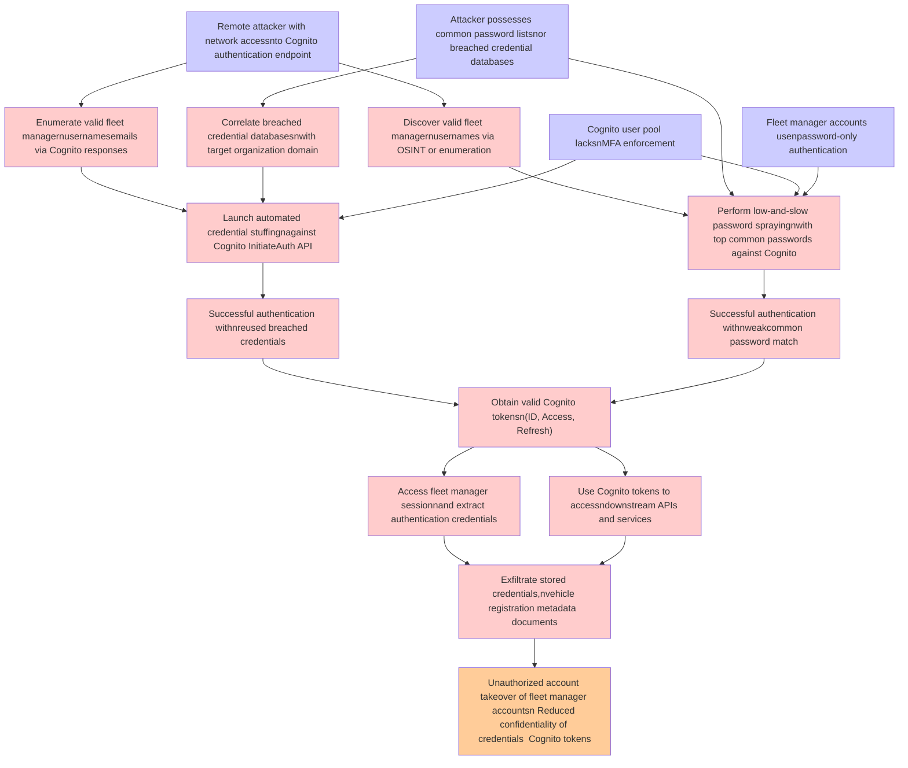

# Attack Tree: Authentication

**Threat ID**: T002
**Statement**: A remote attacker with network access to the Cognito authentication endpoint and a list of common passwords or breached credential databases, can perform credential stuffing or password spraying attacks against the Cognito user pool which lacks MFA enforcement, which leads to unauthorized account takeover of fleet manager accounts, resulting in reduced confidentiality of user authentication credentials and Cognito tokens.

## Attack Tree Diagram

## MITRE ATT&CK Mapping

This attack tree has been mapped to MITRE ATT&CK techniques:

### Perform low-and-slow password sprayingnwith top common passwords against Cognito

- **Technique**: [T1174](https://attack.mitre.org/techniques/T1174/) - Password Filter DLL
- **Tactic**: Credential Access
- **Similarity Score**: 89.57%

### Correlate breached credential databasesnwith target organization domain

- **Technique**: [T1589.001](https://attack.mitre.org/techniques/T1589/001/) - Credentials
- **Tactic**: Reconnaissance
- **Similarity Score**: 68.83%
- **Mitigations (1):**
  - 🛡️ **Pre-compromise**
    Pre-compromise mitigations involve proactive measures and defenses implemented to prevent adversaries from successfully ...

### Cognito user pool lacksnMFA enforcement

- **Technique**: [T1556.006](https://attack.mitre.org/techniques/T1556/006/) - Multi-Factor Authentication
- **Tactic**: Credential Access, Defense Evasion, Persistence
- **Similarity Score**: 72.86%
- **Mitigations (3):**
  - 🛡️ **User Account Management**
    User Account Management involves implementing and enforcing policies for the lifecycle of user accounts, including creat...
  - 🛡️ **Audit**
    Auditing is the process of recording activity and systematically reviewing and analyzing the activity and system configu...
  - 🛡️ **Multi-factor Authentication**
    Multi-Factor Authentication (MFA) enhances security by requiring users to provide at least two forms of verification to ...

### Obtain valid Cognito tokensn(ID, Access, Refresh)

- **Technique**: [T1134.003](https://attack.mitre.org/techniques/T1134/003/) - Make and Impersonate Token
- **Tactic**: Defense Evasion, Privilege Escalation
- **Similarity Score**: 71.23%
- **Mitigations (2):**
  - 🛡️ **Privileged Account Management**
    Privileged Account Management focuses on implementing policies, controls, and tools to securely manage privileged accoun...
  - 🛡️ **User Account Management**
    User Account Management involves implementing and enforcing policies for the lifecycle of user accounts, including creat...

### Remote attacker with network accessnto Cognito authentication endpoint

- **Technique**: [T1187](https://attack.mitre.org/techniques/T1187/) - Forced Authentication
- **Tactic**: Credential Access
- **Similarity Score**: 73.51%
- **Mitigations (2):**
  - 🛡️ **Password Policies**
    Set and enforce secure password policies for accounts to reduce the likelihood of unauthorized access. Strong password p...
  - 🛡️ **Filter Network Traffic**
    Employ network appliances and endpoint software to filter ingress, egress, and lateral network traffic. This includes pr...

### Enumerate valid fleet managernusernamesemails via Cognito responses

- **Technique**: [T1114.002](https://attack.mitre.org/techniques/T1114/002/) - Remote Email Collection
- **Tactic**: Collection
- **Similarity Score**: 63.69%
- **Mitigations (3):**
  - 🛡️ **Out-of-Band Communications Channel**
    Establish secure out-of-band communication channels to ensure the continuity of critical communications during security ...
  - 🛡️ **Encrypt Sensitive Information**
    Protect sensitive information at rest, in transit, and during processing by using strong encryption algorithms. Encrypti...
  - 🛡️ **Multi-factor Authentication**
    Multi-Factor Authentication (MFA) enhances security by requiring users to provide at least two forms of verification to ...

### Attacker possesses common password listsnor breached credential databases

- **Technique**: [T1110.002](https://attack.mitre.org/techniques/T1110/002/) - Password Cracking
- **Tactic**: Credential Access
- **Similarity Score**: 86.29%
- **Mitigations (2):**
  - 🛡️ **Password Policies**
    Set and enforce secure password policies for accounts to reduce the likelihood of unauthorized access. Strong password p...
  - 🛡️ **Multi-factor Authentication**
    Multi-Factor Authentication (MFA) enhances security by requiring users to provide at least two forms of verification to ...

### Successful authentication withnweakcommon password match

- **Technique**: [T1556.004](https://attack.mitre.org/techniques/T1556/004/) - Network Device Authentication
- **Tactic**: Credential Access, Defense Evasion, Persistence
- **Similarity Score**: 80.84%
- **Mitigations (2):**
  - 🛡️ **Privileged Account Management**
    Privileged Account Management focuses on implementing policies, controls, and tools to securely manage privileged accoun...
  - 🛡️ **Multi-factor Authentication**
    Multi-Factor Authentication (MFA) enhances security by requiring users to provide at least two forms of verification to ...

### Use Cognito tokens to accessndownstream APIs and services

- **Technique**: [T1550.001](https://attack.mitre.org/techniques/T1550/001/) - Application Access Token
- **Tactic**: Defense Evasion, Lateral Movement
- **Similarity Score**: 66.23%
- **Mitigations (5):**
  - 🛡️ **Account Use Policies**
    Account Use Policies help mitigate unauthorized access by configuring and enforcing rules that govern how and when accou...
  - 🛡️ **Audit**
    Auditing is the process of recording activity and systematically reviewing and analyzing the activity and system configu...
  - 🛡️ **Restrict Web-Based Content**
    Restricting web-based content involves enforcing policies and technologies that limit access to potentially malicious we...
  - *2 more mitigation(s) available*

### Successful authentication withnreused breached credentials

- **Technique**: [T1550](https://attack.mitre.org/techniques/T1550/) - Use Alternate Authentication Material
- **Tactic**: Defense Evasion, Lateral Movement
- **Similarity Score**: 83.94%
- **Mitigations (7):**
  - 🛡️ **Audit**
    Auditing is the process of recording activity and systematically reviewing and analyzing the activity and system configu...
  - 🛡️ **Password Policies**
    Set and enforce secure password policies for accounts to reduce the likelihood of unauthorized access. Strong password p...
  - 🛡️ **Account Use Policies**
    Account Use Policies help mitigate unauthorized access by configuring and enforcing rules that govern how and when accou...
  - *4 more mitigation(s) available*

### Unauthorized account takeover of fleet manager accountsn Reduced confidentiality of credentials  Cognito tokens

- **Technique**: [T1078](https://attack.mitre.org/techniques/T1078/) - Valid Accounts
- **Tactic**: Defense Evasion, Persistence, Privilege Escalation, Initial Access
- **Similarity Score**: 72.16%
- **Mitigations (8):**
  - 🛡️ **Password Policies**
    Set and enforce secure password policies for accounts to reduce the likelihood of unauthorized access. Strong password p...
  - 🛡️ **User Account Management**
    User Account Management involves implementing and enforcing policies for the lifecycle of user accounts, including creat...
  - 🛡️ **Privileged Account Management**
    Privileged Account Management focuses on implementing policies, controls, and tools to securely manage privileged accoun...
  - *5 more mitigation(s) available*

### Access fleet manager sessionnand extract authentication credentials

- **Technique**: [T1552.001](https://attack.mitre.org/techniques/T1552/001/) - Credentials In Files
- **Tactic**: Credential Access
- **Similarity Score**: 76.11%
- **Mitigations (4):**
  - 🛡️ **User Training**
    User Training involves educating employees and contractors on recognizing, reporting, and preventing cyber threats that ...
  - 🛡️ **Audit**
    Auditing is the process of recording activity and systematically reviewing and analyzing the activity and system configu...
  - 🛡️ **Restrict File and Directory Permissions**
    Restricting file and directory permissions involves setting access controls at the file system level to limit which user...
  - *1 more mitigation(s) available*

### Launch automated credential stuffingnagainst Cognito InitiateAuth API

- **Technique**: [T1550](https://attack.mitre.org/techniques/T1550/) - Use Alternate Authentication Material
- **Tactic**: Defense Evasion, Lateral Movement
- **Similarity Score**: 76.48%
- **Mitigations (7):**
  - 🛡️ **Audit**
    Auditing is the process of recording activity and systematically reviewing and analyzing the activity and system configu...
  - 🛡️ **Password Policies**
    Set and enforce secure password policies for accounts to reduce the likelihood of unauthorized access. Strong password p...
  - 🛡️ **Account Use Policies**
    Account Use Policies help mitigate unauthorized access by configuring and enforcing rules that govern how and when accou...
  - *4 more mitigation(s) available*

### Exfiltrate stored credentials,nvehicle registration metadata  documents

- **Technique**: [T1074.001](https://attack.mitre.org/techniques/T1074/001/) - Local Data Staging
- **Tactic**: Collection
- **Similarity Score**: 65.78%

### Fleet manager accounts usenpassword-only authentication

- **Technique**: [T1556](https://attack.mitre.org/techniques/T1556/) - Modify Authentication Process
- **Tactic**: Credential Access, Defense Evasion, Persistence
- **Similarity Score**: 76.62%
- **Mitigations (9):**
  - 🛡️ **Restrict Registry Permissions**
    Restricting registry permissions involves configuring access control settings for sensitive registry keys and hives to e...
  - 🛡️ **Multi-factor Authentication**
    Multi-Factor Authentication (MFA) enhances security by requiring users to provide at least two forms of verification to ...
  - 🛡️ **Password Policies**
    Set and enforce secure password policies for accounts to reduce the likelihood of unauthorized access. Strong password p...
  - *6 more mitigation(s) available*

### Discover valid fleet managernusernames via OSINT or enumeration

- **Technique**: [T1018](https://attack.mitre.org/techniques/T1018/) - Remote System Discovery
- **Tactic**: Discovery
- **Similarity Score**: 47.91%

*Total technique mappings: 16 | Mitigations found: 55*

## Attack Path Analysis

Review this attack tree to:
1. Identify critical attack paths
2. Implement appropriate security controls
3. Monitor for indicators
4. Develop incident response procedures

---
*Generated by ThreatForest*
