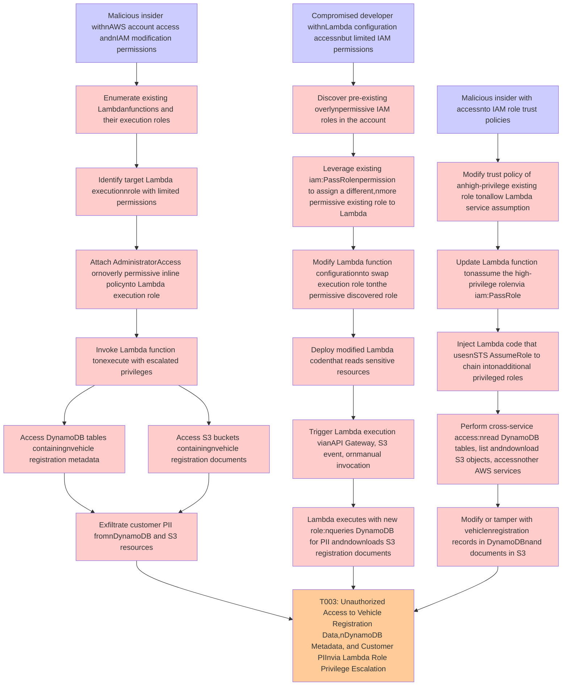

# Attack Tree: Privilege Escalation

**Threat ID**: T003
**Statement**: A malicious insider or compromised developer with access to the AWS account and Lambda function configuration, can escalate privileges by modifying the Lambda execution role to attach overly permissive IAM policies, which leads to unauthorized access to DynamoDB tables, S3 buckets, and other AWS services beyond the function's intended scope, resulting in reduced confidentiality and integrity of vehicle registration documents in S3, vehicle registration metadata in DynamoDB, and customer PII.

## Attack Tree Diagram

## MITRE ATT&CK Mapping

This attack tree has been mapped to MITRE ATT&CK techniques:

### Update Lambda function tonassume the high-privilege rolenvia iam:PassRole

- **Technique**: [T1088](https://attack.mitre.org/techniques/T1088/) - Bypass User Account Control
- **Tactic**: Defense Evasion, Privilege Escalation
- **Similarity Score**: 75.18%

### Enumerate existing Lambdanfunctions and their execution roles

- **Technique**: [T1574.012](https://attack.mitre.org/techniques/T1574/012/) - COR_PROFILER
- **Tactic**: Persistence, Privilege Escalation, Defense Evasion
- **Similarity Score**: 40.26%
- **Mitigations (3):**
  - 🛡️ **Restrict Registry Permissions**
    Restricting registry permissions involves configuring access control settings for sensitive registry keys and hives to e...
  - 🛡️ **Execution Prevention**
    Prevent the execution of unauthorized or malicious code on systems by implementing application control, script blocking,...
  - 🛡️ **User Account Management**
    User Account Management involves implementing and enforcing policies for the lifecycle of user accounts, including creat...

### Leverage existing iam:PassRolenpermission to assign a different,nmore permissive existing role to Lambda

- **Technique**: [T1548.005](https://attack.mitre.org/techniques/T1548/005/) - Temporary Elevated Cloud Access
- **Tactic**: Privilege Escalation, Defense Evasion
- **Similarity Score**: 87.23%
- **Mitigations (1):**
  - 🛡️ **User Account Management**
    User Account Management involves implementing and enforcing policies for the lifecycle of user accounts, including creat...

### Malicious insider with accessnto IAM role trust policies

- **Technique**: [T1199](https://attack.mitre.org/techniques/T1199/) - Trusted Relationship
- **Tactic**: Initial Access
- **Similarity Score**: 65.74%
- **Mitigations (3):**
  - 🛡️ **Multi-factor Authentication**
    Multi-Factor Authentication (MFA) enhances security by requiring users to provide at least two forms of verification to ...
  - 🛡️ **User Account Management**
    User Account Management involves implementing and enforcing policies for the lifecycle of user accounts, including creat...
  - 🛡️ **Network Segmentation**
    Network segmentation involves dividing a network into smaller, isolated segments to control and limit the flow of traffi...

### Identify target Lambda executionnrole with limited permissions

- **Technique**: [T1218.012](https://attack.mitre.org/techniques/T1218/012/) - Verclsid
- **Tactic**: Defense Evasion
- **Similarity Score**: 54.34%
- **Mitigations (3):**
  - 🛡️ **Execution Prevention**
    Prevent the execution of unauthorized or malicious code on systems by implementing application control, script blocking,...
  - 🛡️ **Filter Network Traffic**
    Employ network appliances and endpoint software to filter ingress, egress, and lateral network traffic. This includes pr...
  - 🛡️ **Disable or Remove Feature or Program**
    Disable or remove unnecessary and potentially vulnerable software, features, or services to reduce the attack surface an...

### Trigger Lambda execution vianAPI Gateway, S3 event, ornmanual invocation

- **Technique**: [T1584.007](https://attack.mitre.org/techniques/T1584/007/) - Serverless
- **Tactic**: Resource Development
- **Similarity Score**: 46.50%
- **Mitigations (1):**
  - 🛡️ **Pre-compromise**
    Pre-compromise mitigations involve proactive measures and defenses implemented to prevent adversaries from successfully ...

### Perform cross-service access:nread DynamoDB tables, list andndownload S3 objects, accessnother AWS services

- **Technique**: [T1619](https://attack.mitre.org/techniques/T1619/) - Cloud Storage Object Discovery
- **Tactic**: Discovery
- **Similarity Score**: 64.55%
- **Mitigations (1):**
  - 🛡️ **User Account Management**
    User Account Management involves implementing and enforcing policies for the lifecycle of user accounts, including creat...

### T003: Unauthorized Access to Vehicle Registration Data,nDynamoDB Metadata, and Customer PIInvia Lambda Role Privilege Escalation

- **Technique**: [T1222.001](https://attack.mitre.org/techniques/T1222/001/) - Windows File and Directory Permissions Modification
- **Tactic**: Defense Evasion
- **Similarity Score**: 58.99%
- **Mitigations (2):**
  - 🛡️ **Privileged Account Management**
    Privileged Account Management focuses on implementing policies, controls, and tools to securely manage privileged accoun...
  - 🛡️ **Restrict File and Directory Permissions**
    Restricting file and directory permissions involves setting access controls at the file system level to limit which user...

### Lambda executes with new role:nqueries DynamoDB for PII andndownloads S3 registration documents

- **Technique**: [T1548.005](https://attack.mitre.org/techniques/T1548/005/) - Temporary Elevated Cloud Access
- **Tactic**: Privilege Escalation, Defense Evasion
- **Similarity Score**: 56.52%
- **Mitigations (1):**
  - 🛡️ **User Account Management**
    User Account Management involves implementing and enforcing policies for the lifecycle of user accounts, including creat...

### Invoke Lambda function tonexecute with escalated privileges

- **Technique**: [T1548.002](https://attack.mitre.org/techniques/T1548/002/) - Bypass User Account Control
- **Tactic**: Privilege Escalation, Defense Evasion
- **Similarity Score**: 68.36%
- **Mitigations (4):**
  - 🛡️ **Update Software**
    Software updates ensure systems are protected against known vulnerabilities by applying patches and upgrades provided by...
  - 🛡️ **Audit**
    Auditing is the process of recording activity and systematically reviewing and analyzing the activity and system configu...
  - 🛡️ **User Account Control**
    User Account Control (UAC) is a security feature in Microsoft Windows that prevents unauthorized changes to the operatin...
  - *1 more mitigation(s) available*

### Compromised developer withnLambda configuration accessnbut limited IAM permissions

- **Technique**: [T1548.006](https://attack.mitre.org/techniques/T1548/006/) - TCC Manipulation
- **Tactic**: Defense Evasion, Privilege Escalation
- **Similarity Score**: 67.26%
- **Mitigations (3):**
  - 🛡️ **Privileged Account Management**
    Privileged Account Management focuses on implementing policies, controls, and tools to securely manage privileged accoun...
  - 🛡️ **Audit**
    Auditing is the process of recording activity and systematically reviewing and analyzing the activity and system configu...
  - 🛡️ **Restrict File and Directory Permissions**
    Restricting file and directory permissions involves setting access controls at the file system level to limit which user...

### Modify or tamper with vehiclenregistration records in DynamoDBnand documents in S3

- **Technique**: [T1485.001](https://attack.mitre.org/techniques/T1485/001/) - Lifecycle-Triggered Deletion
- **Tactic**: Impact
- **Similarity Score**: 71.13%
- **Mitigations (2):**
  - 🛡️ **User Account Management**
    User Account Management involves implementing and enforcing policies for the lifecycle of user accounts, including creat...
  - 🛡️ **Data Backup**
    Data Backup involves taking and securely storing backups of data from end-user systems and critical servers. It ensures ...

### Inject Lambda code that usesnSTS AssumeRole to chain intonadditional privileged roles

- **Technique**: [T1088](https://attack.mitre.org/techniques/T1088/) - Bypass User Account Control
- **Tactic**: Defense Evasion, Privilege Escalation
- **Similarity Score**: 65.53%

### Discover pre-existing overlynpermissive IAM roles in the account

- **Technique**: [T1069.003](https://attack.mitre.org/techniques/T1069/003/) - Cloud Groups
- **Tactic**: Discovery
- **Similarity Score**: 74.24%

### Access S3 buckets containingnvehicle registration documents

- **Technique**: [T1619](https://attack.mitre.org/techniques/T1619/) - Cloud Storage Object Discovery
- **Tactic**: Discovery
- **Similarity Score**: 68.33%
- **Mitigations (1):**
  - 🛡️ **User Account Management**
    User Account Management involves implementing and enforcing policies for the lifecycle of user accounts, including creat...

### Modify Lambda function configurationnto swap execution role tonthe permissive discovered role

- **Technique**: [T1548.006](https://attack.mitre.org/techniques/T1548/006/) - TCC Manipulation
- **Tactic**: Defense Evasion, Privilege Escalation
- **Similarity Score**: 66.48%
- **Mitigations (3):**
  - 🛡️ **Privileged Account Management**
    Privileged Account Management focuses on implementing policies, controls, and tools to securely manage privileged accoun...
  - 🛡️ **Audit**
    Auditing is the process of recording activity and systematically reviewing and analyzing the activity and system configu...
  - 🛡️ **Restrict File and Directory Permissions**
    Restricting file and directory permissions involves setting access controls at the file system level to limit which user...

### Attach AdministratorAccess ornoverly permissive inline policynto Lambda execution role

- **Technique**: [T1484.001](https://attack.mitre.org/techniques/T1484/001/) - Group Policy Modification
- **Tactic**: Defense Evasion, Privilege Escalation
- **Similarity Score**: 79.81%
- **Mitigations (2):**
  - 🛡️ **Audit**
    Auditing is the process of recording activity and systematically reviewing and analyzing the activity and system configu...
  - 🛡️ **User Account Management**
    User Account Management involves implementing and enforcing policies for the lifecycle of user accounts, including creat...

### Access DynamoDB tables containingnvehicle registration metadata

- **Technique**: [T1119](https://attack.mitre.org/techniques/T1119/) - Automated Collection
- **Tactic**: Collection
- **Similarity Score**: 54.58%
- **Mitigations (2):**
  - 🛡️ **Remote Data Storage**
    Remote Data Storage focuses on moving critical data, such as security logs and sensitive files, to secure, off-host loca...
  - 🛡️ **Encrypt Sensitive Information**
    Protect sensitive information at rest, in transit, and during processing by using strong encryption algorithms. Encrypti...

### Exfiltrate customer PII fromnDynamoDB and S3 resources

- **Technique**: [T1074.001](https://attack.mitre.org/techniques/T1074/001/) - Local Data Staging
- **Tactic**: Collection
- **Similarity Score**: 74.61%

### Malicious insider withnAWS account access andnIAM modification permissions

- **Technique**: [T1098](https://attack.mitre.org/techniques/T1098/) - Account Manipulation
- **Tactic**: Persistence, Privilege Escalation
- **Similarity Score**: 74.73%
- **Mitigations (7):**
  - 🛡️ **Network Segmentation**
    Network segmentation involves dividing a network into smaller, isolated segments to control and limit the flow of traffi...
  - 🛡️ **Disable or Remove Feature or Program**
    Disable or remove unnecessary and potentially vulnerable software, features, or services to reduce the attack surface an...
  - 🛡️ **User Account Management**
    User Account Management involves implementing and enforcing policies for the lifecycle of user accounts, including creat...
  - *4 more mitigation(s) available*

### Deploy modified Lambda codenthat reads sensitive resources

- **Technique**: [T1221](https://attack.mitre.org/techniques/T1221/) - Template Injection
- **Tactic**: Defense Evasion
- **Similarity Score**: 46.31%
- **Mitigations (4):**
  - 🛡️ **Antivirus/Antimalware**
    Antivirus/Antimalware solutions utilize signatures, heuristics, and behavioral analysis to detect, block, and remediate ...
  - 🛡️ **Network Intrusion Prevention**
    Use intrusion detection signatures to block traffic at network boundaries.
  - 🛡️ **User Training**
    User Training involves educating employees and contractors on recognizing, reporting, and preventing cyber threats that ...
  - *1 more mitigation(s) available*

### Modify trust policy of anhigh-privilege existing role tonallow Lambda service assumption

- **Technique**: [T1548.002](https://attack.mitre.org/techniques/T1548/002/) - Bypass User Account Control
- **Tactic**: Privilege Escalation, Defense Evasion
- **Similarity Score**: 63.21%
- **Mitigations (4):**
  - 🛡️ **Update Software**
    Software updates ensure systems are protected against known vulnerabilities by applying patches and upgrades provided by...
  - 🛡️ **Audit**
    Auditing is the process of recording activity and systematically reviewing and analyzing the activity and system configu...
  - 🛡️ **User Account Control**
    User Account Control (UAC) is a security feature in Microsoft Windows that prevents unauthorized changes to the operatin...
  - *1 more mitigation(s) available*

*Total technique mappings: 22 | Mitigations found: 47*

## Attack Path Analysis

Review this attack tree to:
1. Identify critical attack paths
2. Implement appropriate security controls
3. Monitor for indicators
4. Develop incident response procedures

---
*Generated by ThreatForest*
