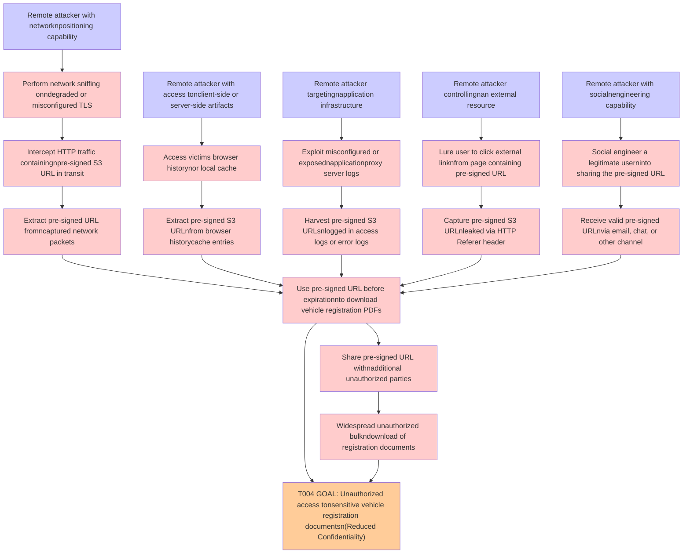

# Attack Tree: Data Breach

**Threat ID**: T004
**Statement**: A remote attacker with the ability to intercept or obtain a pre-signed S3 URL before its expiration, can reuse or share the pre-signed URL to download vehicle registration PDF documents without authenticating through the application, which leads to unauthorized access to sensitive vehicle registration documents, resulting in reduced confidentiality of vehicle registration documents stored in S3.

## Attack Tree Diagram

## MITRE ATT&CK Mapping

This attack tree has been mapped to MITRE ATT&CK techniques:

### Receive valid pre-signed URLnvia email, chat, or other channel

- **Technique**: [T1598.003](https://attack.mitre.org/techniques/T1598/003/) - Spearphishing Link
- **Tactic**: Reconnaissance
- **Similarity Score**: 65.19%
- **Mitigations (2):**
  - 🛡️ **User Training**
    User Training involves educating employees and contractors on recognizing, reporting, and preventing cyber threats that ...
  - 🛡️ **Software Configuration**
    Software configuration refers to making security-focused adjustments to the settings of applications, middleware, databa...

### Remote attacker controllingnan external resource

- **Technique**: [T1108](https://attack.mitre.org/techniques/T1108/) - Redundant Access
- **Tactic**: Defense Evasion, Persistence
- **Similarity Score**: 52.21%

### Use pre-signed URL before expirationnto download vehicle registration PDFs

- **Technique**: [T1596.003](https://attack.mitre.org/techniques/T1596/003/) - Digital Certificates
- **Tactic**: Reconnaissance
- **Similarity Score**: 41.97%
- **Mitigations (1):**
  - 🛡️ **Pre-compromise**
    Pre-compromise mitigations involve proactive measures and defenses implemented to prevent adversaries from successfully ...

### Capture pre-signed S3 URLnleaked via HTTP Referer header

- **Technique**: [T1090.004](https://attack.mitre.org/techniques/T1090/004/) - Domain Fronting
- **Tactic**: Command And Control
- **Similarity Score**: 54.03%
- **Mitigations (1):**
  - 🛡️ **SSL/TLS Inspection**
    SSL/TLS inspection involves decrypting encrypted network traffic to examine its content for signs of malicious activity....

### Lure user to click external linknfrom page containing pre-signed URL

- **Technique**: [T1608.005](https://attack.mitre.org/techniques/T1608/005/) - Link Target
- **Tactic**: Resource Development
- **Similarity Score**: 69.93%
- **Mitigations (1):**
  - 🛡️ **Pre-compromise**
    Pre-compromise mitigations involve proactive measures and defenses implemented to prevent adversaries from successfully ...

### Remote attacker with access tonclient-side or server-side artifacts

- **Technique**: [T1505.003](https://attack.mitre.org/techniques/T1505/003/) - Web Shell
- **Tactic**: Persistence
- **Similarity Score**: 52.01%
- **Mitigations (2):**
  - 🛡️ **Disable or Remove Feature or Program**
    Disable or remove unnecessary and potentially vulnerable software, features, or services to reduce the attack surface an...
  - 🛡️ **User Account Management**
    User Account Management involves implementing and enforcing policies for the lifecycle of user accounts, including creat...

### Remote attacker targetingnapplication infrastructure

- **Technique**: [T1190](https://attack.mitre.org/techniques/T1190/) - Exploit Public-Facing Application
- **Tactic**: Initial Access
- **Similarity Score**: 58.12%
- **Mitigations (8):**
  - 🛡️ **Application Isolation and Sandboxing**
    Application Isolation and Sandboxing refers to the technique of restricting the execution of code to a controlled and is...
  - 🛡️ **Filter Network Traffic**
    Employ network appliances and endpoint software to filter ingress, egress, and lateral network traffic. This includes pr...
  - 🛡️ **Network Segmentation**
    Network segmentation involves dividing a network into smaller, isolated segments to control and limit the flow of traffi...
  - *5 more mitigation(s) available*

### Social engineer a legitimate userninto sharing the pre-signed URL

- **Technique**: [T1598.003](https://attack.mitre.org/techniques/T1598/003/) - Spearphishing Link
- **Tactic**: Reconnaissance
- **Similarity Score**: 58.41%
- **Mitigations (2):**
  - 🛡️ **User Training**
    User Training involves educating employees and contractors on recognizing, reporting, and preventing cyber threats that ...
  - 🛡️ **Software Configuration**
    Software configuration refers to making security-focused adjustments to the settings of applications, middleware, databa...

### Remote attacker with networknpositioning capability

- **Technique**: [T1219](https://attack.mitre.org/techniques/T1219/) - Remote Access Tools
- **Tactic**: Command And Control
- **Similarity Score**: 55.51%
- **Mitigations (5):**
  - 🛡️ **Execution Prevention**
    Prevent the execution of unauthorized or malicious code on systems by implementing application control, script blocking,...
  - 🛡️ **Filter Network Traffic**
    Employ network appliances and endpoint software to filter ingress, egress, and lateral network traffic. This includes pr...
  - 🛡️ **Limit Hardware Installation**
    Prevent unauthorized users or groups from installing or using hardware, such as external drives, peripheral devices, or ...
  - *2 more mitigation(s) available*

### Access victims browser historynor local cache

- **Technique**: [T1217](https://attack.mitre.org/techniques/T1217/) - Browser Information Discovery
- **Tactic**: Discovery
- **Similarity Score**: 65.87%

### Widespread unauthorized bulkndownload of registration documents

- **Technique**: [T1119](https://attack.mitre.org/techniques/T1119/) - Automated Collection
- **Tactic**: Collection
- **Similarity Score**: 48.76%
- **Mitigations (2):**
  - 🛡️ **Remote Data Storage**
    Remote Data Storage focuses on moving critical data, such as security logs and sensitive files, to secure, off-host loca...
  - 🛡️ **Encrypt Sensitive Information**
    Protect sensitive information at rest, in transit, and during processing by using strong encryption algorithms. Encrypti...

### Remote attacker with socialnengineering capability

- **Technique**: [T1108](https://attack.mitre.org/techniques/T1108/) - Redundant Access
- **Tactic**: Defense Evasion, Persistence
- **Similarity Score**: 60.38%

### Intercept HTTP traffic containingnpre-signed S3 URL in transit

- **Technique**: [T1001.003](https://attack.mitre.org/techniques/T1001/003/) - Protocol or Service Impersonation
- **Tactic**: Command And Control
- **Similarity Score**: 75.18%
- **Mitigations (1):**
  - 🛡️ **Network Intrusion Prevention**
    Use intrusion detection signatures to block traffic at network boundaries.

### Perform network sniffing onndegraded or misconfigured TLS

- **Technique**: [T1001.003](https://attack.mitre.org/techniques/T1001/003/) - Protocol or Service Impersonation
- **Tactic**: Command And Control
- **Similarity Score**: 67.11%
- **Mitigations (1):**
  - 🛡️ **Network Intrusion Prevention**
    Use intrusion detection signatures to block traffic at network boundaries.

### Share pre-signed URL withnadditional unauthorized parties

- **Technique**: [T1608.003](https://attack.mitre.org/techniques/T1608/003/) - Install Digital Certificate
- **Tactic**: Resource Development
- **Similarity Score**: 45.79%
- **Mitigations (1):**
  - 🛡️ **Pre-compromise**
    Pre-compromise mitigations involve proactive measures and defenses implemented to prevent adversaries from successfully ...

### Extract pre-signed S3 URLnfrom browser historycache entries

- **Technique**: [T1217](https://attack.mitre.org/techniques/T1217/) - Browser Information Discovery
- **Tactic**: Discovery
- **Similarity Score**: 60.13%

### Extract pre-signed URL fromncaptured network packets

- **Technique**: [T1040](https://attack.mitre.org/techniques/T1040/) - Network Sniffing
- **Tactic**: Credential Access, Discovery
- **Similarity Score**: 67.25%
- **Mitigations (4):**
  - 🛡️ **User Account Management**
    User Account Management involves implementing and enforcing policies for the lifecycle of user accounts, including creat...
  - 🛡️ **Multi-factor Authentication**
    Multi-Factor Authentication (MFA) enhances security by requiring users to provide at least two forms of verification to ...
  - 🛡️ **Encrypt Sensitive Information**
    Protect sensitive information at rest, in transit, and during processing by using strong encryption algorithms. Encrypti...
  - *1 more mitigation(s) available*

### T004 GOAL: Unauthorized access tonsensitive vehicle registration documentsn(Reduced Confidentiality)

- **Technique**: [T1213](https://attack.mitre.org/techniques/T1213/) - Data from Information Repositories
- **Tactic**: Collection
- **Similarity Score**: 50.97%
- **Mitigations (7):**
  - 🛡️ **Multi-factor Authentication**
    Multi-Factor Authentication (MFA) enhances security by requiring users to provide at least two forms of verification to ...
  - 🛡️ **Out-of-Band Communications Channel**
    Establish secure out-of-band communication channels to ensure the continuity of critical communications during security ...
  - 🛡️ **User Training**
    User Training involves educating employees and contractors on recognizing, reporting, and preventing cyber threats that ...
  - *4 more mitigation(s) available*

### Exploit misconfigured or exposednapplicationproxy server logs

- **Technique**: [T1188](https://attack.mitre.org/techniques/T1188/) - Multi-hop Proxy
- **Tactic**: Command And Control
- **Similarity Score**: 63.31%

### Harvest pre-signed S3 URLsnlogged in access logs or error logs

- **Technique**: [T1654](https://attack.mitre.org/techniques/T1654/) - Log Enumeration
- **Tactic**: Discovery
- **Similarity Score**: 57.76%
- **Mitigations (1):**
  - 🛡️ **User Account Management**
    User Account Management involves implementing and enforcing policies for the lifecycle of user accounts, including creat...

*Total technique mappings: 20 | Mitigations found: 39*

## Attack Path Analysis

Review this attack tree to:
1. Identify critical attack paths
2. Implement appropriate security controls
3. Monitor for indicators
4. Develop incident response procedures

---
*Generated by ThreatForest*
