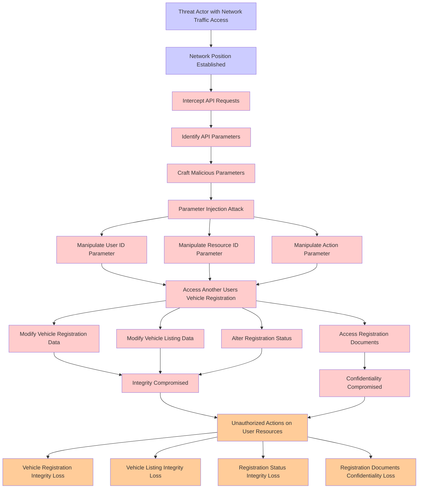

# Attack Tree: Injection

**Threat ID**: c5ac485c-a985-4004-be21-1fb26173a2d3
**Statement**: A threat actor with access to modify network traffic can manipulate API parameter input which leads to the API Gateway performing actions on another user's resources, resulting in reduced integrity and confidentiality of vehicle registration, vehicle listing, registration status, and vehicle registration documents.

## Attack Tree Diagram

## MITRE ATT&CK Mapping

This attack tree has been mapped to MITRE ATT&CK techniques:

### Vehicle Listing Integrity Loss

- **Technique**: [T1096](https://attack.mitre.org/techniques/T1096/) - NTFS File Attributes
- **Tactic**: Defense Evasion
- **Similarity Score**: 55.71%

### Threat Actor with Network Traffic Access

- **Technique**: [T1090](https://attack.mitre.org/techniques/T1090/) - Proxy
- **Tactic**: Command And Control
- **Similarity Score**: 74.00%
- **Mitigations (3):**
  - 🛡️ **Filter Network Traffic**
    Employ network appliances and endpoint software to filter ingress, egress, and lateral network traffic. This includes pr...
  - 🛡️ **Network Intrusion Prevention**
    Use intrusion detection signatures to block traffic at network boundaries.
  - 🛡️ **SSL/TLS Inspection**
    SSL/TLS inspection involves decrypting encrypted network traffic to examine its content for signs of malicious activity....

### Access Registration Documents

- **Technique**: [T1589.001](https://attack.mitre.org/techniques/T1589/001/) - Credentials
- **Tactic**: Reconnaissance
- **Similarity Score**: 52.87%
- **Mitigations (1):**
  - 🛡️ **Pre-compromise**
    Pre-compromise mitigations involve proactive measures and defenses implemented to prevent adversaries from successfully ...

### Parameter Injection Attack

- **Technique**: [T1659](https://attack.mitre.org/techniques/T1659/) - Content Injection
- **Tactic**: Initial Access, Command And Control
- **Similarity Score**: 42.81%
- **Mitigations (2):**
  - 🛡️ **Restrict Web-Based Content**
    Restricting web-based content involves enforcing policies and technologies that limit access to potentially malicious we...
  - 🛡️ **Encrypt Sensitive Information**
    Protect sensitive information at rest, in transit, and during processing by using strong encryption algorithms. Encrypti...

### Vehicle Registration Integrity Loss

- **Technique**: [T1096](https://attack.mitre.org/techniques/T1096/) - NTFS File Attributes
- **Tactic**: Defense Evasion
- **Similarity Score**: 46.72%

### Manipulate Resource ID Parameter

- **Technique**: [T1036.005](https://attack.mitre.org/techniques/T1036/005/) - Match Legitimate Resource Name or Location
- **Tactic**: Defense Evasion
- **Similarity Score**: 48.58%
- **Mitigations (3):**
  - 🛡️ **Restrict File and Directory Permissions**
    Restricting file and directory permissions involves setting access controls at the file system level to limit which user...
  - 🛡️ **Execution Prevention**
    Prevent the execution of unauthorized or malicious code on systems by implementing application control, script blocking,...
  - 🛡️ **Code Signing**
    Code Signing is a security process that ensures the authenticity and integrity of software by digitally signing executab...

### Craft Malicious Parameters

- **Technique**: [T1064](https://attack.mitre.org/techniques/T1064/) - Scripting
- **Tactic**: Defense Evasion, Execution
- **Similarity Score**: 38.80%

### Registration Documents Confidentiality Loss

- **Technique**: [T1492](https://attack.mitre.org/techniques/T1492/) - Stored Data Manipulation
- **Tactic**: Impact
- **Similarity Score**: 47.45%

### Registration Status Integrity Loss

- **Technique**: [T1070.009](https://attack.mitre.org/techniques/T1070/009/) - Clear Persistence
- **Tactic**: Defense Evasion
- **Similarity Score**: 63.28%
- **Mitigations (2):**
  - 🛡️ **Restrict File and Directory Permissions**
    Restricting file and directory permissions involves setting access controls at the file system level to limit which user...
  - 🛡️ **Remote Data Storage**
    Remote Data Storage focuses on moving critical data, such as security logs and sensitive files, to secure, off-host loca...

### Modify Vehicle Registration Data

- **Technique**: [T1565.003](https://attack.mitre.org/techniques/T1565/003/) - Runtime Data Manipulation
- **Tactic**: Impact
- **Similarity Score**: 45.00%
- **Mitigations (2):**
  - 🛡️ **Network Segmentation**
    Network segmentation involves dividing a network into smaller, isolated segments to control and limit the flow of traffi...
  - 🛡️ **Restrict File and Directory Permissions**
    Restricting file and directory permissions involves setting access controls at the file system level to limit which user...

### Manipulate Action Parameter

- **Technique**: [T1064](https://attack.mitre.org/techniques/T1064/) - Scripting
- **Tactic**: Defense Evasion, Execution
- **Similarity Score**: 31.47%

### Network Position Established

- **Technique**: [T1018](https://attack.mitre.org/techniques/T1018/) - Remote System Discovery
- **Tactic**: Discovery
- **Similarity Score**: 58.91%

### Alter Registration Status

- **Technique**: [T1098](https://attack.mitre.org/techniques/T1098/) - Account Manipulation
- **Tactic**: Persistence, Privilege Escalation
- **Similarity Score**: 56.06%
- **Mitigations (7):**
  - 🛡️ **Network Segmentation**
    Network segmentation involves dividing a network into smaller, isolated segments to control and limit the flow of traffi...
  - 🛡️ **Disable or Remove Feature or Program**
    Disable or remove unnecessary and potentially vulnerable software, features, or services to reduce the attack surface an...
  - 🛡️ **User Account Management**
    User Account Management involves implementing and enforcing policies for the lifecycle of user accounts, including creat...
  - *4 more mitigation(s) available*

### Manipulate User ID Parameter

- **Technique**: [T1147](https://attack.mitre.org/techniques/T1147/) - Hidden Users
- **Tactic**: Defense Evasion
- **Similarity Score**: 61.95%

### Access Another Users Vehicle Registration

- **Technique**: [T1098.005](https://attack.mitre.org/techniques/T1098/005/) - Device Registration
- **Tactic**: Persistence, Privilege Escalation
- **Similarity Score**: 39.83%
- **Mitigations (1):**
  - 🛡️ **Multi-factor Authentication**
    Multi-Factor Authentication (MFA) enhances security by requiring users to provide at least two forms of verification to ...

### Confidentiality Compromised

- **Technique**: [T1114](https://attack.mitre.org/techniques/T1114/) - Email Collection
- **Tactic**: Collection
- **Similarity Score**: 54.21%
- **Mitigations (4):**
  - 🛡️ **Multi-factor Authentication**
    Multi-Factor Authentication (MFA) enhances security by requiring users to provide at least two forms of verification to ...
  - 🛡️ **Out-of-Band Communications Channel**
    Establish secure out-of-band communication channels to ensure the continuity of critical communications during security ...
  - 🛡️ **Encrypt Sensitive Information**
    Protect sensitive information at rest, in transit, and during processing by using strong encryption algorithms. Encrypti...
  - *1 more mitigation(s) available*

### Intercept API Requests

- **Technique**: [T1505.004](https://attack.mitre.org/techniques/T1505/004/) - IIS Components
- **Tactic**: Persistence
- **Similarity Score**: 42.09%
- **Mitigations (4):**
  - 🛡️ **Privileged Account Management**
    Privileged Account Management focuses on implementing policies, controls, and tools to securely manage privileged accoun...
  - 🛡️ **Execution Prevention**
    Prevent the execution of unauthorized or malicious code on systems by implementing application control, script blocking,...
  - 🛡️ **Audit**
    Auditing is the process of recording activity and systematically reviewing and analyzing the activity and system configu...
  - *1 more mitigation(s) available*

### Identify API Parameters

- **Technique**: [T1552.005](https://attack.mitre.org/techniques/T1552/005/) - Cloud Instance Metadata API
- **Tactic**: Credential Access
- **Similarity Score**: 44.05%
- **Mitigations (3):**
  - 🛡️ **Limit Access to Resource Over Network**
    Restrict access to network resources, such as file shares, remote systems, and services, to only those users, accounts, ...
  - 🛡️ **Disable or Remove Feature or Program**
    Disable or remove unnecessary and potentially vulnerable software, features, or services to reduce the attack surface an...
  - 🛡️ **Filter Network Traffic**
    Employ network appliances and endpoint software to filter ingress, egress, and lateral network traffic. This includes pr...

### Modify Vehicle Listing Data

- **Technique**: [T1494](https://attack.mitre.org/techniques/T1494/) - Runtime Data Manipulation
- **Tactic**: Impact
- **Similarity Score**: 42.37%

### Unauthorized Actions on User Resources

- **Technique**: [T1546](https://attack.mitre.org/techniques/T1546/) - Event Triggered Execution
- **Tactic**: Privilege Escalation, Persistence
- **Similarity Score**: 56.59%
- **Mitigations (2):**
  - 🛡️ **Privileged Account Management**
    Privileged Account Management focuses on implementing policies, controls, and tools to securely manage privileged accoun...
  - 🛡️ **Update Software**
    Software updates ensure systems are protected against known vulnerabilities by applying patches and upgrades provided by...

### Integrity Compromised

- **Technique**: [T1565.003](https://attack.mitre.org/techniques/T1565/003/) - Runtime Data Manipulation
- **Tactic**: Impact
- **Similarity Score**: 58.95%
- **Mitigations (2):**
  - 🛡️ **Network Segmentation**
    Network segmentation involves dividing a network into smaller, isolated segments to control and limit the flow of traffi...
  - 🛡️ **Restrict File and Directory Permissions**
    Restricting file and directory permissions involves setting access controls at the file system level to limit which user...

*Total technique mappings: 21 | Mitigations found: 36*

## Attack Path Analysis

Review this attack tree to:
1. Identify critical attack paths
2. Implement appropriate security controls
3. Monitor for indicators
4. Develop incident response procedures

---
*Generated by ThreatForest*
