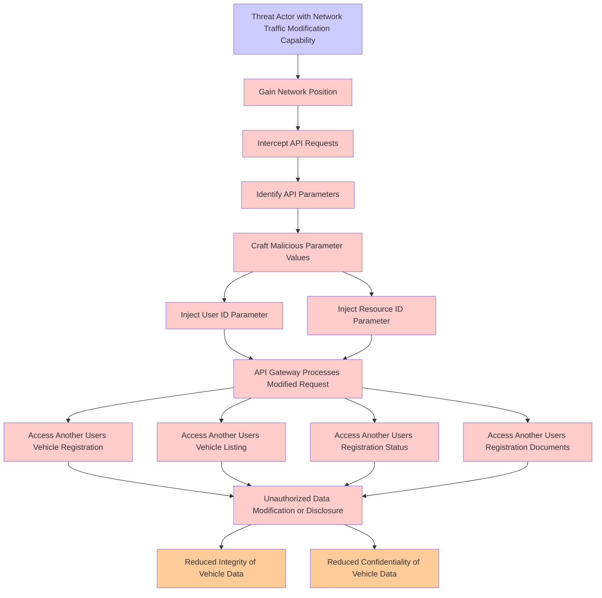

# Attack Tree: Injection

**Threat ID**: c5ac485c-a985-4004-be21-1fb26173a2d3
**Statement**: A threat actor with access to modify network traffic can manipulate API parameter input which leads to the API Gateway performing actions on another user's resources, resulting in reduced integrity and confidentiality of vehicle registration, vehicle listing, registration status, and vehicle registration documents.

## Attack Tree Diagram

## MITRE ATT&CK Mapping

This attack tree has been mapped to MITRE ATT&CK techniques:

### API Gateway Processes Modified Request

- **Technique**: [T1505.004](https://attack.mitre.org/techniques/T1505/004/) - IIS Components
- **Tactic**: Persistence
- **Similarity Score**: 50.85%
- **Mitigations (4):**
  - 🛡️ **Privileged Account Management**
    Privileged Account Management focuses on implementing policies, controls, and tools to securely manage privileged accoun...
  - 🛡️ **Execution Prevention**
    Prevent the execution of unauthorized or malicious code on systems by implementing application control, script blocking,...
  - 🛡️ **Audit**
    Auditing is the process of recording activity and systematically reviewing and analyzing the activity and system configu...
  - *1 more mitigation(s) available*

### Access Another Users Vehicle Registration

- **Technique**: [T1098.005](https://attack.mitre.org/techniques/T1098/005/) - Device Registration
- **Tactic**: Persistence, Privilege Escalation
- **Similarity Score**: 39.83%
- **Mitigations (1):**
  - 🛡️ **Multi-factor Authentication**
    Multi-Factor Authentication (MFA) enhances security by requiring users to provide at least two forms of verification to ...

### Craft Malicious Parameter Values

- **Technique**: [T1027.010](https://attack.mitre.org/techniques/T1027/010/) - Command Obfuscation
- **Tactic**: Defense Evasion
- **Similarity Score**: 41.08%
- **Mitigations (2):**
  - 🛡️ **Behavior Prevention on Endpoint**
    Behavior Prevention on Endpoint refers to the use of technologies and strategies to detect and block potentially malicio...
  - 🛡️ **Antivirus/Antimalware**
    Antivirus/Antimalware solutions utilize signatures, heuristics, and behavioral analysis to detect, block, and remediate ...

### Inject User ID Parameter

- **Technique**: [T1147](https://attack.mitre.org/techniques/T1147/) - Hidden Users
- **Tactic**: Defense Evasion
- **Similarity Score**: 56.30%

### Access Another Users Registration Documents

- **Technique**: [T1078](https://attack.mitre.org/techniques/T1078/) - Valid Accounts
- **Tactic**: Defense Evasion, Persistence, Privilege Escalation, Initial Access
- **Similarity Score**: 58.47%
- **Mitigations (8):**
  - 🛡️ **Password Policies**
    Set and enforce secure password policies for accounts to reduce the likelihood of unauthorized access. Strong password p...
  - 🛡️ **User Account Management**
    User Account Management involves implementing and enforcing policies for the lifecycle of user accounts, including creat...
  - 🛡️ **Privileged Account Management**
    Privileged Account Management focuses on implementing policies, controls, and tools to securely manage privileged accoun...
  - *5 more mitigation(s) available*

### Threat Actor with Network Traffic Modification Capability

- **Technique**: [T1090](https://attack.mitre.org/techniques/T1090/) - Proxy
- **Tactic**: Command And Control
- **Similarity Score**: 72.44%
- **Mitigations (3):**
  - 🛡️ **Filter Network Traffic**
    Employ network appliances and endpoint software to filter ingress, egress, and lateral network traffic. This includes pr...
  - 🛡️ **Network Intrusion Prevention**
    Use intrusion detection signatures to block traffic at network boundaries.
  - 🛡️ **SSL/TLS Inspection**
    SSL/TLS inspection involves decrypting encrypted network traffic to examine its content for signs of malicious activity....

### Reduced Integrity of Vehicle Data

- **Technique**: [T1485](https://attack.mitre.org/techniques/T1485/) - Data Destruction
- **Tactic**: Impact
- **Similarity Score**: 69.72%
- **Mitigations (3):**
  - 🛡️ **Multi-factor Authentication**
    Multi-Factor Authentication (MFA) enhances security by requiring users to provide at least two forms of verification to ...
  - 🛡️ **Data Backup**
    Data Backup involves taking and securely storing backups of data from end-user systems and critical servers. It ensures ...
  - 🛡️ **User Account Management**
    User Account Management involves implementing and enforcing policies for the lifecycle of user accounts, including creat...

### Unauthorized Data Modification or Disclosure

- **Technique**: [T1492](https://attack.mitre.org/techniques/T1492/) - Stored Data Manipulation
- **Tactic**: Impact
- **Similarity Score**: 78.80%

### Access Another Users Registration Status

- **Technique**: [T1087](https://attack.mitre.org/techniques/T1087/) - Account Discovery
- **Tactic**: Discovery
- **Similarity Score**: 59.18%
- **Mitigations (2):**
  - 🛡️ **Operating System Configuration**
    Operating System Configuration involves adjusting system settings and hardening the default configurations of an operati...
  - 🛡️ **User Account Management**
    User Account Management involves implementing and enforcing policies for the lifecycle of user accounts, including creat...

### Gain Network Position

- **Technique**: [T1018](https://attack.mitre.org/techniques/T1018/) - Remote System Discovery
- **Tactic**: Discovery
- **Similarity Score**: 61.50%

### Intercept API Requests

- **Technique**: [T1505.004](https://attack.mitre.org/techniques/T1505/004/) - IIS Components
- **Tactic**: Persistence
- **Similarity Score**: 42.09%
- **Mitigations (4):**
  - 🛡️ **Privileged Account Management**
    Privileged Account Management focuses on implementing policies, controls, and tools to securely manage privileged accoun...
  - 🛡️ **Execution Prevention**
    Prevent the execution of unauthorized or malicious code on systems by implementing application control, script blocking,...
  - 🛡️ **Audit**
    Auditing is the process of recording activity and systematically reviewing and analyzing the activity and system configu...
  - *1 more mitigation(s) available*

### Inject Resource ID Parameter

- **Technique**: [T1036.005](https://attack.mitre.org/techniques/T1036/005/) - Match Legitimate Resource Name or Location
- **Tactic**: Defense Evasion
- **Similarity Score**: 46.61%
- **Mitigations (3):**
  - 🛡️ **Restrict File and Directory Permissions**
    Restricting file and directory permissions involves setting access controls at the file system level to limit which user...
  - 🛡️ **Execution Prevention**
    Prevent the execution of unauthorized or malicious code on systems by implementing application control, script blocking,...
  - 🛡️ **Code Signing**
    Code Signing is a security process that ensures the authenticity and integrity of software by digitally signing executab...

### Identify API Parameters

- **Technique**: [T1552.005](https://attack.mitre.org/techniques/T1552/005/) - Cloud Instance Metadata API
- **Tactic**: Credential Access
- **Similarity Score**: 44.05%
- **Mitigations (3):**
  - 🛡️ **Limit Access to Resource Over Network**
    Restrict access to network resources, such as file shares, remote systems, and services, to only those users, accounts, ...
  - 🛡️ **Disable or Remove Feature or Program**
    Disable or remove unnecessary and potentially vulnerable software, features, or services to reduce the attack surface an...
  - 🛡️ **Filter Network Traffic**
    Employ network appliances and endpoint software to filter ingress, egress, and lateral network traffic. This includes pr...

### Access Another Users Vehicle Listing

- **Technique**: [T1039](https://attack.mitre.org/techniques/T1039/) - Data from Network Shared Drive
- **Tactic**: Collection
- **Similarity Score**: 41.82%

### Reduced Confidentiality of Vehicle Data

- **Technique**: [T1486](https://attack.mitre.org/techniques/T1486/) - Data Encrypted for Impact
- **Tactic**: Impact
- **Similarity Score**: 63.46%
- **Mitigations (2):**
  - 🛡️ **Behavior Prevention on Endpoint**
    Behavior Prevention on Endpoint refers to the use of technologies and strategies to detect and block potentially malicio...
  - 🛡️ **Data Backup**
    Data Backup involves taking and securely storing backups of data from end-user systems and critical servers. It ensures ...

*Total technique mappings: 15 | Mitigations found: 35*

## Attack Path Analysis

Review this attack tree to:
1. Identify critical attack paths
2. Implement appropriate security controls
3. Monitor for indicators
4. Develop incident response procedures

---
*Generated by ThreatForest*
