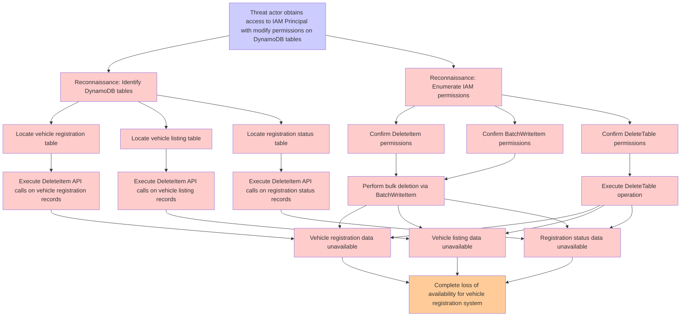

# Attack Tree: Data Breach

**Threat ID**: d38a0bd2-35cc-4c35-a48b-f73db6794a6e
**Statement**: A threat actor with access to an IAM Principal with modify access to the DynamoDB tables can delete the data, resulting in reduced availability of vehicle registration, vehicle listing, and registration status.

## Attack Tree Diagram

## MITRE ATT&CK Mapping

This attack tree has been mapped to MITRE ATT&CK techniques:

### Reconnaissance: Enumerate IAM permissions

- **Technique**: [T1069.001](https://attack.mitre.org/techniques/T1069/001/) - Local Groups
- **Tactic**: Discovery
- **Similarity Score**: 77.69%

### Locate vehicle registration table

- **Technique**: [T1590.001](https://attack.mitre.org/techniques/T1590/001/) - Domain Properties
- **Tactic**: Reconnaissance
- **Similarity Score**: 46.97%
- **Mitigations (1):**
  - 🛡️ **Pre-compromise**
    Pre-compromise mitigations involve proactive measures and defenses implemented to prevent adversaries from successfully ...

### Threat actor obtains access to IAM Principal with modify permissions on DynamoDB tables

- **Technique**: [T1098.003](https://attack.mitre.org/techniques/T1098/003/) - Additional Cloud Roles
- **Tactic**: Persistence, Privilege Escalation
- **Similarity Score**: 71.13%
- **Mitigations (3):**
  - 🛡️ **Privileged Account Management**
    Privileged Account Management focuses on implementing policies, controls, and tools to securely manage privileged accoun...
  - 🛡️ **Multi-factor Authentication**
    Multi-Factor Authentication (MFA) enhances security by requiring users to provide at least two forms of verification to ...
  - 🛡️ **User Account Management**
    User Account Management involves implementing and enforcing policies for the lifecycle of user accounts, including creat...

### Reconnaissance: Identify DynamoDB tables

- **Technique**: [T1119](https://attack.mitre.org/techniques/T1119/) - Automated Collection
- **Tactic**: Collection
- **Similarity Score**: 62.46%
- **Mitigations (2):**
  - 🛡️ **Remote Data Storage**
    Remote Data Storage focuses on moving critical data, such as security logs and sensitive files, to secure, off-host loca...
  - 🛡️ **Encrypt Sensitive Information**
    Protect sensitive information at rest, in transit, and during processing by using strong encryption algorithms. Encrypti...

### Confirm DeleteTable permissions

- **Technique**: [T1070.004](https://attack.mitre.org/techniques/T1070/004/) - File Deletion
- **Tactic**: Defense Evasion
- **Similarity Score**: 71.58%

### Execute DeleteItem API calls on vehicle listing records

- **Technique**: [T1107](https://attack.mitre.org/techniques/T1107/) - File Deletion
- **Tactic**: Defense Evasion
- **Similarity Score**: 65.30%

### Execute DeleteTable operation

- **Technique**: [T1107](https://attack.mitre.org/techniques/T1107/) - File Deletion
- **Tactic**: Defense Evasion
- **Similarity Score**: 78.12%

### Vehicle registration data unavailable

- **Technique**: [T1602](https://attack.mitre.org/techniques/T1602/) - Data from Configuration Repository
- **Tactic**: Collection
- **Similarity Score**: 50.15%
- **Mitigations (6):**
  - 🛡️ **Update Software**
    Software updates ensure systems are protected against known vulnerabilities by applying patches and upgrades provided by...
  - 🛡️ **Software Configuration**
    Software configuration refers to making security-focused adjustments to the settings of applications, middleware, databa...
  - 🛡️ **Network Segmentation**
    Network segmentation involves dividing a network into smaller, isolated segments to control and limit the flow of traffi...
  - *3 more mitigation(s) available*

### Registration status data unavailable

- **Technique**: [T1087](https://attack.mitre.org/techniques/T1087/) - Account Discovery
- **Tactic**: Discovery
- **Similarity Score**: 48.62%
- **Mitigations (2):**
  - 🛡️ **Operating System Configuration**
    Operating System Configuration involves adjusting system settings and hardening the default configurations of an operati...
  - 🛡️ **User Account Management**
    User Account Management involves implementing and enforcing policies for the lifecycle of user accounts, including creat...

### Complete loss of availability for vehicle registration system

- **Technique**: [T1098.005](https://attack.mitre.org/techniques/T1098/005/) - Device Registration
- **Tactic**: Persistence, Privilege Escalation
- **Similarity Score**: 44.74%
- **Mitigations (1):**
  - 🛡️ **Multi-factor Authentication**
    Multi-Factor Authentication (MFA) enhances security by requiring users to provide at least two forms of verification to ...

### Confirm BatchWriteItem permissions

- **Technique**: [T1222.001](https://attack.mitre.org/techniques/T1222/001/) - Windows File and Directory Permissions Modification
- **Tactic**: Defense Evasion
- **Similarity Score**: 80.80%
- **Mitigations (2):**
  - 🛡️ **Privileged Account Management**
    Privileged Account Management focuses on implementing policies, controls, and tools to securely manage privileged accoun...
  - 🛡️ **Restrict File and Directory Permissions**
    Restricting file and directory permissions involves setting access controls at the file system level to limit which user...

### Locate registration status table

- **Technique**: [T1087](https://attack.mitre.org/techniques/T1087/) - Account Discovery
- **Tactic**: Discovery
- **Similarity Score**: 55.48%
- **Mitigations (2):**
  - 🛡️ **Operating System Configuration**
    Operating System Configuration involves adjusting system settings and hardening the default configurations of an operati...
  - 🛡️ **User Account Management**
    User Account Management involves implementing and enforcing policies for the lifecycle of user accounts, including creat...

### Locate vehicle listing table

- **Technique**: [T1039](https://attack.mitre.org/techniques/T1039/) - Data from Network Shared Drive
- **Tactic**: Collection
- **Similarity Score**: 49.20%

### Confirm DeleteItem permissions

- **Technique**: [T1070.004](https://attack.mitre.org/techniques/T1070/004/) - File Deletion
- **Tactic**: Defense Evasion
- **Similarity Score**: 72.56%

### Vehicle listing data unavailable

- **Technique**: [T1005](https://attack.mitre.org/techniques/T1005/) - Data from Local System
- **Tactic**: Collection
- **Similarity Score**: 57.40%
- **Mitigations (1):**
  - 🛡️ **Data Loss Prevention**
    Data Loss Prevention (DLP) involves implementing strategies and technologies to identify, categorize, monitor, and contr...

### Execute DeleteItem API calls on vehicle registration records

- **Technique**: [T1107](https://attack.mitre.org/techniques/T1107/) - File Deletion
- **Tactic**: Defense Evasion
- **Similarity Score**: 62.08%

### Execute DeleteItem API calls on registration status records

- **Technique**: [T1070.009](https://attack.mitre.org/techniques/T1070/009/) - Clear Persistence
- **Tactic**: Defense Evasion
- **Similarity Score**: 66.49%
- **Mitigations (2):**
  - 🛡️ **Restrict File and Directory Permissions**
    Restricting file and directory permissions involves setting access controls at the file system level to limit which user...
  - 🛡️ **Remote Data Storage**
    Remote Data Storage focuses on moving critical data, such as security logs and sensitive files, to secure, off-host loca...

### Perform bulk deletion via BatchWriteItem

- **Technique**: [T1107](https://attack.mitre.org/techniques/T1107/) - File Deletion
- **Tactic**: Defense Evasion
- **Similarity Score**: 82.28%

*Total technique mappings: 18 | Mitigations found: 22*

## Attack Path Analysis

Review this attack tree to:
1. Identify critical attack paths
2. Implement appropriate security controls
3. Monitor for indicators
4. Develop incident response procedures

---
*Generated by ThreatForest*
