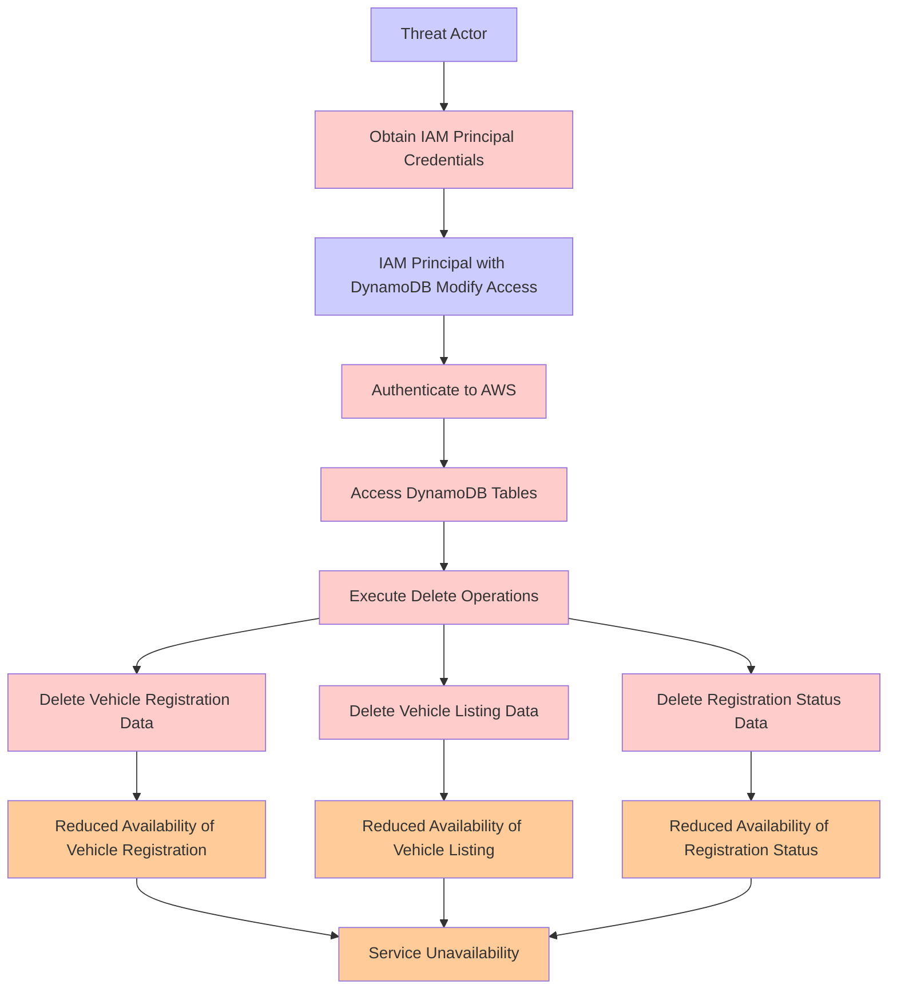

# Attack Tree: Data Destruction

**Threat ID**: d38a0bd2-35cc-4c35-a48b-f73db6794a6e
**Statement**: A threat actor with access to an IAM Principal with modify access to the DynamoDB tables can delete the data, resulting in reduced availability of vehicle registration, vehicle listing, and registration status.

## Attack Tree Diagram

## MITRE ATT&CK Mapping

This attack tree has been mapped to MITRE ATT&CK techniques:

### Service Unavailability

- **Technique**: [T1489](https://attack.mitre.org/techniques/T1489/) - Service Stop
- **Tactic**: Impact
- **Similarity Score**: 76.67%
- **Mitigations (5):**
  - 🛡️ **Network Segmentation**
    Network segmentation involves dividing a network into smaller, isolated segments to control and limit the flow of traffi...
  - 🛡️ **User Account Management**
    User Account Management involves implementing and enforcing policies for the lifecycle of user accounts, including creat...
  - 🛡️ **Out-of-Band Communications Channel**
    Establish secure out-of-band communication channels to ensure the continuity of critical communications during security ...
  - *2 more mitigation(s) available*

### Access DynamoDB Tables

- **Technique**: [T1530](https://attack.mitre.org/techniques/T1530/) - Data from Cloud Storage
- **Tactic**: Collection
- **Similarity Score**: 53.80%
- **Mitigations (6):**
  - 🛡️ **User Account Management**
    User Account Management involves implementing and enforcing policies for the lifecycle of user accounts, including creat...
  - 🛡️ **Encrypt Sensitive Information**
    Protect sensitive information at rest, in transit, and during processing by using strong encryption algorithms. Encrypti...
  - 🛡️ **Restrict File and Directory Permissions**
    Restricting file and directory permissions involves setting access controls at the file system level to limit which user...
  - *3 more mitigation(s) available*

### Threat Actor

- **Technique**: [T1584.005](https://attack.mitre.org/techniques/T1584/005/) - Botnet
- **Tactic**: Resource Development
- **Similarity Score**: 42.53%
- **Mitigations (1):**
  - 🛡️ **Pre-compromise**
    Pre-compromise mitigations involve proactive measures and defenses implemented to prevent adversaries from successfully ...

### Delete Vehicle Listing Data

- **Technique**: [T1107](https://attack.mitre.org/techniques/T1107/) - File Deletion
- **Tactic**: Defense Evasion
- **Similarity Score**: 73.99%

### Reduced Availability of Vehicle Listing

- **Technique**: [T1673](https://attack.mitre.org/techniques/T1673/) - Virtual Machine Discovery
- **Tactic**: Discovery
- **Similarity Score**: 39.73%

### Delete Vehicle Registration Data

- **Technique**: [T1107](https://attack.mitre.org/techniques/T1107/) - File Deletion
- **Tactic**: Defense Evasion
- **Similarity Score**: 65.30%

### Delete Registration Status Data

- **Technique**: [T1070.009](https://attack.mitre.org/techniques/T1070/009/) - Clear Persistence
- **Tactic**: Defense Evasion
- **Similarity Score**: 77.01%
- **Mitigations (2):**
  - 🛡️ **Restrict File and Directory Permissions**
    Restricting file and directory permissions involves setting access controls at the file system level to limit which user...
  - 🛡️ **Remote Data Storage**
    Remote Data Storage focuses on moving critical data, such as security logs and sensitive files, to secure, off-host loca...

### Authenticate to AWS

- **Technique**: [T1021.007](https://attack.mitre.org/techniques/T1021/007/) - Cloud Services
- **Tactic**: Lateral Movement
- **Similarity Score**: 71.65%
- **Mitigations (2):**
  - 🛡️ **Multi-factor Authentication**
    Multi-Factor Authentication (MFA) enhances security by requiring users to provide at least two forms of verification to ...
  - 🛡️ **Privileged Account Management**
    Privileged Account Management focuses on implementing policies, controls, and tools to securely manage privileged accoun...

### Obtain IAM Principal Credentials

- **Technique**: [T1556.003](https://attack.mitre.org/techniques/T1556/003/) - Pluggable Authentication Modules
- **Tactic**: Credential Access, Defense Evasion, Persistence
- **Similarity Score**: 74.11%
- **Mitigations (2):**
  - 🛡️ **Multi-factor Authentication**
    Multi-Factor Authentication (MFA) enhances security by requiring users to provide at least two forms of verification to ...
  - 🛡️ **Privileged Account Management**
    Privileged Account Management focuses on implementing policies, controls, and tools to securely manage privileged accoun...

### IAM Principal with DynamoDB Modify Access

- **Technique**: [T1548.005](https://attack.mitre.org/techniques/T1548/005/) - Temporary Elevated Cloud Access
- **Tactic**: Privilege Escalation, Defense Evasion
- **Similarity Score**: 74.60%
- **Mitigations (1):**
  - 🛡️ **User Account Management**
    User Account Management involves implementing and enforcing policies for the lifecycle of user accounts, including creat...

### Execute Delete Operations

- **Technique**: [T1107](https://attack.mitre.org/techniques/T1107/) - File Deletion
- **Tactic**: Defense Evasion
- **Similarity Score**: 82.80%

### Reduced Availability of Registration Status

- **Technique**: [T1098.005](https://attack.mitre.org/techniques/T1098/005/) - Device Registration
- **Tactic**: Persistence, Privilege Escalation
- **Similarity Score**: 51.66%
- **Mitigations (1):**
  - 🛡️ **Multi-factor Authentication**
    Multi-Factor Authentication (MFA) enhances security by requiring users to provide at least two forms of verification to ...

### Reduced Availability of Vehicle Registration

- **Technique**: [T1098.005](https://attack.mitre.org/techniques/T1098/005/) - Device Registration
- **Tactic**: Persistence, Privilege Escalation
- **Similarity Score**: 43.07%
- **Mitigations (1):**
  - 🛡️ **Multi-factor Authentication**
    Multi-Factor Authentication (MFA) enhances security by requiring users to provide at least two forms of verification to ...

*Total technique mappings: 13 | Mitigations found: 21*

## Attack Path Analysis

Review this attack tree to:
1. Identify critical attack paths
2. Implement appropriate security controls
3. Monitor for indicators
4. Develop incident response procedures

---
*Generated by ThreatForest*
