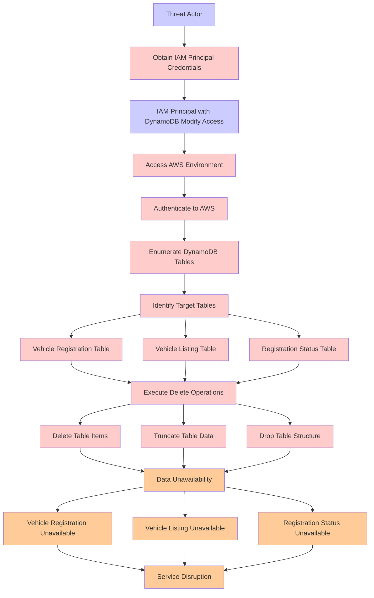

# Attack Tree: Data Destruction

**Threat ID**: d38a0bd2-35cc-4c35-a48b-f73db6794a6e
**Statement**: A threat actor with access to an IAM Principal with modify access to the DynamoDB tables can delete the data, resulting in reduced availability of vehicle registration, vehicle listing, and registration status.

## Attack Tree Diagram

## MITRE ATT&CK Mapping

This attack tree has been mapped to MITRE ATT&CK techniques:

### Vehicle Registration Table

- **Technique**: [T1590.001](https://attack.mitre.org/techniques/T1590/001/) - Domain Properties
- **Tactic**: Reconnaissance
- **Similarity Score**: 44.99%
- **Mitigations (1):**
  - 🛡️ **Pre-compromise**
    Pre-compromise mitigations involve proactive measures and defenses implemented to prevent adversaries from successfully ...

### Authenticate to AWS

- **Technique**: [T1021.007](https://attack.mitre.org/techniques/T1021/007/) - Cloud Services
- **Tactic**: Lateral Movement
- **Similarity Score**: 71.65%
- **Mitigations (2):**
  - 🛡️ **Multi-factor Authentication**
    Multi-Factor Authentication (MFA) enhances security by requiring users to provide at least two forms of verification to ...
  - 🛡️ **Privileged Account Management**
    Privileged Account Management focuses on implementing policies, controls, and tools to securely manage privileged accoun...

### Identify Target Tables

- **Technique**: [T1213.006](https://attack.mitre.org/techniques/T1213/006/) - Databases
- **Tactic**: Collection
- **Similarity Score**: 45.56%
- **Mitigations (5):**
  - 🛡️ **User Training**
    User Training involves educating employees and contractors on recognizing, reporting, and preventing cyber threats that ...
  - 🛡️ **Encrypt Sensitive Information**
    Protect sensitive information at rest, in transit, and during processing by using strong encryption algorithms. Encrypti...
  - 🛡️ **Software Configuration**
    Software configuration refers to making security-focused adjustments to the settings of applications, middleware, databa...
  - *2 more mitigation(s) available*

### Service Disruption

- **Technique**: [T1499.004](https://attack.mitre.org/techniques/T1499/004/) - Application or System Exploitation
- **Tactic**: Impact
- **Similarity Score**: 58.34%
- **Mitigations (1):**
  - 🛡️ **Filter Network Traffic**
    Employ network appliances and endpoint software to filter ingress, egress, and lateral network traffic. This includes pr...

### Vehicle Registration Unavailable

- **Technique**: [T1590.001](https://attack.mitre.org/techniques/T1590/001/) - Domain Properties
- **Tactic**: Reconnaissance
- **Similarity Score**: 35.84%
- **Mitigations (1):**
  - 🛡️ **Pre-compromise**
    Pre-compromise mitigations involve proactive measures and defenses implemented to prevent adversaries from successfully ...

### Truncate Table Data

- **Technique**: [T1070.004](https://attack.mitre.org/techniques/T1070/004/) - File Deletion
- **Tactic**: Defense Evasion
- **Similarity Score**: 60.89%

### Registration Status Unavailable

- **Technique**: [T1098.005](https://attack.mitre.org/techniques/T1098/005/) - Device Registration
- **Tactic**: Persistence, Privilege Escalation
- **Similarity Score**: 50.34%
- **Mitigations (1):**
  - 🛡️ **Multi-factor Authentication**
    Multi-Factor Authentication (MFA) enhances security by requiring users to provide at least two forms of verification to ...

### Delete Table Items

- **Technique**: [T1070.004](https://attack.mitre.org/techniques/T1070/004/) - File Deletion
- **Tactic**: Defense Evasion
- **Similarity Score**: 72.82%

### Execute Delete Operations

- **Technique**: [T1107](https://attack.mitre.org/techniques/T1107/) - File Deletion
- **Tactic**: Defense Evasion
- **Similarity Score**: 82.80%

### Drop Table Structure

- **Technique**: [T1070.010](https://attack.mitre.org/techniques/T1070/010/) - Relocate Malware
- **Tactic**: Defense Evasion
- **Similarity Score**: 51.33%

### Access AWS Environment

- **Technique**: [T1021.008](https://attack.mitre.org/techniques/T1021/008/) - Direct Cloud VM Connections
- **Tactic**: Lateral Movement
- **Similarity Score**: 73.73%
- **Mitigations (2):**
  - 🛡️ **User Account Management**
    User Account Management involves implementing and enforcing policies for the lifecycle of user accounts, including creat...
  - 🛡️ **Disable or Remove Feature or Program**
    Disable or remove unnecessary and potentially vulnerable software, features, or services to reduce the attack surface an...

### Enumerate DynamoDB Tables

- **Technique**: [T1119](https://attack.mitre.org/techniques/T1119/) - Automated Collection
- **Tactic**: Collection
- **Similarity Score**: 59.88%
- **Mitigations (2):**
  - 🛡️ **Remote Data Storage**
    Remote Data Storage focuses on moving critical data, such as security logs and sensitive files, to secure, off-host loca...
  - 🛡️ **Encrypt Sensitive Information**
    Protect sensitive information at rest, in transit, and during processing by using strong encryption algorithms. Encrypti...

### Vehicle Listing Unavailable

- **Technique**: [T1082](https://attack.mitre.org/techniques/T1082/) - System Information Discovery
- **Tactic**: Discovery
- **Similarity Score**: 46.60%

### IAM Principal with DynamoDB Modify Access

- **Technique**: [T1548.005](https://attack.mitre.org/techniques/T1548/005/) - Temporary Elevated Cloud Access
- **Tactic**: Privilege Escalation, Defense Evasion
- **Similarity Score**: 74.60%
- **Mitigations (1):**
  - 🛡️ **User Account Management**
    User Account Management involves implementing and enforcing policies for the lifecycle of user accounts, including creat...

### Registration Status Table

- **Technique**: [T1087](https://attack.mitre.org/techniques/T1087/) - Account Discovery
- **Tactic**: Discovery
- **Similarity Score**: 51.57%
- **Mitigations (2):**
  - 🛡️ **Operating System Configuration**
    Operating System Configuration involves adjusting system settings and hardening the default configurations of an operati...
  - 🛡️ **User Account Management**
    User Account Management involves implementing and enforcing policies for the lifecycle of user accounts, including creat...

### Threat Actor

- **Technique**: [T1584.005](https://attack.mitre.org/techniques/T1584/005/) - Botnet
- **Tactic**: Resource Development
- **Similarity Score**: 42.53%
- **Mitigations (1):**
  - 🛡️ **Pre-compromise**
    Pre-compromise mitigations involve proactive measures and defenses implemented to prevent adversaries from successfully ...

### Vehicle Listing Table

- **Technique**: [T1039](https://attack.mitre.org/techniques/T1039/) - Data from Network Shared Drive
- **Tactic**: Collection
- **Similarity Score**: 43.82%

### Obtain IAM Principal Credentials

- **Technique**: [T1556.003](https://attack.mitre.org/techniques/T1556/003/) - Pluggable Authentication Modules
- **Tactic**: Credential Access, Defense Evasion, Persistence
- **Similarity Score**: 74.11%
- **Mitigations (2):**
  - 🛡️ **Multi-factor Authentication**
    Multi-Factor Authentication (MFA) enhances security by requiring users to provide at least two forms of verification to ...
  - 🛡️ **Privileged Account Management**
    Privileged Account Management focuses on implementing policies, controls, and tools to securely manage privileged accoun...

### Data Unavailability

- **Technique**: [T1485](https://attack.mitre.org/techniques/T1485/) - Data Destruction
- **Tactic**: Impact
- **Similarity Score**: 74.11%
- **Mitigations (3):**
  - 🛡️ **Multi-factor Authentication**
    Multi-Factor Authentication (MFA) enhances security by requiring users to provide at least two forms of verification to ...
  - 🛡️ **Data Backup**
    Data Backup involves taking and securely storing backups of data from end-user systems and critical servers. It ensures ...
  - 🛡️ **User Account Management**
    User Account Management involves implementing and enforcing policies for the lifecycle of user accounts, including creat...

*Total technique mappings: 19 | Mitigations found: 24*

## Attack Path Analysis

Review this attack tree to:
1. Identify critical attack paths
2. Implement appropriate security controls
3. Monitor for indicators
4. Develop incident response procedures

---
*Generated by ThreatForest*
