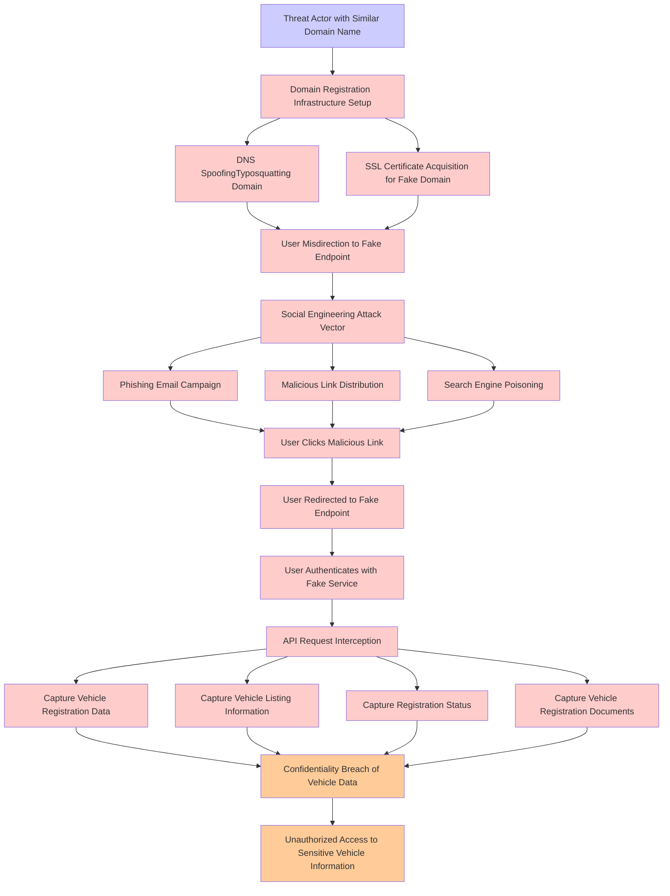

# Attack Tree: Social Engineering

**Threat ID**: e0e6089f-66d2-49ca-8be0-f9346ab85a14
**Statement**: A threat actor with possession of a similar domain name can trick our users into interacting with a fake endpoint, which leads to interception of valid API requests, negatively impacting vehicle registration, vehicle listing, registration status and vehicle registration documents

## Attack Tree Diagram

## MITRE ATT&CK Mapping

This attack tree has been mapped to MITRE ATT&CK techniques:

### User Clicks Malicious Link

- **Technique**: [T1204.001](https://attack.mitre.org/techniques/T1204/001/) - Malicious Link
- **Tactic**: Execution
- **Similarity Score**: 74.22%
- **Mitigations (3):**
  - 🛡️ **Network Intrusion Prevention**
    Use intrusion detection signatures to block traffic at network boundaries.
  - 🛡️ **User Training**
    User Training involves educating employees and contractors on recognizing, reporting, and preventing cyber threats that ...
  - 🛡️ **Restrict Web-Based Content**
    Restricting web-based content involves enforcing policies and technologies that limit access to potentially malicious we...

### SSL Certificate Acquisition for Fake Domain

- **Technique**: [T1588.004](https://attack.mitre.org/techniques/T1588/004/) - Digital Certificates
- **Tactic**: Resource Development
- **Similarity Score**: 77.39%
- **Mitigations (1):**
  - 🛡️ **Pre-compromise**
    Pre-compromise mitigations involve proactive measures and defenses implemented to prevent adversaries from successfully ...

### DNS SpoofingTyposquatting Domain

- **Technique**: [T1583.002](https://attack.mitre.org/techniques/T1583/002/) - DNS Server
- **Tactic**: Resource Development
- **Similarity Score**: 80.10%
- **Mitigations (1):**
  - 🛡️ **Pre-compromise**
    Pre-compromise mitigations involve proactive measures and defenses implemented to prevent adversaries from successfully ...

### Search Engine Poisoning

- **Technique**: [T1608.006](https://attack.mitre.org/techniques/T1608/006/) - SEO Poisoning
- **Tactic**: Resource Development
- **Similarity Score**: 78.07%
- **Mitigations (1):**
  - 🛡️ **Pre-compromise**
    Pre-compromise mitigations involve proactive measures and defenses implemented to prevent adversaries from successfully ...

### Confidentiality Breach of Vehicle Data

- **Technique**: [T1565.002](https://attack.mitre.org/techniques/T1565/002/) - Transmitted Data Manipulation
- **Tactic**: Impact
- **Similarity Score**: 56.57%
- **Mitigations (1):**
  - 🛡️ **Encrypt Sensitive Information**
    Protect sensitive information at rest, in transit, and during processing by using strong encryption algorithms. Encrypti...

### Capture Vehicle Listing Information

- **Technique**: [T1082](https://attack.mitre.org/techniques/T1082/) - System Information Discovery
- **Tactic**: Discovery
- **Similarity Score**: 49.27%

### Domain Registration  Infrastructure Setup

- **Technique**: [T1584.001](https://attack.mitre.org/techniques/T1584/001/) - Domains
- **Tactic**: Resource Development
- **Similarity Score**: 65.39%
- **Mitigations (1):**
  - 🛡️ **Pre-compromise**
    Pre-compromise mitigations involve proactive measures and defenses implemented to prevent adversaries from successfully ...

### API Request Interception

- **Technique**: [T1001.003](https://attack.mitre.org/techniques/T1001/003/) - Protocol or Service Impersonation
- **Tactic**: Command And Control
- **Similarity Score**: 43.83%
- **Mitigations (1):**
  - 🛡️ **Network Intrusion Prevention**
    Use intrusion detection signatures to block traffic at network boundaries.

### Capture Registration Status

- **Technique**: [T1003.002](https://attack.mitre.org/techniques/T1003/002/) - Security Account Manager
- **Tactic**: Credential Access
- **Similarity Score**: 43.27%
- **Mitigations (4):**
  - 🛡️ **Password Policies**
    Set and enforce secure password policies for accounts to reduce the likelihood of unauthorized access. Strong password p...
  - 🛡️ **Privileged Account Management**
    Privileged Account Management focuses on implementing policies, controls, and tools to securely manage privileged accoun...
  - 🛡️ **Operating System Configuration**
    Operating System Configuration involves adjusting system settings and hardening the default configurations of an operati...
  - *1 more mitigation(s) available*

### Capture Vehicle Registration Data

- **Technique**: [T1602](https://attack.mitre.org/techniques/T1602/) - Data from Configuration Repository
- **Tactic**: Collection
- **Similarity Score**: 40.53%
- **Mitigations (6):**
  - 🛡️ **Update Software**
    Software updates ensure systems are protected against known vulnerabilities by applying patches and upgrades provided by...
  - 🛡️ **Software Configuration**
    Software configuration refers to making security-focused adjustments to the settings of applications, middleware, databa...
  - 🛡️ **Network Segmentation**
    Network segmentation involves dividing a network into smaller, isolated segments to control and limit the flow of traffi...
  - *3 more mitigation(s) available*

### Phishing Email Campaign

- **Technique**: [T1566](https://attack.mitre.org/techniques/T1566/) - Phishing
- **Tactic**: Initial Access
- **Similarity Score**: 84.63%
- **Mitigations (6):**
  - 🛡️ **Audit**
    Auditing is the process of recording activity and systematically reviewing and analyzing the activity and system configu...
  - 🛡️ **Network Intrusion Prevention**
    Use intrusion detection signatures to block traffic at network boundaries.
  - 🛡️ **Software Configuration**
    Software configuration refers to making security-focused adjustments to the settings of applications, middleware, databa...
  - *3 more mitigation(s) available*

### User Authenticates with Fake Service

- **Technique**: [T1556](https://attack.mitre.org/techniques/T1556/) - Modify Authentication Process
- **Tactic**: Credential Access, Defense Evasion, Persistence
- **Similarity Score**: 68.78%
- **Mitigations (9):**
  - 🛡️ **Restrict Registry Permissions**
    Restricting registry permissions involves configuring access control settings for sensitive registry keys and hives to e...
  - 🛡️ **Multi-factor Authentication**
    Multi-Factor Authentication (MFA) enhances security by requiring users to provide at least two forms of verification to ...
  - 🛡️ **Password Policies**
    Set and enforce secure password policies for accounts to reduce the likelihood of unauthorized access. Strong password p...
  - *6 more mitigation(s) available*

### Malicious Link Distribution

- **Technique**: [T1204.001](https://attack.mitre.org/techniques/T1204/001/) - Malicious Link
- **Tactic**: Execution
- **Similarity Score**: 71.77%
- **Mitigations (3):**
  - 🛡️ **Network Intrusion Prevention**
    Use intrusion detection signatures to block traffic at network boundaries.
  - 🛡️ **User Training**
    User Training involves educating employees and contractors on recognizing, reporting, and preventing cyber threats that ...
  - 🛡️ **Restrict Web-Based Content**
    Restricting web-based content involves enforcing policies and technologies that limit access to potentially malicious we...

### User Redirected to Fake Endpoint

- **Technique**: [T1001.003](https://attack.mitre.org/techniques/T1001/003/) - Protocol or Service Impersonation
- **Tactic**: Command And Control
- **Similarity Score**: 56.96%
- **Mitigations (1):**
  - 🛡️ **Network Intrusion Prevention**
    Use intrusion detection signatures to block traffic at network boundaries.

### Threat Actor with Similar Domain Name

- **Technique**: [T1583.001](https://attack.mitre.org/techniques/T1583/001/) - Domains
- **Tactic**: Resource Development
- **Similarity Score**: 68.36%
- **Mitigations (1):**
  - 🛡️ **Pre-compromise**
    Pre-compromise mitigations involve proactive measures and defenses implemented to prevent adversaries from successfully ...

### Unauthorized Access to Sensitive Vehicle Information

- **Technique**: [T1213](https://attack.mitre.org/techniques/T1213/) - Data from Information Repositories
- **Tactic**: Collection
- **Similarity Score**: 47.50%
- **Mitigations (7):**
  - 🛡️ **Multi-factor Authentication**
    Multi-Factor Authentication (MFA) enhances security by requiring users to provide at least two forms of verification to ...
  - 🛡️ **Out-of-Band Communications Channel**
    Establish secure out-of-band communication channels to ensure the continuity of critical communications during security ...
  - 🛡️ **User Training**
    User Training involves educating employees and contractors on recognizing, reporting, and preventing cyber threats that ...
  - *4 more mitigation(s) available*

### User Misdirection to Fake Endpoint

- **Technique**: [T1090](https://attack.mitre.org/techniques/T1090/) - Proxy
- **Tactic**: Command And Control
- **Similarity Score**: 60.54%
- **Mitigations (3):**
  - 🛡️ **Filter Network Traffic**
    Employ network appliances and endpoint software to filter ingress, egress, and lateral network traffic. This includes pr...
  - 🛡️ **Network Intrusion Prevention**
    Use intrusion detection signatures to block traffic at network boundaries.
  - 🛡️ **SSL/TLS Inspection**
    SSL/TLS inspection involves decrypting encrypted network traffic to examine its content for signs of malicious activity....

### Capture Vehicle Registration Documents

- **Technique**: [T1025](https://attack.mitre.org/techniques/T1025/) - Data from Removable Media
- **Tactic**: Collection
- **Similarity Score**: 41.77%
- **Mitigations (1):**
  - 🛡️ **Data Loss Prevention**
    Data Loss Prevention (DLP) involves implementing strategies and technologies to identify, categorize, monitor, and contr...

### Social Engineering Attack Vector

- **Technique**: [T1566](https://attack.mitre.org/techniques/T1566/) - Phishing
- **Tactic**: Initial Access
- **Similarity Score**: 77.55%
- **Mitigations (6):**
  - 🛡️ **Audit**
    Auditing is the process of recording activity and systematically reviewing and analyzing the activity and system configu...
  - 🛡️ **Network Intrusion Prevention**
    Use intrusion detection signatures to block traffic at network boundaries.
  - 🛡️ **Software Configuration**
    Software configuration refers to making security-focused adjustments to the settings of applications, middleware, databa...
  - *3 more mitigation(s) available*

*Total technique mappings: 19 | Mitigations found: 56*

## Attack Path Analysis

Review this attack tree to:
1. Identify critical attack paths
2. Implement appropriate security controls
3. Monitor for indicators
4. Develop incident response procedures

---
*Generated by ThreatForest*
