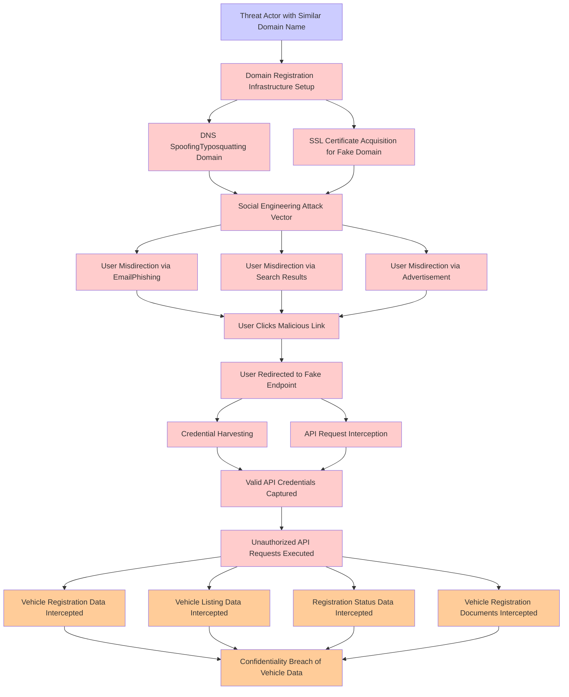

# Attack Tree: Social Engineering

**Threat ID**: e0e6089f-66d2-49ca-8be0-f9346ab85a14
**Statement**: A threat actor with possession of a similar domain name can trick our users into interacting with a fake endpoint, which leads to interception of valid API requests, negatively impacting vehicle registration, vehicle listing, registration status and vehicle registration documents

## Attack Tree Diagram

## MITRE ATT&CK Mapping

This attack tree has been mapped to MITRE ATT&CK techniques:

### Unauthorized API Requests Executed

- **Technique**: [T1505.004](https://attack.mitre.org/techniques/T1505/004/) - IIS Components
- **Tactic**: Persistence
- **Similarity Score**: 41.65%
- **Mitigations (4):**
  - 🛡️ **Privileged Account Management**
    Privileged Account Management focuses on implementing policies, controls, and tools to securely manage privileged accoun...
  - 🛡️ **Execution Prevention**
    Prevent the execution of unauthorized or malicious code on systems by implementing application control, script blocking,...
  - 🛡️ **Audit**
    Auditing is the process of recording activity and systematically reviewing and analyzing the activity and system configu...
  - *1 more mitigation(s) available*

### Vehicle Registration Documents Intercepted

- **Technique**: [T1596.003](https://attack.mitre.org/techniques/T1596/003/) - Digital Certificates
- **Tactic**: Reconnaissance
- **Similarity Score**: 37.71%
- **Mitigations (1):**
  - 🛡️ **Pre-compromise**
    Pre-compromise mitigations involve proactive measures and defenses implemented to prevent adversaries from successfully ...

### Valid API Credentials Captured

- **Technique**: [T1056](https://attack.mitre.org/techniques/T1056/) - Input Capture
- **Tactic**: Collection, Credential Access
- **Similarity Score**: 84.94%

### User Misdirection via EmailPhishing

- **Technique**: [T1566](https://attack.mitre.org/techniques/T1566/) - Phishing
- **Tactic**: Initial Access
- **Similarity Score**: 75.64%
- **Mitigations (6):**
  - 🛡️ **Audit**
    Auditing is the process of recording activity and systematically reviewing and analyzing the activity and system configu...
  - 🛡️ **Network Intrusion Prevention**
    Use intrusion detection signatures to block traffic at network boundaries.
  - 🛡️ **Software Configuration**
    Software configuration refers to making security-focused adjustments to the settings of applications, middleware, databa...
  - *3 more mitigation(s) available*

### User Redirected to Fake Endpoint

- **Technique**: [T1001.003](https://attack.mitre.org/techniques/T1001/003/) - Protocol or Service Impersonation
- **Tactic**: Command And Control
- **Similarity Score**: 56.96%
- **Mitigations (1):**
  - 🛡️ **Network Intrusion Prevention**
    Use intrusion detection signatures to block traffic at network boundaries.

### Vehicle Registration Data Intercepted

- **Technique**: [T1096](https://attack.mitre.org/techniques/T1096/) - NTFS File Attributes
- **Tactic**: Defense Evasion
- **Similarity Score**: 39.46%

### DNS SpoofingTyposquatting Domain

- **Technique**: [T1583.002](https://attack.mitre.org/techniques/T1583/002/) - DNS Server
- **Tactic**: Resource Development
- **Similarity Score**: 80.10%
- **Mitigations (1):**
  - 🛡️ **Pre-compromise**
    Pre-compromise mitigations involve proactive measures and defenses implemented to prevent adversaries from successfully ...

### Vehicle Listing Data Intercepted

- **Technique**: [T1005](https://attack.mitre.org/techniques/T1005/) - Data from Local System
- **Tactic**: Collection
- **Similarity Score**: 49.24%
- **Mitigations (1):**
  - 🛡️ **Data Loss Prevention**
    Data Loss Prevention (DLP) involves implementing strategies and technologies to identify, categorize, monitor, and contr...

### Threat Actor with Similar Domain Name

- **Technique**: [T1583.001](https://attack.mitre.org/techniques/T1583/001/) - Domains
- **Tactic**: Resource Development
- **Similarity Score**: 68.36%
- **Mitigations (1):**
  - 🛡️ **Pre-compromise**
    Pre-compromise mitigations involve proactive measures and defenses implemented to prevent adversaries from successfully ...

### SSL Certificate Acquisition for Fake Domain

- **Technique**: [T1588.004](https://attack.mitre.org/techniques/T1588/004/) - Digital Certificates
- **Tactic**: Resource Development
- **Similarity Score**: 77.39%
- **Mitigations (1):**
  - 🛡️ **Pre-compromise**
    Pre-compromise mitigations involve proactive measures and defenses implemented to prevent adversaries from successfully ...

### Domain Registration  Infrastructure Setup

- **Technique**: [T1584.001](https://attack.mitre.org/techniques/T1584/001/) - Domains
- **Tactic**: Resource Development
- **Similarity Score**: 65.39%
- **Mitigations (1):**
  - 🛡️ **Pre-compromise**
    Pre-compromise mitigations involve proactive measures and defenses implemented to prevent adversaries from successfully ...

### Credential Harvesting

- **Technique**: [T1110.004](https://attack.mitre.org/techniques/T1110/004/) - Credential Stuffing
- **Tactic**: Credential Access
- **Similarity Score**: 73.85%
- **Mitigations (4):**
  - 🛡️ **Account Use Policies**
    Account Use Policies help mitigate unauthorized access by configuring and enforcing rules that govern how and when accou...
  - 🛡️ **Password Policies**
    Set and enforce secure password policies for accounts to reduce the likelihood of unauthorized access. Strong password p...
  - 🛡️ **User Account Management**
    User Account Management involves implementing and enforcing policies for the lifecycle of user accounts, including creat...
  - *1 more mitigation(s) available*

### Confidentiality Breach of Vehicle Data

- **Technique**: [T1565.002](https://attack.mitre.org/techniques/T1565/002/) - Transmitted Data Manipulation
- **Tactic**: Impact
- **Similarity Score**: 56.57%
- **Mitigations (1):**
  - 🛡️ **Encrypt Sensitive Information**
    Protect sensitive information at rest, in transit, and during processing by using strong encryption algorithms. Encrypti...

### User Misdirection via Search Results

- **Technique**: [T1593.002](https://attack.mitre.org/techniques/T1593/002/) - Search Engines
- **Tactic**: Reconnaissance
- **Similarity Score**: 52.61%
- **Mitigations (1):**
  - 🛡️ **Pre-compromise**
    Pre-compromise mitigations involve proactive measures and defenses implemented to prevent adversaries from successfully ...

### API Request Interception

- **Technique**: [T1001.003](https://attack.mitre.org/techniques/T1001/003/) - Protocol or Service Impersonation
- **Tactic**: Command And Control
- **Similarity Score**: 43.83%
- **Mitigations (1):**
  - 🛡️ **Network Intrusion Prevention**
    Use intrusion detection signatures to block traffic at network boundaries.

### User Clicks Malicious Link

- **Technique**: [T1204.001](https://attack.mitre.org/techniques/T1204/001/) - Malicious Link
- **Tactic**: Execution
- **Similarity Score**: 74.22%
- **Mitigations (3):**
  - 🛡️ **Network Intrusion Prevention**
    Use intrusion detection signatures to block traffic at network boundaries.
  - 🛡️ **User Training**
    User Training involves educating employees and contractors on recognizing, reporting, and preventing cyber threats that ...
  - 🛡️ **Restrict Web-Based Content**
    Restricting web-based content involves enforcing policies and technologies that limit access to potentially malicious we...

### Social Engineering Attack Vector

- **Technique**: [T1566](https://attack.mitre.org/techniques/T1566/) - Phishing
- **Tactic**: Initial Access
- **Similarity Score**: 77.55%
- **Mitigations (6):**
  - 🛡️ **Audit**
    Auditing is the process of recording activity and systematically reviewing and analyzing the activity and system configu...
  - 🛡️ **Network Intrusion Prevention**
    Use intrusion detection signatures to block traffic at network boundaries.
  - 🛡️ **Software Configuration**
    Software configuration refers to making security-focused adjustments to the settings of applications, middleware, databa...
  - *3 more mitigation(s) available*

### Registration Status Data Intercepted

- **Technique**: [T1087](https://attack.mitre.org/techniques/T1087/) - Account Discovery
- **Tactic**: Discovery
- **Similarity Score**: 44.42%
- **Mitigations (2):**
  - 🛡️ **Operating System Configuration**
    Operating System Configuration involves adjusting system settings and hardening the default configurations of an operati...
  - 🛡️ **User Account Management**
    User Account Management involves implementing and enforcing policies for the lifecycle of user accounts, including creat...

### User Misdirection via Advertisement

- **Technique**: [T1583.008](https://attack.mitre.org/techniques/T1583/008/) - Malvertising
- **Tactic**: Resource Development
- **Similarity Score**: 62.21%
- **Mitigations (1):**
  - 🛡️ **Pre-compromise**
    Pre-compromise mitigations involve proactive measures and defenses implemented to prevent adversaries from successfully ...

*Total technique mappings: 19 | Mitigations found: 36*

## Attack Path Analysis

Review this attack tree to:
1. Identify critical attack paths
2. Implement appropriate security controls
3. Monitor for indicators
4. Develop incident response procedures

---
*Generated by ThreatForest*
