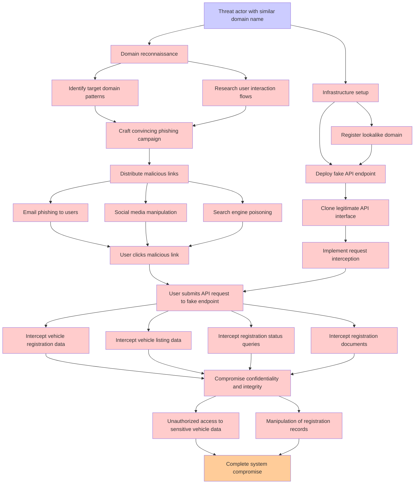

# Attack Tree: Spoofing

**Threat ID**: e0e6089f-66d2-49ca-8be0-f9346ab85a14
**Statement**: A threat actor with possession of a similar domain name can trick our users into interacting with a fake endpoint, which leads to interception of valid API requests, negatively impacting vehicle registration, vehicle listing, registration status and vehicle registration documents

## Attack Tree Diagram

## MITRE ATT&CK Mapping

This attack tree has been mapped to MITRE ATT&CK techniques:

### Complete system compromise

- **Technique**: [T1601.001](https://attack.mitre.org/techniques/T1601/001/) - Patch System Image
- **Tactic**: Defense Evasion
- **Similarity Score**: 49.68%
- **Mitigations (6):**
  - 🛡️ **Boot Integrity**
    Boot Integrity ensures that a system starts securely by verifying the integrity of its boot process, operating system, a...
  - 🛡️ **Code Signing**
    Code Signing is a security process that ensures the authenticity and integrity of software by digitally signing executab...
  - 🛡️ **Credential Access Protection**
    Credential Access Protection focuses on implementing measures to prevent adversaries from obtaining credentials, such as...
  - *3 more mitigation(s) available*

### Domain reconnaissance

- **Technique**: [T1590.001](https://attack.mitre.org/techniques/T1590/001/) - Domain Properties
- **Tactic**: Reconnaissance
- **Similarity Score**: 72.91%
- **Mitigations (1):**
  - 🛡️ **Pre-compromise**
    Pre-compromise mitigations involve proactive measures and defenses implemented to prevent adversaries from successfully ...

### Intercept vehicle listing data

- **Technique**: [T1005](https://attack.mitre.org/techniques/T1005/) - Data from Local System
- **Tactic**: Collection
- **Similarity Score**: 43.97%
- **Mitigations (1):**
  - 🛡️ **Data Loss Prevention**
    Data Loss Prevention (DLP) involves implementing strategies and technologies to identify, categorize, monitor, and contr...

### Infrastructure setup

- **Technique**: [T1583](https://attack.mitre.org/techniques/T1583/) - Acquire Infrastructure
- **Tactic**: Resource Development
- **Similarity Score**: 67.37%
- **Mitigations (1):**
  - 🛡️ **Pre-compromise**
    Pre-compromise mitigations involve proactive measures and defenses implemented to prevent adversaries from successfully ...

### Compromise confidentiality and integrity

- **Technique**: [T1565.002](https://attack.mitre.org/techniques/T1565/002/) - Transmitted Data Manipulation
- **Tactic**: Impact
- **Similarity Score**: 65.35%
- **Mitigations (1):**
  - 🛡️ **Encrypt Sensitive Information**
    Protect sensitive information at rest, in transit, and during processing by using strong encryption algorithms. Encrypti...

### Research user interaction flows

- **Technique**: [T1204](https://attack.mitre.org/techniques/T1204/) - User Execution
- **Tactic**: Execution
- **Similarity Score**: 35.86%
- **Mitigations (6):**
  - 🛡️ **User Training**
    User Training involves educating employees and contractors on recognizing, reporting, and preventing cyber threats that ...
  - 🛡️ **Execution Prevention**
    Prevent the execution of unauthorized or malicious code on systems by implementing application control, script blocking,...
  - 🛡️ **Behavior Prevention on Endpoint**
    Behavior Prevention on Endpoint refers to the use of technologies and strategies to detect and block potentially malicio...
  - *3 more mitigation(s) available*

### Manipulation of registration records

- **Technique**: [T1098.005](https://attack.mitre.org/techniques/T1098/005/) - Device Registration
- **Tactic**: Persistence, Privilege Escalation
- **Similarity Score**: 55.75%
- **Mitigations (1):**
  - 🛡️ **Multi-factor Authentication**
    Multi-Factor Authentication (MFA) enhances security by requiring users to provide at least two forms of verification to ...

### User clicks malicious link

- **Technique**: [T1204.001](https://attack.mitre.org/techniques/T1204/001/) - Malicious Link
- **Tactic**: Execution
- **Similarity Score**: 74.22%
- **Mitigations (3):**
  - 🛡️ **Network Intrusion Prevention**
    Use intrusion detection signatures to block traffic at network boundaries.
  - 🛡️ **User Training**
    User Training involves educating employees and contractors on recognizing, reporting, and preventing cyber threats that ...
  - 🛡️ **Restrict Web-Based Content**
    Restricting web-based content involves enforcing policies and technologies that limit access to potentially malicious we...

### Search engine poisoning

- **Technique**: [T1608.006](https://attack.mitre.org/techniques/T1608/006/) - SEO Poisoning
- **Tactic**: Resource Development
- **Similarity Score**: 78.07%
- **Mitigations (1):**
  - 🛡️ **Pre-compromise**
    Pre-compromise mitigations involve proactive measures and defenses implemented to prevent adversaries from successfully ...

### User submits API request to fake endpoint

- **Technique**: [T1583.006](https://attack.mitre.org/techniques/T1583/006/) - Web Services
- **Tactic**: Resource Development
- **Similarity Score**: 42.97%
- **Mitigations (1):**
  - 🛡️ **Pre-compromise**
    Pre-compromise mitigations involve proactive measures and defenses implemented to prevent adversaries from successfully ...

### Social media manipulation

- **Technique**: [T1586.001](https://attack.mitre.org/techniques/T1586/001/) - Social Media Accounts
- **Tactic**: Resource Development
- **Similarity Score**: 67.17%
- **Mitigations (1):**
  - 🛡️ **Pre-compromise**
    Pre-compromise mitigations involve proactive measures and defenses implemented to prevent adversaries from successfully ...

### Unauthorized access to sensitive vehicle data

- **Technique**: [T1530](https://attack.mitre.org/techniques/T1530/) - Data from Cloud Storage
- **Tactic**: Collection
- **Similarity Score**: 56.40%
- **Mitigations (6):**
  - 🛡️ **User Account Management**
    User Account Management involves implementing and enforcing policies for the lifecycle of user accounts, including creat...
  - 🛡️ **Encrypt Sensitive Information**
    Protect sensitive information at rest, in transit, and during processing by using strong encryption algorithms. Encrypti...
  - 🛡️ **Restrict File and Directory Permissions**
    Restricting file and directory permissions involves setting access controls at the file system level to limit which user...
  - *3 more mitigation(s) available*

### Intercept vehicle registration data

- **Technique**: [T1602](https://attack.mitre.org/techniques/T1602/) - Data from Configuration Repository
- **Tactic**: Collection
- **Similarity Score**: 35.58%
- **Mitigations (6):**
  - 🛡️ **Update Software**
    Software updates ensure systems are protected against known vulnerabilities by applying patches and upgrades provided by...
  - 🛡️ **Software Configuration**
    Software configuration refers to making security-focused adjustments to the settings of applications, middleware, databa...
  - 🛡️ **Network Segmentation**
    Network segmentation involves dividing a network into smaller, isolated segments to control and limit the flow of traffi...
  - *3 more mitigation(s) available*

### Intercept registration documents

- **Technique**: [T1098.005](https://attack.mitre.org/techniques/T1098/005/) - Device Registration
- **Tactic**: Persistence, Privilege Escalation
- **Similarity Score**: 53.77%
- **Mitigations (1):**
  - 🛡️ **Multi-factor Authentication**
    Multi-Factor Authentication (MFA) enhances security by requiring users to provide at least two forms of verification to ...

### Intercept registration status queries

- **Technique**: [T1087](https://attack.mitre.org/techniques/T1087/) - Account Discovery
- **Tactic**: Discovery
- **Similarity Score**: 53.45%
- **Mitigations (2):**
  - 🛡️ **Operating System Configuration**
    Operating System Configuration involves adjusting system settings and hardening the default configurations of an operati...
  - 🛡️ **User Account Management**
    User Account Management involves implementing and enforcing policies for the lifecycle of user accounts, including creat...

### Distribute malicious links

- **Technique**: [T1204.001](https://attack.mitre.org/techniques/T1204/001/) - Malicious Link
- **Tactic**: Execution
- **Similarity Score**: 71.03%
- **Mitigations (3):**
  - 🛡️ **Network Intrusion Prevention**
    Use intrusion detection signatures to block traffic at network boundaries.
  - 🛡️ **User Training**
    User Training involves educating employees and contractors on recognizing, reporting, and preventing cyber threats that ...
  - 🛡️ **Restrict Web-Based Content**
    Restricting web-based content involves enforcing policies and technologies that limit access to potentially malicious we...

### Email phishing to users

- **Technique**: [T1566](https://attack.mitre.org/techniques/T1566/) - Phishing
- **Tactic**: Initial Access
- **Similarity Score**: 88.29%
- **Mitigations (6):**
  - 🛡️ **Audit**
    Auditing is the process of recording activity and systematically reviewing and analyzing the activity and system configu...
  - 🛡️ **Network Intrusion Prevention**
    Use intrusion detection signatures to block traffic at network boundaries.
  - 🛡️ **Software Configuration**
    Software configuration refers to making security-focused adjustments to the settings of applications, middleware, databa...
  - *3 more mitigation(s) available*

### Threat actor with similar domain name

- **Technique**: [T1583.001](https://attack.mitre.org/techniques/T1583/001/) - Domains
- **Tactic**: Resource Development
- **Similarity Score**: 68.36%
- **Mitigations (1):**
  - 🛡️ **Pre-compromise**
    Pre-compromise mitigations involve proactive measures and defenses implemented to prevent adversaries from successfully ...

### Clone legitimate API interface

- **Technique**: [T1106](https://attack.mitre.org/techniques/T1106/) - Native API
- **Tactic**: Execution
- **Similarity Score**: 44.52%
- **Mitigations (2):**
  - 🛡️ **Execution Prevention**
    Prevent the execution of unauthorized or malicious code on systems by implementing application control, script blocking,...
  - 🛡️ **Behavior Prevention on Endpoint**
    Behavior Prevention on Endpoint refers to the use of technologies and strategies to detect and block potentially malicio...

### Register lookalike domain

- **Technique**: [T1584.001](https://attack.mitre.org/techniques/T1584/001/) - Domains
- **Tactic**: Resource Development
- **Similarity Score**: 63.01%
- **Mitigations (1):**
  - 🛡️ **Pre-compromise**
    Pre-compromise mitigations involve proactive measures and defenses implemented to prevent adversaries from successfully ...

### Implement request interception

- **Technique**: [T1001.003](https://attack.mitre.org/techniques/T1001/003/) - Protocol or Service Impersonation
- **Tactic**: Command And Control
- **Similarity Score**: 57.07%
- **Mitigations (1):**
  - 🛡️ **Network Intrusion Prevention**
    Use intrusion detection signatures to block traffic at network boundaries.

### Craft convincing phishing campaign

- **Technique**: [T1566](https://attack.mitre.org/techniques/T1566/) - Phishing
- **Tactic**: Initial Access
- **Similarity Score**: 82.48%
- **Mitigations (6):**
  - 🛡️ **Audit**
    Auditing is the process of recording activity and systematically reviewing and analyzing the activity and system configu...
  - 🛡️ **Network Intrusion Prevention**
    Use intrusion detection signatures to block traffic at network boundaries.
  - 🛡️ **Software Configuration**
    Software configuration refers to making security-focused adjustments to the settings of applications, middleware, databa...
  - *3 more mitigation(s) available*

### Deploy fake API endpoint

- **Technique**: [T1583.006](https://attack.mitre.org/techniques/T1583/006/) - Web Services
- **Tactic**: Resource Development
- **Similarity Score**: 41.41%
- **Mitigations (1):**
  - 🛡️ **Pre-compromise**
    Pre-compromise mitigations involve proactive measures and defenses implemented to prevent adversaries from successfully ...

### Identify target domain patterns

- **Technique**: [T1590.001](https://attack.mitre.org/techniques/T1590/001/) - Domain Properties
- **Tactic**: Reconnaissance
- **Similarity Score**: 67.39%
- **Mitigations (1):**
  - 🛡️ **Pre-compromise**
    Pre-compromise mitigations involve proactive measures and defenses implemented to prevent adversaries from successfully ...

*Total technique mappings: 24 | Mitigations found: 60*

## Attack Path Analysis

Review this attack tree to:
1. Identify critical attack paths
2. Implement appropriate security controls
3. Monitor for indicators
4. Develop incident response procedures

---
*Generated by ThreatForest*
