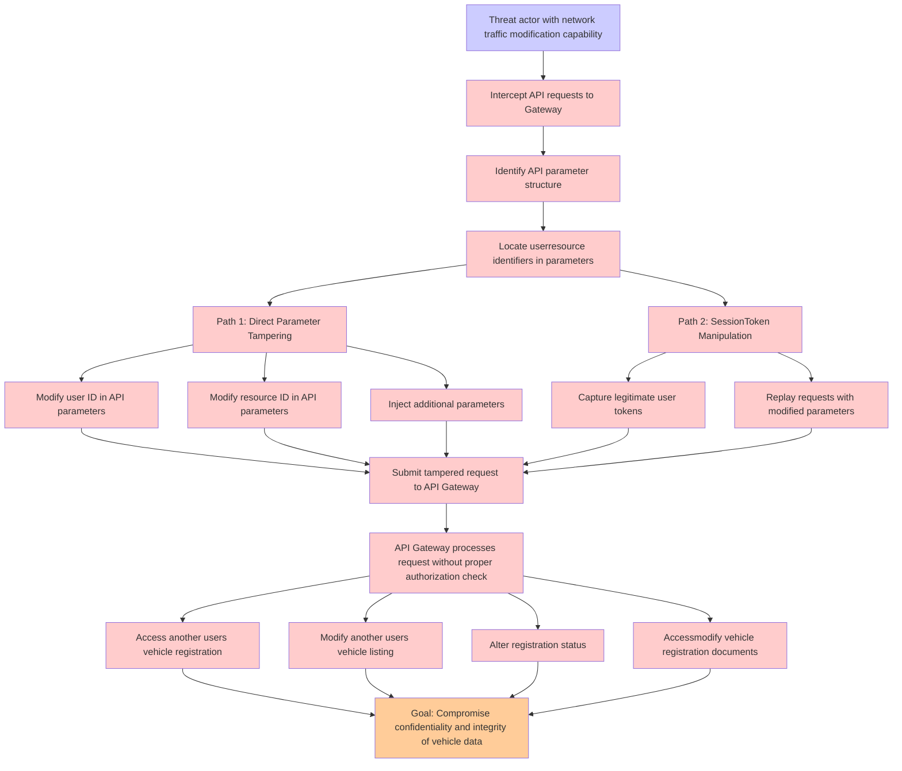

# Attack Tree: Authorization

**Threat ID**: c5ac485c-a985-4004-be21-1fb26173a2d3
**Statement**: A threat actor with access to modify network traffic can manipulate API parameter input which leads to the API Gateway performing actions on another user's resources, resulting in reduced integrity and confidentiality of vehicle registration, vehicle listing, registration status, and vehicle registration documents.

## Attack Tree Diagram

## MITRE ATT&CK Mapping

This attack tree has been mapped to MITRE ATT&CK techniques:

### Identify API parameter structure

- **Technique**: [T1027.007](https://attack.mitre.org/techniques/T1027/007/) - Dynamic API Resolution
- **Tactic**: Defense Evasion
- **Similarity Score**: 46.95%

### Path 1: Direct Parameter Tampering

- **Technique**: [T1036](https://attack.mitre.org/techniques/T1036/) - Masquerading
- **Tactic**: Defense Evasion
- **Similarity Score**: 56.43%
- **Mitigations (8):**
  - 🛡️ **Audit**
    Auditing is the process of recording activity and systematically reviewing and analyzing the activity and system configu...
  - 🛡️ **User Account Management**
    User Account Management involves implementing and enforcing policies for the lifecycle of user accounts, including creat...
  - 🛡️ **User Training**
    User Training involves educating employees and contractors on recognizing, reporting, and preventing cyber threats that ...
  - *5 more mitigation(s) available*

### Threat actor with network traffic modification capability

- **Technique**: [T1090](https://attack.mitre.org/techniques/T1090/) - Proxy
- **Tactic**: Command And Control
- **Similarity Score**: 72.44%
- **Mitigations (3):**
  - 🛡️ **Filter Network Traffic**
    Employ network appliances and endpoint software to filter ingress, egress, and lateral network traffic. This includes pr...
  - 🛡️ **Network Intrusion Prevention**
    Use intrusion detection signatures to block traffic at network boundaries.
  - 🛡️ **SSL/TLS Inspection**
    SSL/TLS inspection involves decrypting encrypted network traffic to examine its content for signs of malicious activity....

### Submit tampered request to API Gateway

- **Technique**: [T1001.003](https://attack.mitre.org/techniques/T1001/003/) - Protocol or Service Impersonation
- **Tactic**: Command And Control
- **Similarity Score**: 40.04%
- **Mitigations (1):**
  - 🛡️ **Network Intrusion Prevention**
    Use intrusion detection signatures to block traffic at network boundaries.

### Locate userresource identifiers in parameters

- **Technique**: [T1033](https://attack.mitre.org/techniques/T1033/) - System Owner/User Discovery
- **Tactic**: Discovery
- **Similarity Score**: 49.25%

### Alter registration status

- **Technique**: [T1098](https://attack.mitre.org/techniques/T1098/) - Account Manipulation
- **Tactic**: Persistence, Privilege Escalation
- **Similarity Score**: 56.06%
- **Mitigations (7):**
  - 🛡️ **Network Segmentation**
    Network segmentation involves dividing a network into smaller, isolated segments to control and limit the flow of traffi...
  - 🛡️ **Disable or Remove Feature or Program**
    Disable or remove unnecessary and potentially vulnerable software, features, or services to reduce the attack surface an...
  - 🛡️ **User Account Management**
    User Account Management involves implementing and enforcing policies for the lifecycle of user accounts, including creat...
  - *4 more mitigation(s) available*

### Modify resource ID in API parameters

- **Technique**: [T1564.009](https://attack.mitre.org/techniques/T1564/009/) - Resource Forking
- **Tactic**: Defense Evasion
- **Similarity Score**: 42.02%
- **Mitigations (1):**
  - 🛡️ **Application Developer Guidance**
    Application Developer Guidance focuses on providing developers with the knowledge, tools, and best practices needed to w...

### Intercept API requests to Gateway

- **Technique**: [T1188](https://attack.mitre.org/techniques/T1188/) - Multi-hop Proxy
- **Tactic**: Command And Control
- **Similarity Score**: 58.04%

### Inject additional parameters

- **Technique**: [T1218.013](https://attack.mitre.org/techniques/T1218/013/) - Mavinject
- **Tactic**: Defense Evasion
- **Similarity Score**: 53.36%
- **Mitigations (2):**
  - 🛡️ **Disable or Remove Feature or Program**
    Disable or remove unnecessary and potentially vulnerable software, features, or services to reduce the attack surface an...
  - 🛡️ **Execution Prevention**
    Prevent the execution of unauthorized or malicious code on systems by implementing application control, script blocking,...

### Capture legitimate user tokens

- **Technique**: [T1134.003](https://attack.mitre.org/techniques/T1134/003/) - Make and Impersonate Token
- **Tactic**: Defense Evasion, Privilege Escalation
- **Similarity Score**: 66.90%
- **Mitigations (2):**
  - 🛡️ **Privileged Account Management**
    Privileged Account Management focuses on implementing policies, controls, and tools to securely manage privileged accoun...
  - 🛡️ **User Account Management**
    User Account Management involves implementing and enforcing policies for the lifecycle of user accounts, including creat...

### Accessmodify vehicle registration documents

- **Technique**: [T1565.001](https://attack.mitre.org/techniques/T1565/001/) - Stored Data Manipulation
- **Tactic**: Impact
- **Similarity Score**: 47.51%
- **Mitigations (3):**
  - 🛡️ **Restrict File and Directory Permissions**
    Restricting file and directory permissions involves setting access controls at the file system level to limit which user...
  - 🛡️ **Remote Data Storage**
    Remote Data Storage focuses on moving critical data, such as security logs and sensitive files, to secure, off-host loca...
  - 🛡️ **Encrypt Sensitive Information**
    Protect sensitive information at rest, in transit, and during processing by using strong encryption algorithms. Encrypti...

### Replay requests with modified parameters

- **Technique**: [T1020.001](https://attack.mitre.org/techniques/T1020/001/) - Traffic Duplication
- **Tactic**: Exfiltration
- **Similarity Score**: 40.75%
- **Mitigations (3):**
  - 🛡️ **Encrypt Sensitive Information**
    Protect sensitive information at rest, in transit, and during processing by using strong encryption algorithms. Encrypti...
  - 🛡️ **User Account Management**
    User Account Management involves implementing and enforcing policies for the lifecycle of user accounts, including creat...
  - 🛡️ **Data Loss Prevention**
    Data Loss Prevention (DLP) involves implementing strategies and technologies to identify, categorize, monitor, and contr...

### Path 2: SessionToken Manipulation

- **Technique**: [T1134.003](https://attack.mitre.org/techniques/T1134/003/) - Make and Impersonate Token
- **Tactic**: Defense Evasion, Privilege Escalation
- **Similarity Score**: 62.10%
- **Mitigations (2):**
  - 🛡️ **Privileged Account Management**
    Privileged Account Management focuses on implementing policies, controls, and tools to securely manage privileged accoun...
  - 🛡️ **User Account Management**
    User Account Management involves implementing and enforcing policies for the lifecycle of user accounts, including creat...

### API Gateway processes request without proper authorization check

- **Technique**: [T1528](https://attack.mitre.org/techniques/T1528/) - Steal Application Access Token
- **Tactic**: Credential Access
- **Similarity Score**: 51.63%
- **Mitigations (4):**
  - 🛡️ **Restrict Web-Based Content**
    Restricting web-based content involves enforcing policies and technologies that limit access to potentially malicious we...
  - 🛡️ **Audit**
    Auditing is the process of recording activity and systematically reviewing and analyzing the activity and system configu...
  - 🛡️ **User Training**
    User Training involves educating employees and contractors on recognizing, reporting, and preventing cyber threats that ...
  - *1 more mitigation(s) available*

### Modify user ID in API parameters

- **Technique**: [T1036.010](https://attack.mitre.org/techniques/T1036/010/) - Masquerade Account Name
- **Tactic**: Defense Evasion
- **Similarity Score**: 57.98%
- **Mitigations (2):**
  - 🛡️ **Audit**
    Auditing is the process of recording activity and systematically reviewing and analyzing the activity and system configu...
  - 🛡️ **User Account Management**
    User Account Management involves implementing and enforcing policies for the lifecycle of user accounts, including creat...

### Modify another users vehicle listing

- **Technique**: [T1494](https://attack.mitre.org/techniques/T1494/) - Runtime Data Manipulation
- **Tactic**: Impact
- **Similarity Score**: 39.46%

### Goal: Compromise confidentiality and integrity of vehicle data

- **Technique**: [T1565.002](https://attack.mitre.org/techniques/T1565/002/) - Transmitted Data Manipulation
- **Tactic**: Impact
- **Similarity Score**: 62.49%
- **Mitigations (1):**
  - 🛡️ **Encrypt Sensitive Information**
    Protect sensitive information at rest, in transit, and during processing by using strong encryption algorithms. Encrypti...

### Access another users vehicle registration

- **Technique**: [T1098.005](https://attack.mitre.org/techniques/T1098/005/) - Device Registration
- **Tactic**: Persistence, Privilege Escalation
- **Similarity Score**: 39.83%
- **Mitigations (1):**
  - 🛡️ **Multi-factor Authentication**
    Multi-Factor Authentication (MFA) enhances security by requiring users to provide at least two forms of verification to ...

*Total technique mappings: 18 | Mitigations found: 40*

## Attack Path Analysis

Review this attack tree to:
1. Identify critical attack paths
2. Implement appropriate security controls
3. Monitor for indicators
4. Develop incident response procedures

---
*Generated by ThreatForest*
