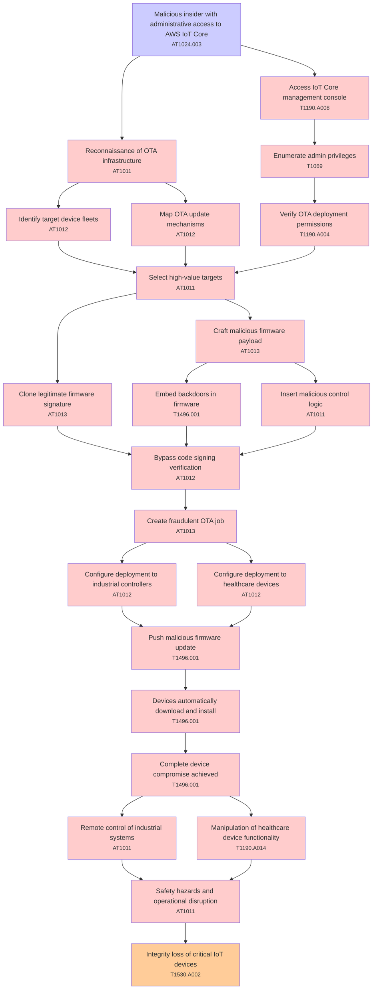

# Attack Tree: Supply Chain

**Threat ID**: T003  
**Associated threat statement**: T003 - Supply Chain

- **Threat Source**: malicious insider
- **Prerequisites**: administrative access to AWS IoT Core
- **Threat Action**: push malicious firmware updates through the OTA system
- **Threat Impact**: complete device compromise and potential safety hazards
- **Reduced Goal**: integrity
- **Impacted Assets**: industrial controllers and healthcare devices
- **Priority**: High
- **Category**: Supply Chain

---

## Attack Tree Diagram

## Attack Path Analysis

This attack tree represents the potential attack paths for the identified threat. Each node in the tree represents either:
- **Attack Goal** (orange): The ultimate objective
- **Attack Step** (red): Individual attack actions
- **Fact/Condition** (blue): Prerequisites or conditions
- **Mitigation** (green): Defensive measures

Review this attack tree to:
1. Identify critical attack paths
2. Implement appropriate security controls
3. Monitor for indicators of these attack patterns
4. Develop incident response procedures

---
*Generated by ThreatForest - Attack Tree Analysis*

## TTC Technique Mappings

| Attack Step | Technique ID | Technique Name | Confidence | Similarity |
|-------------|--------------|----------------|------------|------------|
| Configure deployment to industrial controllers... | AT1012 | Region Selection and Hopping... | 🔴 low | 0.484 |
| Configure deployment to healthcare devices... | AT1012 | Region Selection and Hopping... | 🟡 medium | 0.505 |
| Access IoT Core management console... | T1190.A008 | CloudWatch Event Bus... | 🟡 medium | 0.605 |
| Push malicious firmware update... | T1496.001 | Compute Hijacking... | 🟡 medium | 0.550 |
| Malicious insider with administrative access to AW... | AT1024.003 | IAM Role Hopping... | 🟢 high | 0.793 |
| Devices automatically download and install... | T1496.001 | Compute Hijacking... | 🟡 medium | 0.594 |
| Safety hazards and operational disruption... | AT1011 | Operation Rate Control... | 🟡 medium | 0.582 |
| Select high-value targets... | AT1011 | Operation Rate Control... | 🟡 medium | 0.569 |
| Embed backdoors in firmware... | T1496.001 | Compute Hijacking... | 🟡 medium | 0.594 |
| Verify OTA deployment permissions... | T1190.A004 | S3 Glacier Vault... | 🟡 medium | 0.547 |
| Manipulation of healthcare device functionality... | T1190.A014 | EMR Cluster... | 🟡 medium | 0.518 |
| Enumerate admin privileges... | T1069 | Permission Groups Discovery... | 🔴 low | 0.486 |
| Map OTA update mechanisms... | AT1012 | Region Selection and Hopping... | 🟡 medium | 0.540 |
| Complete device compromise achieved... | T1496.001 | Compute Hijacking... | 🟡 medium | 0.691 |
| Create fraudulent OTA job... | AT1013 | User Agent Spoofing and Randomization... | 🟡 medium | 0.567 |
| Reconnaissance of OTA infrastructure... | AT1011 | Operation Rate Control... | 🟡 medium | 0.601 |
| Remote control of industrial systems... | AT1011 | Operation Rate Control... | 🟡 medium | 0.540 |
| Craft malicious firmware payload... | AT1013 | User Agent Spoofing and Randomization... | 🟡 medium | 0.580 |
| Insert malicious control logic... | AT1011 | Operation Rate Control... | 🟡 medium | 0.609 |
| Bypass code signing verification... | AT1012 | Region Selection and Hopping... | 🟡 medium | 0.515 |
| Clone legitimate firmware signature... | AT1013 | User Agent Spoofing and Randomization... | 🟡 medium | 0.548 |
| Identify target device fleets... | AT1012 | Region Selection and Hopping... | 🟡 medium | 0.608 |
| Integrity loss of critical IoT devices... | T1530.A002 | S3 Glacier... | 🟡 medium | 0.577 |
