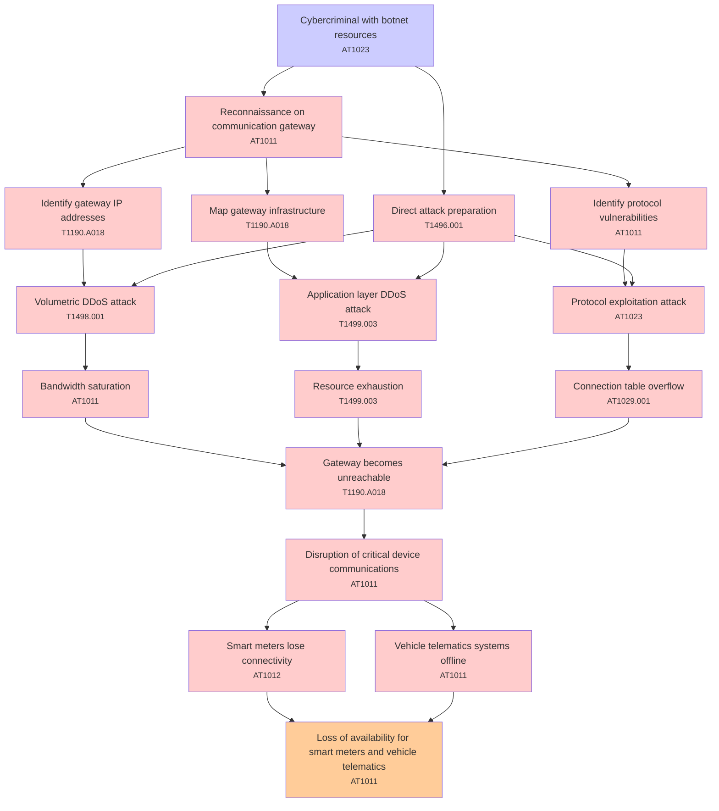

# Attack Tree: Denial of Service

**Threat ID**: T004  
**Associated threat statement**: T004 - Denial of Service

- **Threat Source**: cybercriminal
- **Prerequisites**: botnet resources
- **Threat Action**: launch distributed denial-of-service attacks against the communication gateway
- **Threat Impact**: disruption of critical device communications
- **Reduced Goal**: availability
- **Impacted Assets**: smart meters and vehicle telematics systems
- **Priority**: High
- **Category**: Denial of Service

---

## Attack Tree Diagram

## Attack Path Analysis

This attack tree represents the potential attack paths for the identified threat. Each node in the tree represents either:
- **Attack Goal** (orange): The ultimate objective
- **Attack Step** (red): Individual attack actions
- **Fact/Condition** (blue): Prerequisites or conditions
- **Mitigation** (green): Defensive measures

Review this attack tree to:
1. Identify critical attack paths
2. Implement appropriate security controls
3. Monitor for indicators of these attack patterns
4. Develop incident response procedures

---
*Generated by ThreatForest - Attack Tree Analysis*

## TTC Technique Mappings

| Attack Step | Technique ID | Technique Name | Confidence | Similarity |
|-------------|--------------|----------------|------------|------------|
| Connection table overflow... | AT1029.001 | DynamoDB... | 🟡 medium | 0.581 |
| Reconnaissance on communication gateway... | AT1011 | Operation Rate Control... | 🟡 medium | 0.629 |
| Disruption of critical device communications... | AT1011 | Operation Rate Control... | 🟡 medium | 0.608 |
| Identify protocol vulnerabilities... | AT1011 | Operation Rate Control... | 🟡 medium | 0.639 |
| Resource exhaustion... | T1499.003 | Application Exhaustion Flood... | 🟡 medium | 0.600 |
| Cybercriminal with botnet resources... | AT1023 | Cloud Database Discovery... | 🟡 medium | 0.586 |
| Identify gateway IP addresses... | T1190.A018 | API Gateway... | 🟡 medium | 0.564 |
| Volumetric DDoS attack... | T1498.001 | Direct Network Flood... | 🟡 medium | 0.656 |
| Vehicle telematics systems offline... | AT1011 | Operation Rate Control... | 🟡 medium | 0.547 |
| Gateway becomes unreachable... | T1190.A018 | API Gateway... | 🟡 medium | 0.672 |
| Application layer DDoS attack... | T1499.003 | Application Exhaustion Flood... | 🟡 medium | 0.671 |
| Loss of availability for smart meters and vehicle ... | AT1011 | Operation Rate Control... | 🟡 medium | 0.551 |
| Direct attack preparation... | T1496.001 | Compute Hijacking... | 🟡 medium | 0.602 |
| Map gateway infrastructure... | T1190.A018 | API Gateway... | 🟡 medium | 0.677 |
| Smart meters lose connectivity... | AT1012 | Region Selection and Hopping... | 🔴 low | 0.463 |
| Bandwidth saturation... | AT1011 | Operation Rate Control... | 🟡 medium | 0.615 |
| Protocol exploitation attack... | AT1023 | Cloud Database Discovery... | 🟡 medium | 0.667 |
