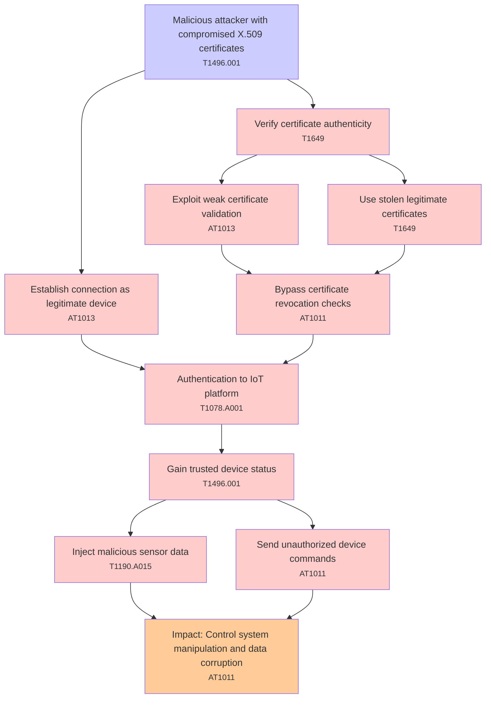

# Attack Tree: Authentication

**Threat ID**: T001  
**Associated threat statement**: T001 - Authentication

- **Threat Source**: malicious attacker
- **Prerequisites**: compromised X.509 certificates
- **Threat Action**: impersonate legitimate IoT devices
- **Threat Impact**: injection of malicious sensor data and unauthorized device commands
- **Reduced Goal**: integrity
- **Impacted Assets**: device data and control systems
- **Priority**: High
- **Category**: Authentication

---

## Attack Tree Diagram

## Attack Path Analysis

This attack tree represents the potential attack paths for the identified threat. Each node in the tree represents either:
- **Attack Goal** (orange): The ultimate objective
- **Attack Step** (red): Individual attack actions
- **Fact/Condition** (blue): Prerequisites or conditions
- **Mitigation** (green): Defensive measures

Review this attack tree to:
1. Identify critical attack paths
2. Implement appropriate security controls
3. Monitor for indicators of these attack patterns
4. Develop incident response procedures

---
*Generated by ThreatForest - Attack Tree Analysis*

## TTC Technique Mappings

| Attack Step | Technique ID | Technique Name | Confidence | Similarity |
|-------------|--------------|----------------|------------|------------|
| Inject malicious sensor data... | T1190.A015 | SNS Topic... | 🟡 medium | 0.597 |
| Use stolen legitimate certificates... | T1649 | Steal or Forge Authentication Certificat... | 🟡 medium | 0.570 |
| Exploit weak certificate validation... | AT1013 | User Agent Spoofing and Randomization... | 🟡 medium | 0.518 |
| Direct device impersonation... | AT1013 | User Agent Spoofing and Randomization... | 🟡 medium | 0.678 |
| Malicious attacker with compromised X.509 certific... | T1496.001 | Compute Hijacking... | 🟡 medium | 0.600 |
| Impact: Control system manipulation and data corru... | AT1011 | Operation Rate Control... | 🟡 medium | 0.613 |
| Verify certificate authenticity... | T1649 | Steal or Forge Authentication Certificat... | 🔴 low | 0.465 |
| Certificate validation... | T1190.A004 | S3 Glacier Vault... | 🟡 medium | 0.506 |
| Bypass certificate revocation checks... | AT1011 | Operation Rate Control... | 🟡 medium | 0.579 |
| Send unauthorized device commands... | AT1011 | Operation Rate Control... | 🟡 medium | 0.540 |
| Establish connection as legitimate device... | AT1013 | User Agent Spoofing and Randomization... | 🔴 low | 0.493 |
| Gain trusted device status... | T1496.001 | Compute Hijacking... | 🔴 low | 0.488 |
| Authentication to IoT platform... | T1078.A001 | IAM Entities... | 🟡 medium | 0.570 |
| Compromise data integrity... | T1530.A002 | S3 Glacier... | 🟡 medium | 0.590 |
