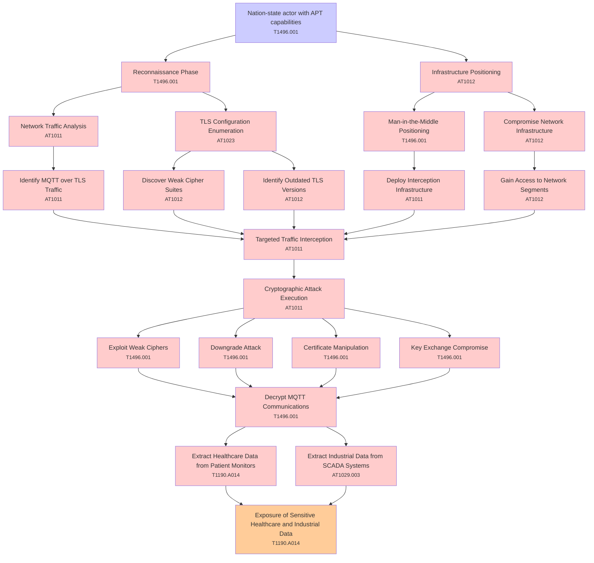

# Attack Tree: Cryptographic Failures

**Threat ID**: T002  
**Associated threat statement**: T002 - Cryptographic Failures

- **Threat Source**: nation-state actor
- **Prerequisites**: advanced persistent threat capabilities
- **Threat Action**: intercept and decrypt MQTT over TLS communications
- **Threat Impact**: exposure of sensitive healthcare and industrial data
- **Reduced Goal**: confidentiality
- **Impacted Assets**: patient monitors and SCADA systems
- **Priority**: High
- **Category**: Cryptographic Failures

---

## Attack Tree Diagram

## Attack Path Analysis

This attack tree represents the potential attack paths for the identified threat. Each node in the tree represents either:
- **Attack Goal** (orange): The ultimate objective
- **Attack Step** (red): Individual attack actions
- **Fact/Condition** (blue): Prerequisites or conditions
- **Mitigation** (green): Defensive measures

Review this attack tree to:
1. Identify critical attack paths
2. Implement appropriate security controls
3. Monitor for indicators of these attack patterns
4. Develop incident response procedures

---
*Generated by ThreatForest - Attack Tree Analysis*

## TTC Technique Mappings

| Attack Step | Technique ID | Technique Name | Confidence | Similarity |
|-------------|--------------|----------------|------------|------------|
| Exposure of Sensitive Healthcare and Industrial Da... | T1190.A014 | EMR Cluster... | 🟡 medium | 0.683 |
| Extract Industrial Data from SCADA Systems... | AT1029.003 | Redshift... | 🟡 medium | 0.537 |
| Key Exchange Compromise... | T1496.001 | Compute Hijacking... | 🟡 medium | 0.599 |
| Cryptographic Attack Execution... | AT1011 | Operation Rate Control... | 🟡 medium | 0.651 |
| Exploit Weak Ciphers... | T1496.001 | Compute Hijacking... | 🟡 medium | 0.583 |
| Downgrade Attack... | T1496.001 | Compute Hijacking... | 🟡 medium | 0.689 |
| Gain Access to Network Segments... | AT1012 | Region Selection and Hopping... | 🟡 medium | 0.664 |
| Identify Outdated TLS Versions... | AT1012 | Region Selection and Hopping... | 🟡 medium | 0.555 |
| Compromise Network Infrastructure... | AT1012 | Region Selection and Hopping... | 🟡 medium | 0.608 |
| Identify MQTT over TLS Traffic... | AT1011 | Operation Rate Control... | 🟡 medium | 0.530 |
| Extract Healthcare Data from Patient Monitors... | T1190.A014 | EMR Cluster... | 🟡 medium | 0.628 |
| Infrastructure Positioning... | AT1012 | Region Selection and Hopping... | 🟡 medium | 0.611 |
| Man-in-the-Middle Positioning... | T1496.001 | Compute Hijacking... | 🟡 medium | 0.666 |
| Network Traffic Analysis... | AT1011 | Operation Rate Control... | 🟡 medium | 0.635 |
| Deploy Interception Infrastructure... | AT1011 | Operation Rate Control... | 🟡 medium | 0.599 |
| Targeted Traffic Interception... | AT1011 | Operation Rate Control... | 🟢 high | 0.707 |
| Certificate Manipulation... | T1496.001 | Compute Hijacking... | 🟡 medium | 0.615 |
| Decrypt MQTT Communications... | T1496.001 | Compute Hijacking... | 🟡 medium | 0.569 |
| TLS Configuration Enumeration... | AT1023 | Cloud Database Discovery... | 🟡 medium | 0.607 |
| Nation-state actor with APT capabilities... | T1496.001 | Compute Hijacking... | 🟡 medium | 0.611 |
| Discover Weak Cipher Suites... | AT1012 | Region Selection and Hopping... | 🟡 medium | 0.598 |
| Reconnaissance Phase... | T1496.001 | Compute Hijacking... | 🟡 medium | 0.629 |
