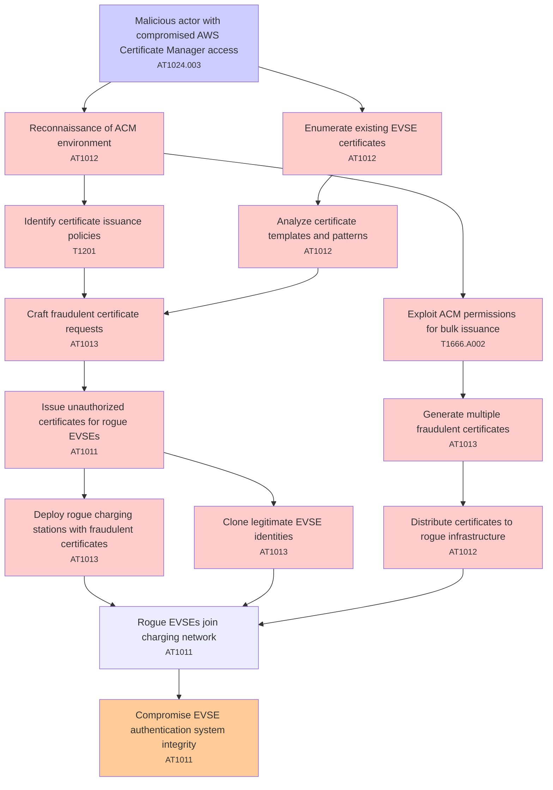

# Attack Tree: Certificate Management

**Threat ID**: T004  
**Associated threat statement**: T004 - Certificate Management

- **Threat Source**: malicious actor
- **Prerequisites**: compromised AWS Certificate Manager access
- **Threat Action**: issue fraudulent certificates for unauthorized EVSEs
- **Threat Impact**: rogue charging stations joining the network
- **Reduced Goal**: integrity
- **Impacted Assets**: EVSE authentication system
- **Priority**: High
- **Category**: Certificate Management

---

## Attack Tree Diagram

## Attack Path Analysis

This attack tree represents the potential attack paths for the identified threat. Each node in the tree represents either:
- **Attack Goal** (orange): The ultimate objective
- **Attack Step** (red): Individual attack actions
- **Fact/Condition** (blue): Prerequisites or conditions
- **Mitigation** (green): Defensive measures

Review this attack tree to:
1. Identify critical attack paths
2. Implement appropriate security controls
3. Monitor for indicators of these attack patterns
4. Develop incident response procedures

---
*Generated by ThreatForest - Attack Tree Analysis*

## TTC Technique Mappings

| Attack Step | Technique ID | Technique Name | Confidence | Similarity |
|-------------|--------------|----------------|------------|------------|
| Rogue EVSEs join charging network... | AT1011 | Operation Rate Control... | 🟡 medium | 0.514 |
| Malicious actor with compromised AWS Certificate M... | AT1024.003 | IAM Role Hopping... | 🟢 high | 0.784 |
| Clone legitimate EVSE identities... | AT1013 | User Agent Spoofing and Randomization... | 🟡 medium | 0.567 |
| Generate multiple fraudulent certificates... | AT1013 | User Agent Spoofing and Randomization... | 🟡 medium | 0.546 |
| Compromise EVSE authentication system integrity... | AT1011 | Operation Rate Control... | 🟡 medium | 0.619 |
| Enumerate existing EVSE certificates... | AT1012 | Region Selection and Hopping... | 🔴 low | 0.437 |
| Craft fraudulent certificate requests... | AT1013 | User Agent Spoofing and Randomization... | 🟡 medium | 0.586 |
| Issue unauthorized certificates for rogue EVSEs... | AT1011 | Operation Rate Control... | 🟡 medium | 0.565 |
| Identify certificate issuance policies... | T1201 | Password Policy Discovery... | 🟡 medium | 0.569 |
| Distribute certificates to rogue infrastructure... | AT1012 | Region Selection and Hopping... | 🟡 medium | 0.584 |
| Deploy rogue charging stations with fraudulent cer... | AT1013 | User Agent Spoofing and Randomization... | 🟡 medium | 0.613 |
| Analyze certificate templates and patterns... | AT1012 | Region Selection and Hopping... | 🟡 medium | 0.536 |
| Exploit ACM permissions for bulk issuance... | T1666.A002 | Leave AWS Organization... | 🟡 medium | 0.605 |
| Reconnaissance of ACM environment... | AT1012 | Region Selection and Hopping... | 🟡 medium | 0.565 |
