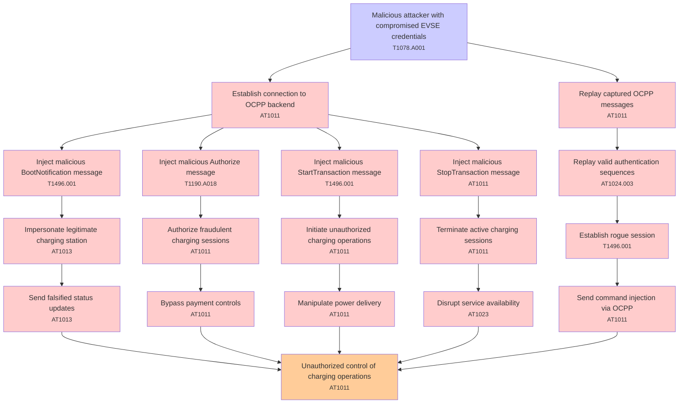

# Attack Tree: Authentication

**Threat ID**: T001  
**Associated threat statement**: T001 - Authentication

- **Threat Source**: malicious attacker
- **Prerequisites**: compromised EVSE credentials
- **Threat Action**: send malicious OCPP messages to the connection handler
- **Threat Impact**: unauthorized control of charging operations
- **Reduced Goal**: integrity
- **Impacted Assets**: charging station infrastructure
- **Priority**: High
- **Category**: Authentication

---

## Attack Tree Diagram

## Attack Path Analysis

This attack tree represents the potential attack paths for the identified threat. Each node in the tree represents either:
- **Attack Goal** (orange): The ultimate objective
- **Attack Step** (red): Individual attack actions
- **Fact/Condition** (blue): Prerequisites or conditions
- **Mitigation** (green): Defensive measures

Review this attack tree to:
1. Identify critical attack paths
2. Implement appropriate security controls
3. Monitor for indicators of these attack patterns
4. Develop incident response procedures

---
*Generated by ThreatForest - Attack Tree Analysis*

## TTC Technique Mappings

| Attack Step | Technique ID | Technique Name | Confidence | Similarity |
|-------------|--------------|----------------|------------|------------|
| Unauthorized control of charging operations... | AT1011 | Operation Rate Control... | 🟡 medium | 0.620 |
| Inject malicious StopTransaction message... | AT1011 | Operation Rate Control... | 🔴 low | 0.492 |
| Disrupt service availability... | AT1023 | Cloud Database Discovery... | 🟡 medium | 0.641 |
| Send falsified status updates... | AT1013 | User Agent Spoofing and Randomization... | 🔴 low | 0.467 |
| Replay captured OCPP messages... | AT1011 | Operation Rate Control... | 🔴 low | 0.444 |
| Malicious attacker with compromised EVSE credentia... | T1078.A001 | IAM Entities... | 🟡 medium | 0.616 |
| Initiate unauthorized charging operations... | AT1011 | Operation Rate Control... | 🟡 medium | 0.560 |
| Inject malicious StartTransaction message... | T1496.001 | Compute Hijacking... | 🔴 low | 0.491 |
| Send command injection via OCPP... | AT1011 | Operation Rate Control... | 🟡 medium | 0.570 |
| Replay valid authentication sequences... | AT1024.003 | IAM Role Hopping... | 🟡 medium | 0.506 |
| Inject malicious BootNotification message... | T1496.001 | Compute Hijacking... | 🟡 medium | 0.536 |
| Manipulate power delivery... | AT1011 | Operation Rate Control... | 🟡 medium | 0.562 |
| Authorize fraudulent charging sessions... | AT1011 | Operation Rate Control... | 🟡 medium | 0.507 |
| Impersonate legitimate charging station... | AT1013 | User Agent Spoofing and Randomization... | 🟡 medium | 0.615 |
| Inject malicious Authorize message... | T1190.A018 | API Gateway... | 🟡 medium | 0.568 |
| Establish connection to OCPP backend... | AT1011 | Operation Rate Control... | 🔴 low | 0.426 |
| Establish rogue session... | T1496.001 | Compute Hijacking... | 🟡 medium | 0.580 |
| Bypass payment controls... | AT1011 | Operation Rate Control... | 🟡 medium | 0.626 |
| Terminate active charging sessions... | AT1011 | Operation Rate Control... | 🔴 low | 0.415 |
