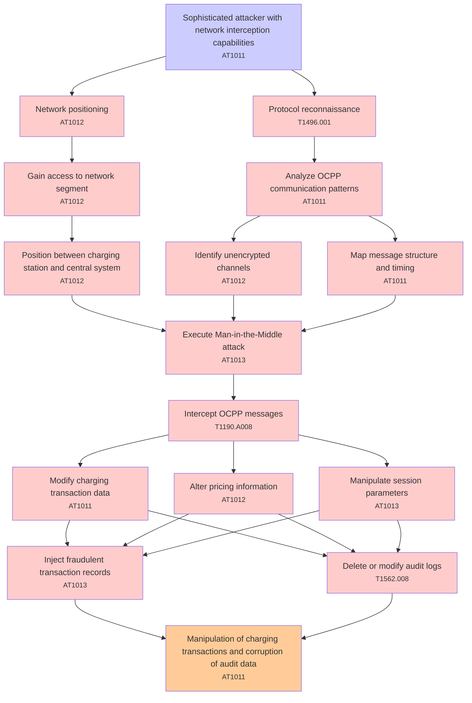

# Attack Tree: Communication Security

**Threat ID**: T003  
**Associated threat statement**: T003 - Communication Security

- **Threat Source**: sophisticated attacker
- **Prerequisites**: network interception capabilities
- **Threat Action**: perform man-in-the-middle attacks on OCPP communications
- **Threat Impact**: manipulation of charging transactions
- **Reduced Goal**: integrity
- **Impacted Assets**: transaction management and audit data
- **Priority**: High
- **Category**: Communication Security

---

## Attack Tree Diagram

## Attack Path Analysis

This attack tree represents the potential attack paths for the identified threat. Each node in the tree represents either:
- **Attack Goal** (orange): The ultimate objective
- **Attack Step** (red): Individual attack actions
- **Fact/Condition** (blue): Prerequisites or conditions
- **Mitigation** (green): Defensive measures

Review this attack tree to:
1. Identify critical attack paths
2. Implement appropriate security controls
3. Monitor for indicators of these attack patterns
4. Develop incident response procedures

---
*Generated by ThreatForest - Attack Tree Analysis*

## TTC Technique Mappings

| Attack Step | Technique ID | Technique Name | Confidence | Similarity |
|-------------|--------------|----------------|------------|------------|
| Alter pricing information... | AT1012 | Region Selection and Hopping... | 🟡 medium | 0.537 |
| Manipulation of charging transactions and corrupti... | AT1011 | Operation Rate Control... | 🟡 medium | 0.603 |
| Network positioning... | AT1012 | Region Selection and Hopping... | 🟡 medium | 0.609 |
| Protocol reconnaissance... | T1496.001 | Compute Hijacking... | 🟡 medium | 0.667 |
| Intercept OCPP messages... | T1190.A008 | CloudWatch Event Bus... | 🔴 low | 0.492 |
| Inject fraudulent transaction records... | AT1013 | User Agent Spoofing and Randomization... | 🟡 medium | 0.566 |
| Position between charging station and central syst... | AT1012 | Region Selection and Hopping... | 🔴 low | 0.493 |
| Map message structure and timing... | AT1011 | Operation Rate Control... | 🟡 medium | 0.530 |
| Modify charging transaction data... | AT1011 | Operation Rate Control... | 🔴 low | 0.401 |
| Manipulate session parameters... | AT1013 | User Agent Spoofing and Randomization... | 🔴 low | 0.476 |
| Sophisticated attacker with network interception c... | AT1011 | Operation Rate Control... | 🟡 medium | 0.635 |
| Delete or modify audit logs... | T1562.008 | Disable Cloud Logs... | 🟡 medium | 0.529 |
| Gain access to network segment... | AT1012 | Region Selection and Hopping... | 🟡 medium | 0.607 |
| Execute Man-in-the-Middle attack... | AT1013 | User Agent Spoofing and Randomization... | 🟡 medium | 0.648 |
| Analyze OCPP communication patterns... | AT1011 | Operation Rate Control... | 🟡 medium | 0.594 |
| Identify unencrypted channels... | AT1012 | Region Selection and Hopping... | 🟡 medium | 0.523 |
