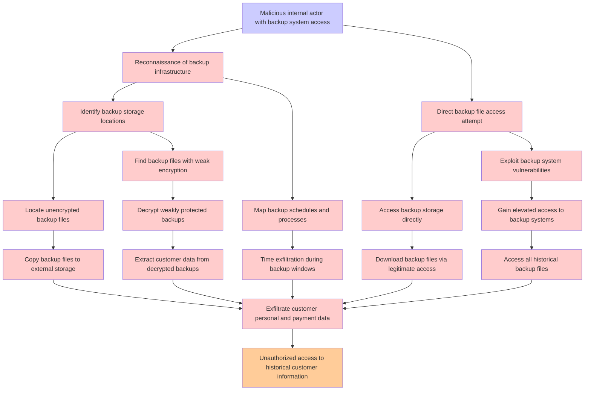

# Attack Tree: Database Backup Exposure

**Threat ID**: T007  
**Associated threat statement**: T007 - Database Backup Exposure

- **Threat Source**: Malicious internal actor
- **Prerequisites**: Access to database backup systems
- **Threat Action**: Exfiltrate backup files containing customer data
- **Threat Impact**: Unauthorized access to historical customer information
- **Reduced Goal**: Confidentiality
- **Impacted Assets**: Customer personal and payment data
- **Priority**: High
- **Category**: Database Backup Exposure

---

## Attack Tree Diagram

## Attack Path Analysis

This attack tree represents the potential attack paths for the identified threat. Each node in the tree represents either:
- **Attack Goal** (orange): The ultimate objective
- **Attack Step** (red): Individual attack actions
- **Fact/Condition** (blue): Prerequisites or conditions
- **Mitigation** (green): Defensive measures

Review this attack tree to:
1. Identify critical attack paths
2. Implement appropriate security controls
3. Monitor for indicators of these attack patterns
4. Develop incident response procedures

---
*Generated by ThreatForest - Attack Tree Analysis*
