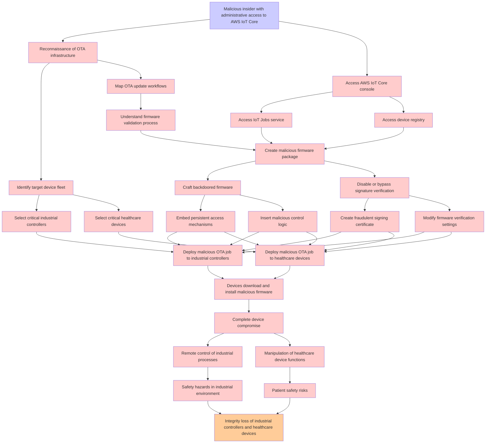

# Attack Tree: T003 - Supply Chain

**Threat ID**: T003  
**Description**: A malicious insider with administrative access to AWS IoT Core, can push malicious firmware updates through the OTA system, which leads to complete device compromise and potential safety hazards, resulting in reduced integrity of industrial controllers and healthcare devices.

---

## Attack Tree Diagram

## Attack Path Analysis

This attack tree represents the potential attack paths for the identified threat. Each node in the tree represents either:
- **Attack Goal** (orange): The ultimate objective
- **Attack Step** (red): Individual attack actions
- **Fact/Condition** (blue): Prerequisites or conditions
- **Mitigation** (green): Defensive measures

Review this attack tree to:
1. Identify critical attack paths
2. Implement appropriate security controls
3. Monitor for indicators of these attack patterns
4. Develop incident response procedures

---
*Generated by ThreatForest - Attack Tree Analysis*
