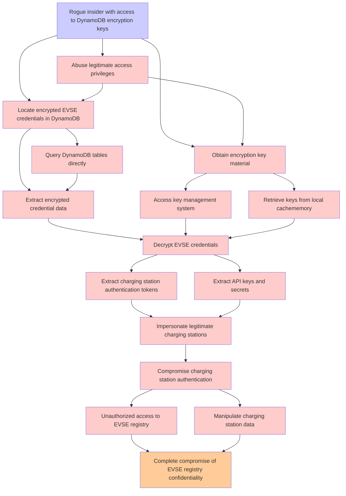

# Attack Tree: T002 - Data Exposure

**Threat ID**: T002  
**Description**: A rogue insider with access to DynamoDB encryption keys, can decrypt stored EVSE credentials, which leads to compromise of charging station authentication, resulting in reduced confidentiality of EVSE registry.

---

## Attack Tree Diagram

## Attack Path Analysis

This attack tree represents the potential attack paths for the identified threat. Each node in the tree represents either:
- **Attack Goal** (orange): The ultimate objective
- **Attack Step** (red): Individual attack actions
- **Fact/Condition** (blue): Prerequisites or conditions
- **Mitigation** (green): Defensive measures

Review this attack tree to:
1. Identify critical attack paths
2. Implement appropriate security controls
3. Monitor for indicators of these attack patterns
4. Develop incident response procedures

---
*Generated by ThreatForest - Attack Tree Analysis*
