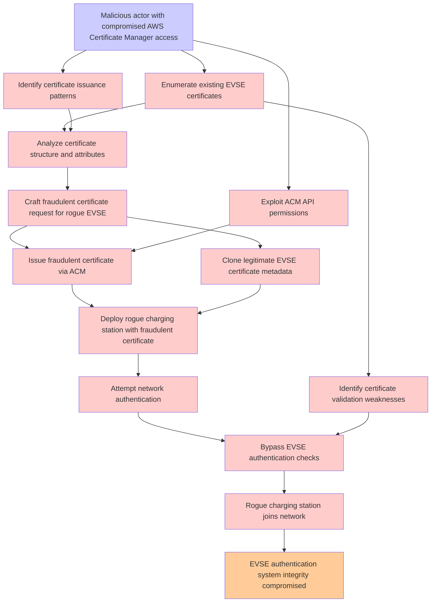

# Attack Tree: T004 - Certificate Management

**Threat ID**: T004  
**Description**: A malicious actor with compromised AWS Certificate Manager access, can issue fraudulent certificates for unauthorized EVSEs, which leads to rogue charging stations joining the network, resulting in reduced integrity of EVSE authentication system.

---

## Attack Tree Diagram

## Attack Path Analysis

This attack tree represents the potential attack paths for the identified threat. Each node in the tree represents either:
- **Attack Goal** (orange): The ultimate objective
- **Attack Step** (red): Individual attack actions
- **Fact/Condition** (blue): Prerequisites or conditions
- **Mitigation** (green): Defensive measures

Review this attack tree to:
1. Identify critical attack paths
2. Implement appropriate security controls
3. Monitor for indicators of these attack patterns
4. Develop incident response procedures

---
*Generated by ThreatForest - Attack Tree Analysis*
