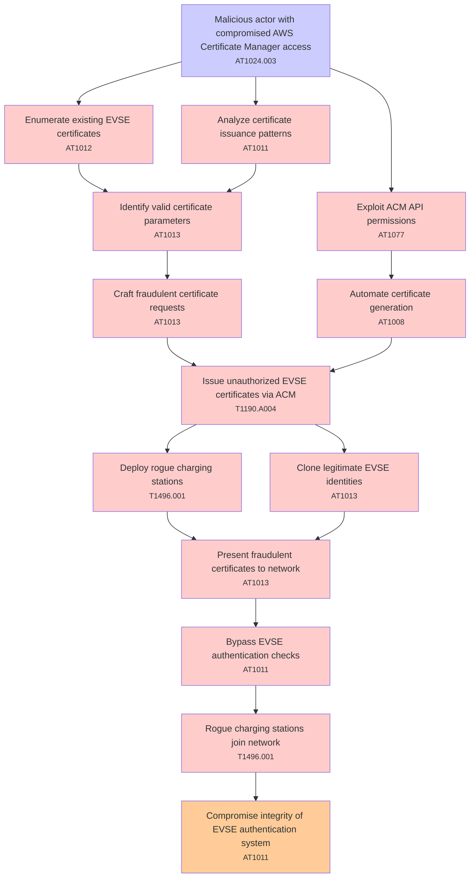

# Attack Tree: T004 - Certificate Management

**Threat ID**: T004  
**Description**: A malicious actor with compromised AWS Certificate Manager access, can issue fraudulent certificates for unauthorized EVSEs, which leads to rogue charging stations joining the network, resulting in reduced integrity of EVSE authentication system.

---

## Attack Tree Diagram

## Attack Path Analysis

This attack tree represents the potential attack paths for the identified threat. Each node in the tree represents either:
- **Attack Goal** (orange): The ultimate objective
- **Attack Step** (red): Individual attack actions
- **Fact/Condition** (blue): Prerequisites or conditions
- **Mitigation** (green): Defensive measures

Review this attack tree to:
1. Identify critical attack paths
2. Implement appropriate security controls
3. Monitor for indicators of these attack patterns
4. Develop incident response procedures

---
*Generated by ThreatForest - Attack Tree Analysis*

## TTC Technique Mappings

| Attack Step | Technique ID | Technique Name | Confidence | Similarity |
|-------------|--------------|----------------|------------|------------|
| Enumerate existing EVSE certificates... | AT1012 | Region Selection and Hopping... | 🔴 low | 0.437 |
| Malicious actor with compromised AWS Certificate M... | AT1024.003 | IAM Role Hopping... | 🟢 high | 0.784 |
| Automate certificate generation... | AT1008 | Golden SAML... | 🔴 low | 0.472 |
| Identify valid certificate parameters... | AT1013 | User Agent Spoofing and Randomization... | 🔴 low | 0.445 |
| Present fraudulent certificates to network... | AT1013 | User Agent Spoofing and Randomization... | 🟡 medium | 0.592 |
| Bypass EVSE authentication checks... | AT1011 | Operation Rate Control... | 🟡 medium | 0.568 |
| Clone legitimate EVSE identities... | AT1013 | User Agent Spoofing and Randomization... | 🟡 medium | 0.567 |
| Exploit ACM API permissions... | AT1077 | Authorize VPC Security Groups... | 🟡 medium | 0.696 |
| Issue unauthorized EVSE certificates via ACM... | T1190.A004 | S3 Glacier Vault... | 🟡 medium | 0.575 |
| Analyze certificate issuance patterns... | AT1011 | Operation Rate Control... | 🟡 medium | 0.546 |
| Compromise integrity of EVSE authentication system... | AT1011 | Operation Rate Control... | 🟡 medium | 0.627 |
| Deploy rogue charging stations... | T1496.001 | Compute Hijacking... | 🟡 medium | 0.637 |
| Rogue charging stations join network... | T1496.001 | Compute Hijacking... | 🟡 medium | 0.546 |
| Craft fraudulent certificate requests... | AT1013 | User Agent Spoofing and Randomization... | 🟡 medium | 0.586 |
