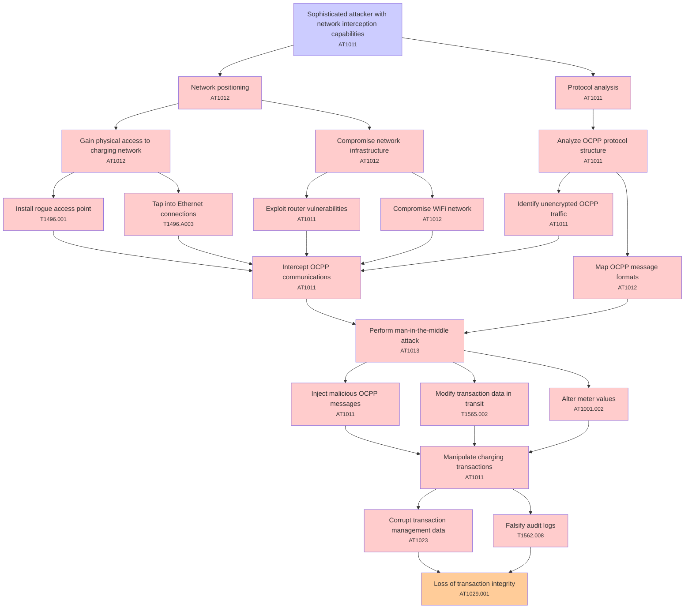

# Attack Tree: T003 - Communication Security

**Threat ID**: T003  
**Description**: A sophisticated attacker with network interception capabilities, can perform man-in-the-middle attacks on OCPP communications, which leads to manipulation of charging transactions, resulting in reduced integrity of transaction management and audit data.

---

## Attack Tree Diagram

## Attack Path Analysis

This attack tree represents the potential attack paths for the identified threat. Each node in the tree represents either:
- **Attack Goal** (orange): The ultimate objective
- **Attack Step** (red): Individual attack actions
- **Fact/Condition** (blue): Prerequisites or conditions
- **Mitigation** (green): Defensive measures

Review this attack tree to:
1. Identify critical attack paths
2. Implement appropriate security controls
3. Monitor for indicators of these attack patterns
4. Develop incident response procedures

---
*Generated by ThreatForest - Attack Tree Analysis*

## TTC Technique Mappings

| Attack Step | Technique ID | Technique Name | Confidence | Similarity |
|-------------|--------------|----------------|------------|------------|
| Falsify audit logs... | T1562.008 | Disable Cloud Logs... | 🟡 medium | 0.556 |
| Compromise network infrastructure... | AT1012 | Region Selection and Hopping... | 🟡 medium | 0.597 |
| Install rogue access point... | T1496.001 | Compute Hijacking... | 🟡 medium | 0.628 |
| Manipulate charging transactions... | AT1011 | Operation Rate Control... | 🔴 low | 0.460 |
| Loss of transaction integrity... | AT1029.001 | DynamoDB... | 🟡 medium | 0.549 |
| Network positioning... | AT1012 | Region Selection and Hopping... | 🟡 medium | 0.609 |
| Perform man-in-the-middle attack... | AT1013 | User Agent Spoofing and Randomization... | 🟡 medium | 0.619 |
| Compromise WiFi network... | AT1012 | Region Selection and Hopping... | 🟡 medium | 0.541 |
| Identify unencrypted OCPP traffic... | AT1011 | Operation Rate Control... | 🟡 medium | 0.607 |
| Tap into Ethernet connections... | T1496.A003 | Compute Hijacking - EC2 Use... | 🟡 medium | 0.539 |
| Sophisticated attacker with network interception c... | AT1011 | Operation Rate Control... | 🟡 medium | 0.635 |
| Corrupt transaction management data... | AT1023 | Cloud Database Discovery... | 🟡 medium | 0.574 |
| Alter meter values... | AT1001.002 | Modify Existing Lambda Function... | 🔴 low | 0.487 |
| Protocol analysis... | AT1011 | Operation Rate Control... | 🟡 medium | 0.645 |
| Analyze OCPP protocol structure... | AT1011 | Operation Rate Control... | 🟡 medium | 0.541 |
| Intercept OCPP communications... | AT1011 | Operation Rate Control... | 🟡 medium | 0.539 |
| Map OCPP message formats... | AT1012 | Region Selection and Hopping... | 🔴 low | 0.459 |
| Exploit router vulnerabilities... | AT1011 | Operation Rate Control... | 🟡 medium | 0.615 |
| Inject malicious OCPP messages... | AT1011 | Operation Rate Control... | 🟡 medium | 0.558 |
| Modify transaction data in transit... | T1565.002 | Transmitted Data Manipulation... | 🟡 medium | 0.514 |
| Gain physical access to charging network... | AT1012 | Region Selection and Hopping... | 🟡 medium | 0.580 |
