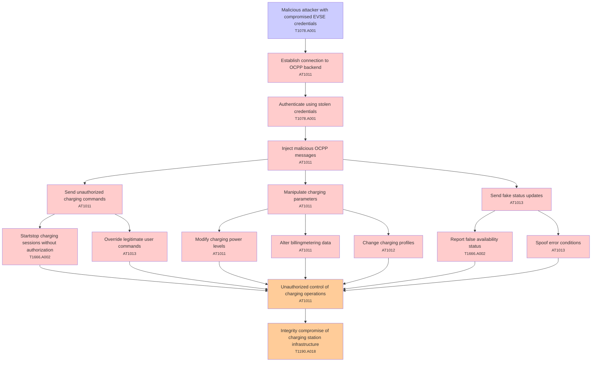

# Attack Tree: T001 - Authentication

**Threat ID**: T001  
**Description**: A malicious attacker with compromised EVSE credentials, can send malicious OCPP messages to the connection handler, which leads to unauthorized control of charging operations, resulting in reduced integrity of charging station infrastructure.

---

## Attack Tree Diagram

## Attack Path Analysis

This attack tree represents the potential attack paths for the identified threat. Each node in the tree represents either:
- **Attack Goal** (orange): The ultimate objective
- **Attack Step** (red): Individual attack actions
- **Fact/Condition** (blue): Prerequisites or conditions
- **Mitigation** (green): Defensive measures

Review this attack tree to:
1. Identify critical attack paths
2. Implement appropriate security controls
3. Monitor for indicators of these attack patterns
4. Develop incident response procedures

---
*Generated by ThreatForest - Attack Tree Analysis*

## TTC Technique Mappings

| Attack Step | Technique ID | Technique Name | Confidence | Similarity |
|-------------|--------------|----------------|------------|------------|
| Establish connection to OCPP backend... | AT1011 | Operation Rate Control... | 🔴 low | 0.426 |
| Spoof error conditions... | AT1013 | User Agent Spoofing and Randomization... | 🟡 medium | 0.557 |
| Send fake status updates... | AT1013 | User Agent Spoofing and Randomization... | 🔴 low | 0.458 |
| Manipulate charging parameters... | AT1011 | Operation Rate Control... | 🟡 medium | 0.521 |
| Report false availability status... | T1666.A002 | Leave AWS Organization... | 🔴 low | 0.489 |
| Unauthorized control of charging operations... | AT1011 | Operation Rate Control... | 🟡 medium | 0.620 |
| Authenticate using stolen credentials... | T1078.A001 | IAM Entities... | 🟡 medium | 0.616 |
| Send unauthorized charging commands... | AT1011 | Operation Rate Control... | 🟡 medium | 0.524 |
| Change charging profiles... | AT1012 | Region Selection and Hopping... | 🟡 medium | 0.515 |
| Integrity compromise of charging station infrastru... | T1190.A018 | API Gateway... | 🟡 medium | 0.571 |
| Override legitimate user commands... | AT1013 | User Agent Spoofing and Randomization... | 🔴 low | 0.475 |
| Inject malicious OCPP messages... | AT1011 | Operation Rate Control... | 🟡 medium | 0.558 |
| Malicious attacker with compromised EVSE credentia... | T1078.A001 | IAM Entities... | 🟡 medium | 0.616 |
| Modify charging power levels... | AT1011 | Operation Rate Control... | 🟡 medium | 0.526 |
| Startstop charging sessions without authorization... | T1666.A002 | Leave AWS Organization... | 🟡 medium | 0.547 |
| Alter billingmetering data... | AT1011 | Operation Rate Control... | 🔴 low | 0.461 |
