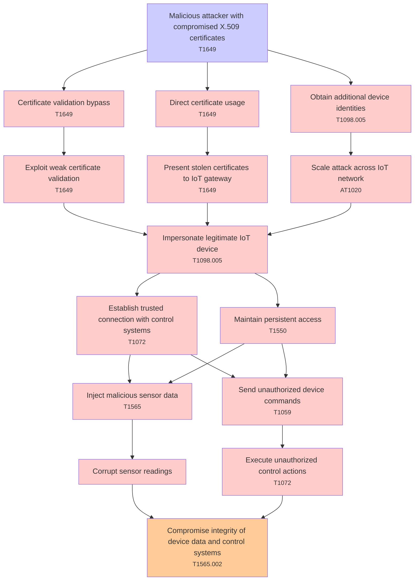

# Attack Tree: Authentication

**Threat ID**: T001  
**Associated threat statement**: A malicious attacker with compromised X.509 certificates, can impersonate legitimate IoT devices, which leads to injection of malicious sensor data and unauthorized device commands, resulting in reduced integrity of device data and control systems.

- **Threat Source**: malicious attacker
- **Prerequisites**: compromised X.509 certificates
- **Threat Action**: impersonate legitimate IoT devices
- **Threat Impact**: injection of malicious sensor data and unauthorized device commands
- **Reduced Goal**: integrity
- **Impacted Assets**: device data and control systems
- **Priority**: High
- **Category**: Authentication

---

## Attack Tree Diagram

## Attack Path Analysis

This attack tree represents the potential attack paths for the identified threat. Each node in the tree represents either:
- **Attack Goal** (orange): The ultimate objective
- **Attack Step** (red): Individual attack actions
- **Fact/Condition** (blue): Prerequisites or conditions
- **Mitigation** (green): Defensive measures

Review this attack tree to:
1. Identify critical attack paths
2. Implement appropriate security controls
3. Monitor for indicators of these attack patterns
4. Develop incident response procedures

---
*Generated by ThreatForest - Attack Tree Analysis*

---

## 🎯 Technique Mappings

| Attack Step | Technique ID | Technique Name | Kill Chain Phase | Confidence |
|-------------|--------------|----------------|------------------|------------|
| Exploit weak certificate validation | T1649 | Steal or Forge Authentication ... | credential-access | 0.383 |
| Obtain additional device identities | T1098.005 | Device Registration | persistence, privilege-escalation | 0.443 |
| Establish trusted connection with control systems | T1072 | Software Deployment Tools | execution, lateral-movement | 0.426 |
| Certificate validation bypass | T1649 | Steal or Forge Authentication ... | credential-access | 0.361 |
| Impersonate legitimate IoT device | T1098.005 | Device Registration | persistence, privilege-escalation | 0.442 |
| Execute unauthorized control actions | T1072 | Software Deployment Tools | execution, lateral-movement | 0.390 |
| Compromise integrity of device data and control sy... | T1565.002 | Transmitted Data Manipulation | impact | 0.575 |
| Scale attack across IoT network | AT1020 | Network to Cloud | lateral-movement | 0.383 |
| Malicious attacker with compromised X.509 certific... | T1649 | Steal or Forge Authentication ... | credential-access | 0.442 |
| Send unauthorized device commands | T1059 | Command and Scripting Interpre... | execution | 0.413 |
| Direct certificate usage | T1649 | Steal or Forge Authentication ... | credential-access | 0.404 |
| Maintain persistent access | T1550 | Use Alternate Authentication M... | defense-evasion, lateral-movement | 0.432 |
| Inject malicious sensor data | T1565 | Data Manipulation | impact | 0.523 |
| Present stolen certificates to IoT gateway | T1649 | Steal or Forge Authentication ... | credential-access | 0.370 |
