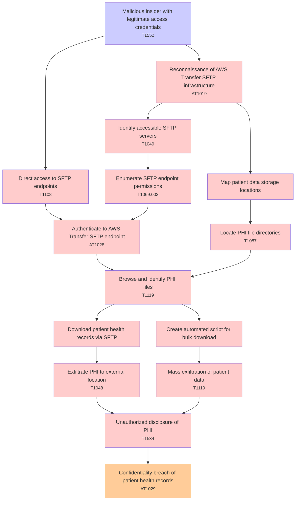

# Attack Tree: Data Breach

**Threat ID**: T001  
**Associated threat statement**: A malicious insider with legitimate access credentials, can exfiltrate sensitive patient data through AWS Transfer for SFTP endpoints, which leads to unauthorized disclosure of PHI, resulting in reduced confidentiality of patient health records.

- **Threat Source**: malicious insider
- **Prerequisites**: legitimate access credentials
- **Threat Action**: exfiltrate sensitive patient data through AWS Transfer for SFTP endpoints
- **Threat Impact**: unauthorized disclosure of PHI
- **Reduced Goal**: confidentiality
- **Impacted Assets**: patient health records
- **Priority**: High
- **Category**: Data Breach

---

## Attack Tree Diagram

## Attack Path Analysis

This attack tree represents the potential attack paths for the identified threat. Each node in the tree represents either:
- **Attack Goal** (orange): The ultimate objective
- **Attack Step** (red): Individual attack actions
- **Fact/Condition** (blue): Prerequisites or conditions
- **Mitigation** (green): Defensive measures

Review this attack tree to:
1. Identify critical attack paths
2. Implement appropriate security controls
3. Monitor for indicators of these attack patterns
4. Develop incident response procedures

---
*Generated by ThreatForest - Attack Tree Analysis*

---

## 🎯 Technique Mappings

| Attack Step | Technique ID | Technique Name | Kill Chain Phase | Confidence |
|-------------|--------------|----------------|------------------|------------|
| Browse and identify PHI files | T1119 | Automated Collection | collection | 0.369 |
| Unauthorized disclosure of PHI | T1534 | Internal Spearphishing | lateral-movement | 0.365 |
| Confidentiality breach of patient health records | AT1029 | Data from Cloud Database | collection | 0.383 |
| Identify accessible SFTP servers | T1049 | System Network Connections Dis... | discovery | 0.439 |
| Enumerate SFTP endpoint permissions | T1069.003 | Cloud Groups | discovery | 0.312 |
| Reconnaissance of AWS Transfer SFTP infrastructure | AT1019 | Cloud to Network | lateral-movement | 0.423 |
| Mass exfiltration of patient data | T1119 | Automated Collection | collection | 0.417 |
| Malicious insider with legitimate access credentia... | T1552 | Unsecured Credentials | credential-access | 0.490 |
| Exfiltrate PHI to external location | T1048 | Exfiltration Over Alternative ... | exfiltration | 0.416 |
| Direct access to SFTP endpoints | T1108 | Redundant Access | defense-evasion, persistence | 0.356 |
| Authenticate to AWS Transfer SFTP endpoint | AT1028 | Create or Modify EC2 Key Pair | persistence | 0.409 |
| Locate PHI file directories | T1087 | Account Discovery | discovery | 0.349 |
