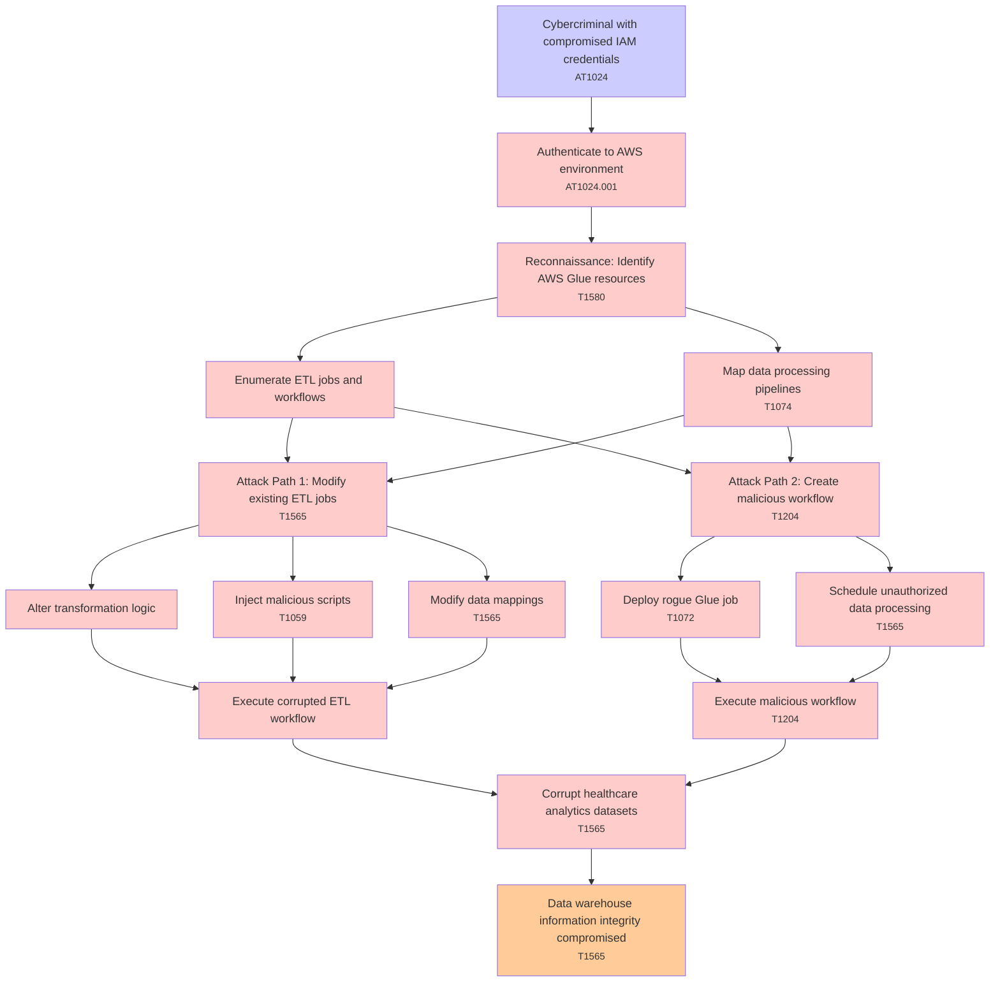

# Attack Tree: Data Integrity

**Threat ID**: T002  
**Associated threat statement**: A cybercriminal with compromised IAM credentials, can manipulate data processing workflows in AWS Glue, which leads to corruption of healthcare analytics datasets, resulting in reduced integrity of data warehouse information.

- **Threat Source**: cybercriminal
- **Prerequisites**: compromised IAM credentials
- **Threat Action**: manipulate data processing workflows in AWS Glue
- **Threat Impact**: corruption of healthcare analytics datasets
- **Reduced Goal**: integrity
- **Impacted Assets**: data warehouse information
- **Priority**: High
- **Category**: Data Integrity

---

## Attack Tree Diagram

## Attack Path Analysis

This attack tree represents the potential attack paths for the identified threat. Each node in the tree represents either:
- **Attack Goal** (orange): The ultimate objective
- **Attack Step** (red): Individual attack actions
- **Fact/Condition** (blue): Prerequisites or conditions
- **Mitigation** (green): Defensive measures

Review this attack tree to:
1. Identify critical attack paths
2. Implement appropriate security controls
3. Monitor for indicators of these attack patterns
4. Develop incident response procedures

---
*Generated by ThreatForest - Attack Tree Analysis*

---

## 🎯 Technique Mappings

| Attack Step | Technique ID | Technique Name | Kill Chain Phase | Confidence |
|-------------|--------------|----------------|------------------|------------|
| Reconnaissance: Identify AWS Glue resources | T1580 | Cloud Infrastructure Discovery | discovery | 0.552 |
| Authenticate to AWS environment | AT1024.001 | Create New IAM User/Role | persistence | 0.672 |
| Inject malicious scripts | T1059 | Command and Scripting Interpre... | execution | 0.544 |
| Modify data mappings | T1565 | Data Manipulation | impact | 0.431 |
| Map data processing pipelines | T1074 | Data Staged | collection | 0.363 |
| Data warehouse information integrity compromised | T1565 | Data Manipulation | impact | 0.577 |
| Attack Path 1: Modify existing ETL jobs | T1565 | Data Manipulation | impact | 0.385 |
| Attack Path 2: Create malicious workflow | T1204 | User Execution | execution | 0.459 |
| Schedule unauthorized data processing | T1565 | Data Manipulation | impact | 0.501 |
| Corrupt healthcare analytics datasets | T1565 | Data Manipulation | impact | 0.420 |
| Execute malicious workflow | T1204 | User Execution | execution | 0.459 |
| Cybercriminal with compromised IAM credentials | AT1024 | IAM Principal Manipulation | persistence | 0.522 |
| Deploy rogue Glue job | T1072 | Software Deployment Tools | execution, lateral-movement | 0.318 |
