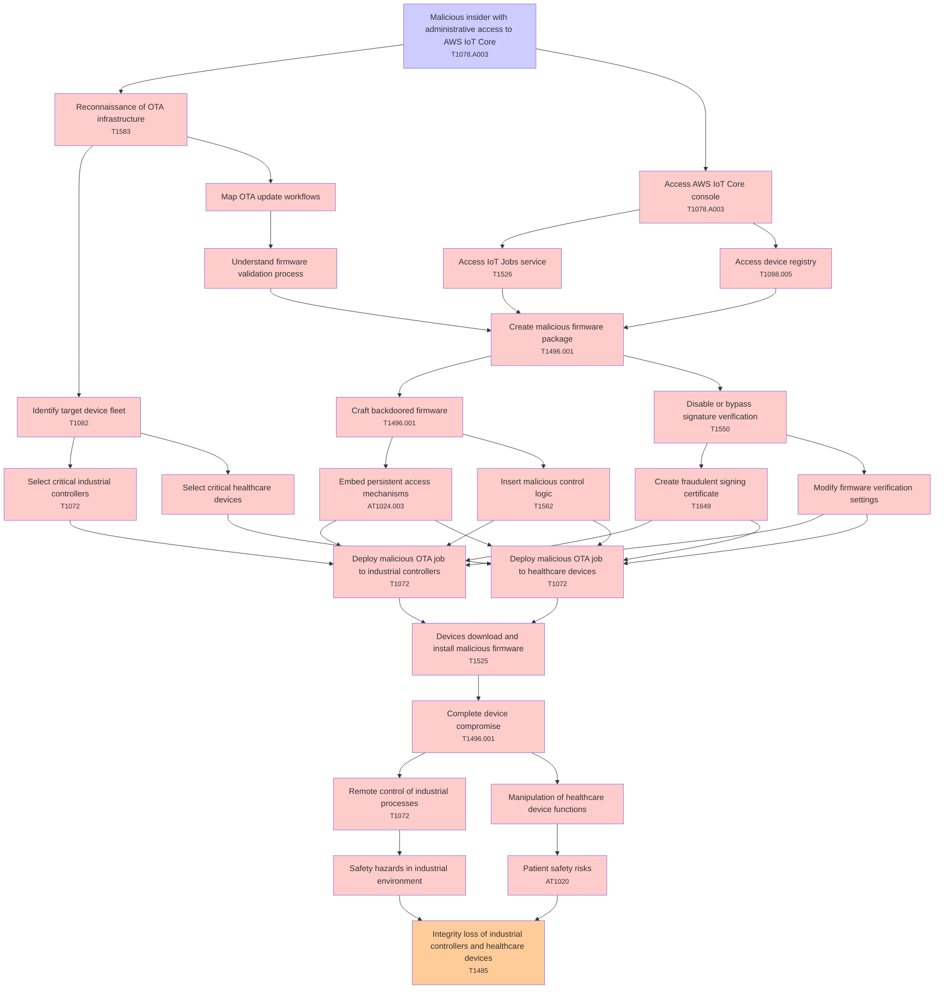

# Attack Tree: Supply Chain

**Threat ID**: T003  
**Associated threat statement**: A malicious insider with administrative access to AWS IoT Core, can push malicious firmware updates through the OTA system, which leads to complete device compromise and potential safety hazards, resulting in reduced integrity of industrial controllers and healthcare devices.

- **Threat Source**: malicious insider
- **Prerequisites**: administrative access to AWS IoT Core
- **Threat Action**: push malicious firmware updates through the OTA system
- **Threat Impact**: complete device compromise and potential safety hazards
- **Reduced Goal**: integrity
- **Impacted Assets**: industrial controllers and healthcare devices
- **Priority**: High
- **Category**: Supply Chain

---

## Attack Tree Diagram

## Attack Path Analysis

This attack tree represents the potential attack paths for the identified threat. Each node in the tree represents either:
- **Attack Goal** (orange): The ultimate objective
- **Attack Step** (red): Individual attack actions
- **Fact/Condition** (blue): Prerequisites or conditions
- **Mitigation** (green): Defensive measures

Review this attack tree to:
1. Identify critical attack paths
2. Implement appropriate security controls
3. Monitor for indicators of these attack patterns
4. Develop incident response procedures

---
*Generated by ThreatForest - Attack Tree Analysis*

---

## 🎯 Technique Mappings

| Attack Step | Technique ID | Technique Name | Kill Chain Phase | Confidence |
|-------------|--------------|----------------|------------------|------------|
| Integrity loss of industrial controllers and healt... | T1485 | Data Destruction | impact | 0.371 |
| Access AWS IoT Core console | T1078.A003 | Console Login | initial-access | 0.562 |
| Deploy malicious OTA job to healthcare devices | T1072 | Software Deployment Tools | execution, lateral-movement | 0.482 |
| Disable or bypass signature verification | T1550 | Use Alternate Authentication M... | defense-evasion, lateral-movement | 0.364 |
| Select critical industrial controllers | T1072 | Software Deployment Tools | execution, lateral-movement | 0.362 |
| Insert malicious control logic | T1562 | Impair Defenses | defense-evasion | 0.487 |
| Access IoT Jobs service | T1526 | Cloud Service Discovery | discovery | 0.339 |
| Devices download and install malicious firmware | T1525 | Implant Internal Image | persistence | 0.339 |
| Embed persistent access mechanisms | AT1024.003 | IAM Role Hopping | persistence | 0.434 |
| Patient safety risks | AT1020 | Network to Cloud | lateral-movement | 0.362 |
| Reconnaissance of OTA infrastructure | T1583 | Acquire Infrastructure | resource-development | 0.316 |
| Complete device compromise | T1496.001 | Compute Hijacking | impact | 0.515 |
| Remote control of industrial processes | T1072 | Software Deployment Tools | execution, lateral-movement | 0.346 |
| Identify target device fleet | T1082 | System Information Discovery | discovery | 0.436 |
| Create fraudulent signing certificate | T1649 | Steal or Forge Authentication ... | credential-access | 0.437 |
| Deploy malicious OTA job to industrial controllers | T1072 | Software Deployment Tools | execution, lateral-movement | 0.540 |
| Malicious insider with administrative access to AW... | T1078.A003 | Console Login | initial-access | 0.563 |
| Access device registry | T1098.005 | Device Registration | persistence, privilege-escalation | 0.363 |
| Create malicious firmware package | T1496.001 | Compute Hijacking | impact | 0.393 |
| Craft backdoored firmware | T1496.001 | Compute Hijacking | impact | 0.390 |
