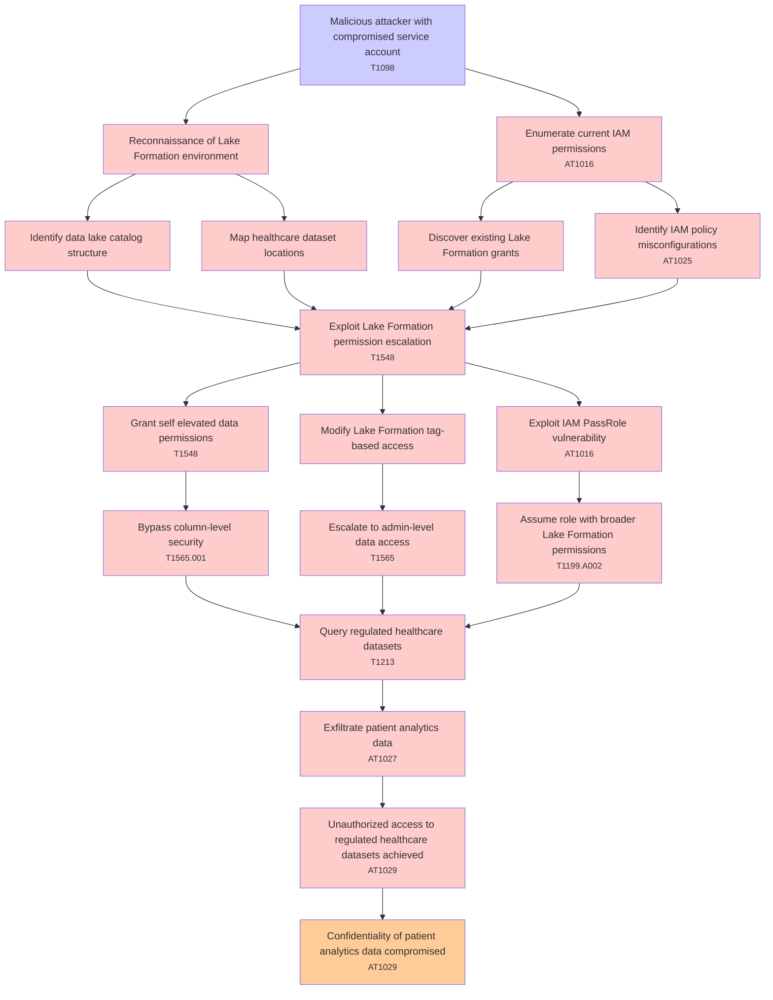

# Attack Tree: Privilege Escalation

**Threat ID**: T004  
**Associated threat statement**: A malicious attacker with compromised service account, can perform privilege escalation attacks against AWS Lake Formation permissions, which leads to unauthorized access to regulated healthcare datasets, resulting in reduced confidentiality of patient analytics data.

- **Threat Source**: malicious attacker
- **Prerequisites**: compromised service account
- **Threat Action**: perform privilege escalation attacks against AWS Lake Formation permissions
- **Threat Impact**: unauthorized access to regulated healthcare datasets
- **Reduced Goal**: confidentiality
- **Impacted Assets**: patient analytics data
- **Priority**: High
- **Category**: Privilege Escalation

---

## Attack Tree Diagram

## Attack Path Analysis

This attack tree represents the potential attack paths for the identified threat. Each node in the tree represents either:
- **Attack Goal** (orange): The ultimate objective
- **Attack Step** (red): Individual attack actions
- **Fact/Condition** (blue): Prerequisites or conditions
- **Mitigation** (green): Defensive measures

Review this attack tree to:
1. Identify critical attack paths
2. Implement appropriate security controls
3. Monitor for indicators of these attack patterns
4. Develop incident response procedures

---
*Generated by ThreatForest - Attack Tree Analysis*

---

## 🎯 Technique Mappings

| Attack Step | Technique ID | Technique Name | Kill Chain Phase | Confidence |
|-------------|--------------|----------------|------------------|------------|
| Query regulated healthcare datasets | T1213 | Data from Information Reposito... | collection | 0.307 |
| Exploit Lake Formation permission escalation | T1548 | Abuse Elevation Control Mechan... | privilege-escalation, defense-evasion | 0.396 |
| Assume role with broader Lake Formation permission... | T1199.A002 | Role Assumption and Federated ... | initial-access, persistence, lateral-movement | 0.397 |
| Confidentiality of patient analytics data compromi... | AT1029 | Data from Cloud Database | collection | 0.460 |
| Exfiltrate patient analytics data | AT1027 | Transfer Data out of Cloud Acc... | exfiltration | 0.346 |
| Escalate to admin-level data access | T1565 | Data Manipulation | impact | 0.412 |
| Identify IAM policy misconfigurations | AT1025 | IAM Policy Manipulation | privilege-escalation | 0.537 |
| Enumerate current IAM permissions | AT1016 | Identity and Access Management... | discovery | 0.507 |
| Bypass column-level security | T1565.001 | Stored Data Manipulation | impact | 0.466 |
| Unauthorized access to regulated healthcare datase... | AT1029 | Data from Cloud Database | collection | 0.525 |
| Exploit IAM PassRole vulnerability | AT1016 | Identity and Access Management... | discovery | 0.479 |
| Malicious attacker with compromised service accoun... | T1098 | Account Manipulation | persistence, privilege-escalation | 0.515 |
| Grant self elevated data permissions | T1548 | Abuse Elevation Control Mechan... | privilege-escalation, defense-evasion | 0.360 |
