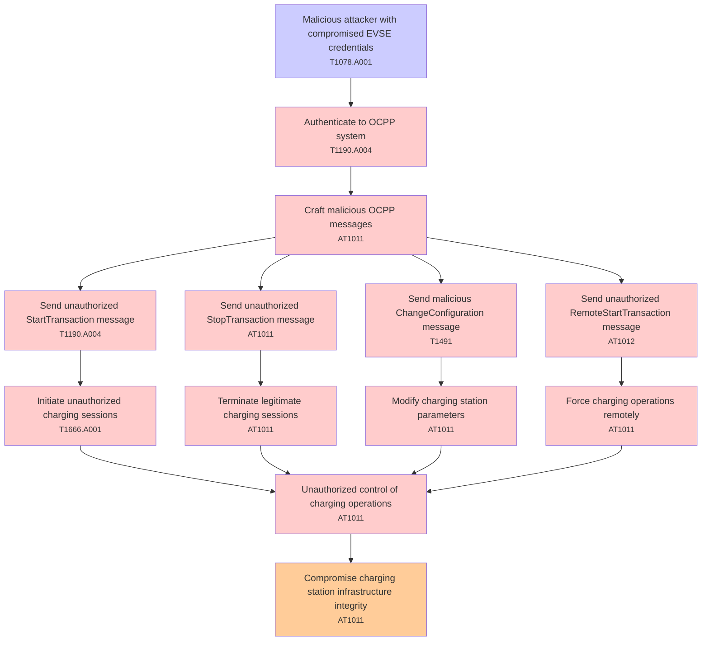

# Attack Tree: Authentication

**Threat ID**: T001  
**Associated threat statement**: T001 - Authentication

- **Threat Source**: malicious attacker
- **Prerequisites**: compromised EVSE credentials
- **Threat Action**: send malicious OCPP messages to the connection handler
- **Threat Impact**: unauthorized control of charging operations
- **Reduced Goal**: integrity
- **Impacted Assets**: charging station infrastructure
- **Priority**: High
- **Category**: Authentication

---

## Attack Tree Diagram

## Attack Path Analysis

This attack tree represents the potential attack paths for the identified threat. Each node in the tree represents either:
- **Attack Goal** (orange): The ultimate objective
- **Attack Step** (red): Individual attack actions
- **Fact/Condition** (blue): Prerequisites or conditions
- **Mitigation** (green): Defensive measures

Review this attack tree to:
1. Identify critical attack paths
2. Implement appropriate security controls
3. Monitor for indicators of these attack patterns
4. Develop incident response procedures

---
*Generated by ThreatForest - Attack Tree Analysis*

## TTC Technique Mappings

| Attack Step | Technique ID | Technique Name | Confidence | Similarity |
|-------------|--------------|----------------|------------|------------|
| Send malicious ChangeConfiguration message... | T1491 | Defacement... | 🟡 medium | 0.507 |
| Modify charging station parameters... | AT1011 | Operation Rate Control... | 🔴 low | 0.468 |
| Compromise charging station infrastructure integri... | AT1011 | Operation Rate Control... | 🟡 medium | 0.503 |
| Malicious attacker with compromised EVSE credentia... | T1078.A001 | IAM Entities... | 🟡 medium | 0.616 |
| Send unauthorized RemoteStartTransaction message... | AT1012 | Region Selection and Hopping... | 🔴 low | 0.456 |
| Terminate legitimate charging sessions... | AT1011 | Operation Rate Control... | 🟡 medium | 0.503 |
| Send unauthorized StopTransaction message... | AT1011 | Operation Rate Control... | 🔴 low | 0.468 |
| Initiate unauthorized charging sessions... | T1666.A001 | Create Organization Account... | 🟡 medium | 0.528 |
| Unauthorized control of charging operations... | AT1011 | Operation Rate Control... | 🟡 medium | 0.620 |
| Force charging operations remotely... | AT1011 | Operation Rate Control... | 🟡 medium | 0.658 |
| Authenticate to OCPP system... | T1190.A004 | S3 Glacier Vault... | 🔴 low | 0.488 |
| Craft malicious OCPP messages... | AT1011 | Operation Rate Control... | 🟡 medium | 0.556 |
| Send unauthorized StartTransaction message... | T1190.A004 | S3 Glacier Vault... | 🔴 low | 0.466 |
