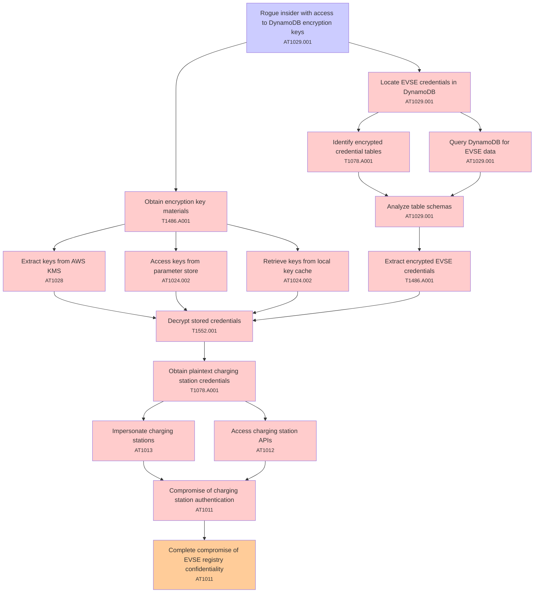

# Attack Tree: Data Exposure

**Threat ID**: T002  
**Associated threat statement**: T002 - Data Exposure

- **Threat Source**: rogue insider
- **Prerequisites**: access to DynamoDB encryption keys
- **Threat Action**: decrypt stored EVSE credentials
- **Threat Impact**: compromise of charging station authentication
- **Reduced Goal**: confidentiality
- **Impacted Assets**: EVSE registry
- **Priority**: High
- **Category**: Data Exposure

---

## Attack Tree Diagram

## Attack Path Analysis

This attack tree represents the potential attack paths for the identified threat. Each node in the tree represents either:
- **Attack Goal** (orange): The ultimate objective
- **Attack Step** (red): Individual attack actions
- **Fact/Condition** (blue): Prerequisites or conditions
- **Mitigation** (green): Defensive measures

Review this attack tree to:
1. Identify critical attack paths
2. Implement appropriate security controls
3. Monitor for indicators of these attack patterns
4. Develop incident response procedures

---
*Generated by ThreatForest - Attack Tree Analysis*

## TTC Technique Mappings

| Attack Step | Technique ID | Technique Name | Confidence | Similarity |
|-------------|--------------|----------------|------------|------------|
| Impersonate charging stations... | AT1013 | User Agent Spoofing and Randomization... | 🟡 medium | 0.607 |
| Access charging station APIs... | AT1012 | Region Selection and Hopping... | 🟡 medium | 0.509 |
| Extract keys from AWS KMS... | AT1028 | Create or Modify EC2 Key Pair... | 🟡 medium | 0.697 |
| Obtain encryption key materials... | T1486.A001 | S3 Encryption - SSE-C Key Encryption... | 🟡 medium | 0.568 |
| Identify encrypted credential tables... | T1078.A001 | IAM Entities... | 🟡 medium | 0.598 |
| Retrieve keys from local key cache... | AT1024.002 | Additional Access Key... | 🔴 low | 0.410 |
| Analyze table schemas... | AT1029.001 | DynamoDB... | 🟡 medium | 0.563 |
| Obtain plaintext charging station credentials... | T1078.A001 | IAM Entities... | 🟡 medium | 0.540 |
| Complete compromise of EVSE registry confidentiali... | AT1011 | Operation Rate Control... | 🟡 medium | 0.554 |
| Extract encrypted EVSE credentials... | T1486.A001 | S3 Encryption - SSE-C Key Encryption... | 🟡 medium | 0.523 |
| Compromise of charging station authentication... | AT1011 | Operation Rate Control... | 🟡 medium | 0.585 |
| Rogue insider with access to DynamoDB encryption k... | AT1029.001 | DynamoDB... | 🟢 high | 0.854 |
| Decrypt stored credentials... | T1552.001 | Credentials In Files... | 🟡 medium | 0.561 |
| Locate EVSE credentials in DynamoDB... | AT1029.001 | DynamoDB... | 🟡 medium | 0.685 |
| Access keys from parameter store... | AT1024.002 | Additional Access Key... | 🟡 medium | 0.576 |
| Query DynamoDB for EVSE data... | AT1029.001 | DynamoDB... | 🟡 medium | 0.680 |
